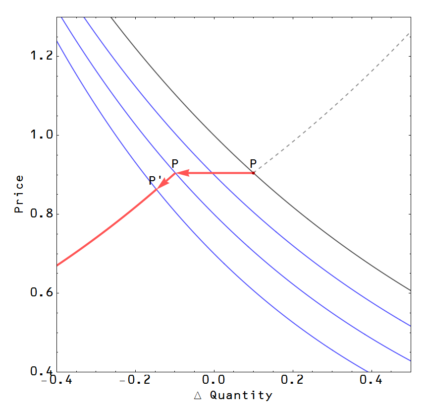

This post will be more speculative than the derivation of supply and demand -- it will give one possible take of how [sticky prices](http://en.wikipedia.org/wiki/Sticky_\(economics\)) appear in the model (which are key to at least some schools of modern macroeconomic theory). If we return to non-ideal information transfer $I_{Q^s} \leq I_{Q^d}$ such that [Equations (4) and (5)](http://informationtransfereconomics.blogspot.com/2013/04/supply-and-demand-from-information.html) become

and we can use Gronwall's inequality \[2\] (for ODEs/stochastic differential equations) to use our supply and demand systems of equations (8a,b) and (9a,b) as upper bounds on the _perceived_ supply and demand curves. These upper bounds are the ideal supply and demand curves that intersect at the ideal price $P^*$. By perceived supply and demand curve, we mean the supply and demand curves that have the _observed_ price $P$ as the equilibrium price. In the case of ideal information transfer, the ideal price is the observed price. However, in the case of non-ideal information transfer the observed price can occur anywhere in the area below the the ideal supply or demand curves.

We first look at the case where we have a constant supply source analgous to Eq. (9a,b). In the case of imperfect information transfer, the equations become (via Gronwall's inequality):

This creates a situation where all allowed prices for a given demand curve fall in the red shaded area below the ideal supply curve defined by the equality in Eq. (12b) in the figure below and the observed price $P$ will fall below the "ideal price" $P^*$.

If we have imperfect information transfer, then all prices along the demand curve (gray) beneath the supply curve are valid. Specifically, the prices marked in dark blue are valid and they remain valid price solutions under downward shifts in the demand curve until it reaches the bounding supply curve and then will be forced to follow the supply curve to price $P'$ and beyond. This looks different from the standard economics perspective in the next figure below. The price $P$ appears to be sticky downward under small shifts of the demand curve, but could revert to ordinary (non-sticky) behavior for large shifts (compared to how far we are from ideal information transfer). The upper portion of the supply curve (here shown in dashed gray) is **_assumed_** \-- but is technically unknown in this picture.

The size of downward shifts in the demand curve for which prices remain sticky could _ceterus paribus_ (including keeping the ideal supply and demand curves constant) give an indication of the magnitude of the "information gap" between the observed imperfect information transfer and perfect information transfer.

If we bound the information transfer from below, we see we can actually get prices that are sticky upward. See next figure below. In general, a point appearing inside the red shaded area will experience sticky prices for shifts upward and downward over some region of changes in demand, only to revert to ordinary (non-sticky) supply and demand behavior as shifts become large and we approach the boundaries of the shaded region.

One interesting point is that given the preponderance of sticky downward prices vs sticky upward prices would imply that our observed price (dark red point) tends to be nearer the lower bound. This makes intuitive sense as we could imagine what we know at the time of observing the price $P$ as being a lower bound on the information we have about the supply curve.

Again, we show how this figure looks in the standard economics narrative in the figure below. We have a price that is sticky upward and downward for small shifts in the demand curve, but becomes "unstuck" for larger shifts.

These results imply a large deviation from ideal information transfer for a given good will result in stickier prices. What causes the non-ideal information transfer? One could imagine cases where the good is difficult to assess (from lots of variables) or is rarely assessed (an inefficient market) -- both situations that come into play in the employment market (people are complex and they may have annual salary reviews but this doesn't mean they are being fully assessed in an open market).

The problem is that while the sticky price trajectory remains _**consistent**_ with Equations (12a,b) -- it is a solution to the differential inequality -- it may not be **_required_** by Equations (12a,b). It is consistent for a pencil standing on its end to fall with the point facing west, but it is not required to fall with the point facing west. A potential direction would be to look at all possible trajectories using some kind of stochastic process and see if they converge to some value.

There is the additional issue that the sticky price trajectory implies that the size of the "information gap" is decreasing assuming the ideal supply curve remains constant in order for the trajectory to reach the edge. But why should it reach the edge? Maybe the information gap is preserved in the short run so that the ideal supply curve moves to the left in tandem. Maybe in the long run, more efficient markets could cause the gap to shrink? I don't know, but again I think a stochastic model might shed some light here.

In particular, [Markov information sources](http://en.wikipedia.org/wiki/Markov_information_source) are frequently used in communication theory and [Markov models are of interest](http://noahpinionblog.blogspot.com/2013/02/is-business-cycle-cycle.html) in economics; the information transfer model may just create constraints ... [which is my goal](http://informationtransfereconomics.blogspot.com/2013/04/an-informal-abstract-addition-why-now.html). The actual dynamics of how a price sticks and how the information gap will be potential subjects for future posts. As you can see, this is an incomplete picture and hence why I decided to go the blog/working paper route. I don't have all the answers!

**References**

\[1\] Information transfer model of natural processes: from the ideal gas law to the distance dependent redshift P. Fielitz, G. Borchardt http://arxiv.org/abs/0905.0610v2

\[2\] http://en.wikipedia.org/wiki/Gronwall's\_inequality

\[3\] http://en.wikipedia.org/wiki/Noisy\_channel\_coding\_theorem#Mathematical\_statement

\[4\] http://en.wikipedia.org/wiki/Entropic\_force

\[5\] http://en.wikipedia.org/wiki/Sticky\_(economics)
