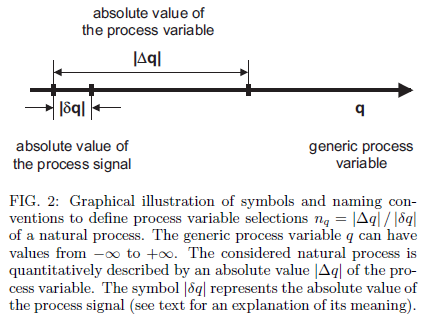
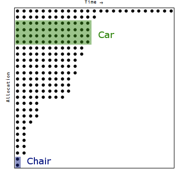
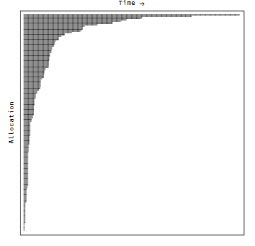

A quick note: The [information transfer model](http://arxiv.org/abs/0905.0610v2) is basically a counting problem: you have a long measuring stick that changes by some amount and you are determining the effect of that change on another long measuring stick.

Looking at an instantaneous snapshot of the economy, an individual has a set of allocations of current credit + cash to various goods and services over time. A car payment continues for the next couple years while a chair is a one-time expense. An individual's allocation (not showing the unused quantity) is then very much like an integer partition (a Ferrers diagram):

The interesting thing is that as the number of elements goes to infinity, the instantaneous allocation of every business, individual, etc looks more and more defined/tractable as an ensemble:

... and you could imagine a statistical mechanics (or information theory) approach would capture much of the phenomena.
