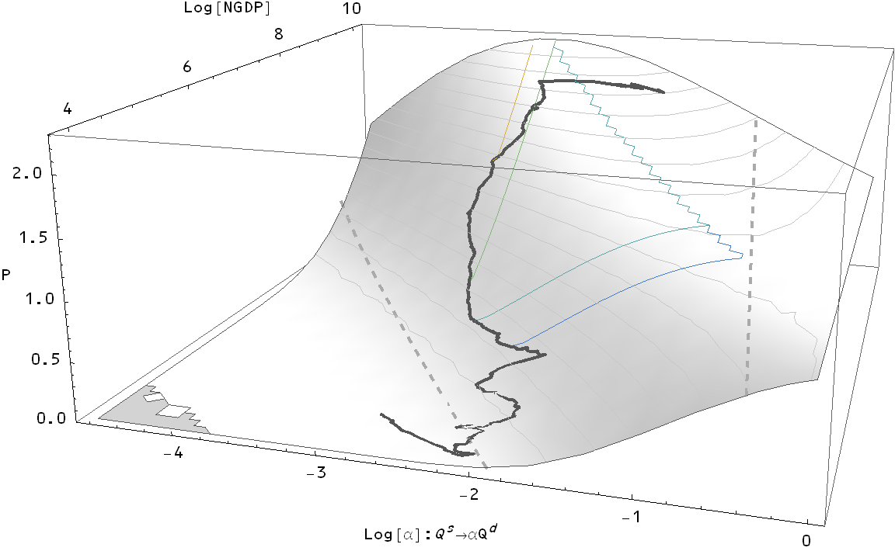

Given that I've made a couple of [random](http://informationtransfereconomics.blogspot.com/2013/07/aggregate-supply-and-aggregate-demand.html) [comments](http://informationtransfereconomics.blogspot.com/2013/07/the-fragility-of-expectations.html) in this direction, I thought I might try and figure out what "optimal" monetary policy should be. I'm continuing from [these results](http://informationtransfereconomics.blogspot.com/2013/07/predicting-inflation-again.html); you can back up from there to figure out what I'm doing. I decided to graph the price surface vs a variable $\alpha = Q^s/Q^d$, i.e. the ratio of the monetary base to NGDP. Here is the price surface:

Now I have graphed a few lines on the surface ...

-   **Dark gray line:** The actual path of monetary policy.
-   **Dashed gray lines:** These two lines represent $\kappa = 0.5$ and $\kappa = 0.9$. The first one (which is toward the left side of the figure) is what is required for the traditional quantity theory of money to apply where growth of the price level is equal to the growth in the monetary base. I chose $0.9$ somewhat arbitrarily -- something close to $1$, but not $1$.
-   **Colored lines:** These represent the path of "optimal" policy starting from the years 1950, 1960, 1970 and 1990 (and going from the blue end of the rainbow toward the red, respectively). What did I define as "optimal" policy? I started at the empirical location for the given year and found the smallest gradient (i.e. the lowest inflation rate), subject to the conditions 1) the price level must increase (no deflation) and 2) NGDP must increase.

Some interesting points ...

-   The optimal policy lines make a bee-line for the ridge (the zero derivative point in the $\alpha$ direction) and then follow the ridge. For 1950 and 1960, this involves a rather sharp change in the angle.
-   There is obviously a major change in the 1960s in what optimal policy looked like going forward. However this is not really a phase transition in terms of the steps you make at each point -- in the calculations from 1950 to 1990, the algorithm remains the same.
-   From the 1970s to the Great Recession, monetary policy was fairly close to optimal. The quantitative easing after 2008 pushed us away from the optimal path, which would require a relative tightening of monetary policy (slowing the growth of the base relative to NGDP -- this is not necessarily actual tightening, but it is a tightening from the current rate of growth).
-   The above discussion neglects fiscal policy, which could be used to guide $\alpha$ by changing NGDP. In particular, the best fiscal + monetary policy seems to be a large fiscal stimulus that allows a reduction in the monetary base. Simply reducing the base and undoing the rounds of QE would cause deflation. NGDP must be pushed forward while the base shrinks slightly. Overall, we are not that far optimal policy and it is possible we could drift back towards the ridge line without major changes in monetary policy.

Additionally, I graphed all of the above lines in the 2D $\alpha-NGDP$ plane as well as the $MB-NGDP$ plane for your viewing pleasure.

