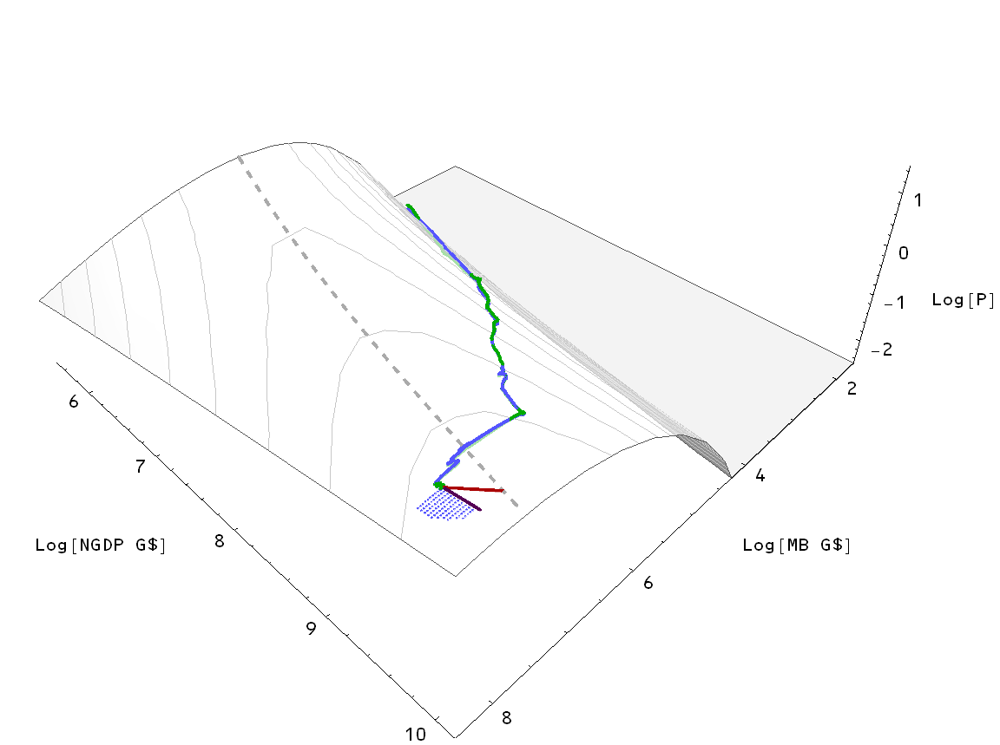

I'm using the fits [here](http://informationtransfereconomics.blogspot.com/2013/07/dotting-is-and-crossing-ts.html) as the basis for some extrapolations. I am using [this framework](http://informationtransfereconomics.blogspot.com/2013/07/predicting-inflation.html) for the predictions along with two new pieces. The new pieces are a linear extrapolation of the NGDP and MB (purple) as well as a linear trajectory to the maximum price level for the MB in 2020 given the linear extrapolation of NGDP (red). For the latter line, I took the extrapolated NGDP in 2020 and used that to find the value of MB that maximizes P in 2020. The line is formed by taking a straight path in MB-NGDP space from the empirical end point in 2013 to this extrapolated point in 2020. All of this is probably easier to see with a picture.

Here are the extrapolated MB and NGDP. The "inflation maximizing path" is in red and the "extrapolated path" is in purple. The extrapolated NGDP is in gray and is the same for both paths.

Now I'll show these paths along with a set of points (in blue) near the empirical end point (like I did [here](http://informationtransfereconomics.blogspot.com/2013/07/predicting-inflation.html)) on the 2D price surface:

These result in the following price level predictions (red for the inflation maximizing path and purple for the linear extrapolated path).

\[I did do something slightly different with the spread; I took the set of points where MB doesn't decrease (lighter blue) and the set of points where MB and NGDP don't decrease (darker blue).\]

Here are the inflation rate predictions (red for the inflation maximizing path and purple for the linear extrapolated path). Note both are about 2% (the gray line), with the extrapolated path coming in at slightly below.

Looks like there is little difference between an inflation maximizing path and the linear extrapolation in terms of inflation, but there is about a $615 billion in the size of the monetary base (about a 20% cut). Interestingly, [Japan undertook a 20% cut in the monetary base in 2006](http://www.themoneyillusion.com/?p=22323) but there was [little visible effect on inflation](http://noahpinionblog.blogspot.jp/2013/07/japans-stagnation-demand-side-or-supply.html).
