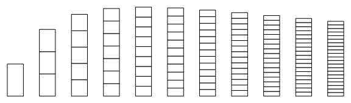

Building off of [this post](http://informationtransfereconomics.blogspot.com/2013/07/a-summary-of-information-transfer-model.html), I'd like to show how you might visualize how adding to the monetary base can cause your economy to expand ... up to a point. Base money is behaving both as the number of "bits" used to describe the economy (i.e. receive the information transferred from the aggregate demand) as well as a determination of the meaning of the unit "bit" (i.e. how many bits the aggregate demand consists of). In analogous economic terminology, money is the medium of exchange (the monetary base determines how many dollars are available) and the unit of account (the definition of a dollar unit).

In the model adding bits will capture more of the information being transmitted from the aggregate demand and allow the economy to grow. Simultaneously, the value of these bits is decreasing since their supply is increasing. Let's imagine each of these bits as boxes and the economy as a stack of boxes, like this:

As you add boxes to a stack, two things happen. One, the number of boxes in the stack gets larger (the monetary base grows). Two, the size of the boxes shrink (the value of each dollar decreases). Depending on the size of these competing effects, the result can vary. In the information transfer model, a series of these stacks at a fixed aggregate demand looks like this:

Note that at fixed aggregate demand, the height of the boxes represents NGDP for a fixed RGDP, a measure effectively equivalent to the price level. The price level (height of the stack) grows with the size of the base initially, but then starts to shrink as the size of the boxes gets smaller. Thus, we recover the picture from [this post](http://informationtransfereconomics.blogspot.com/2013/07/a-summary-of-information-transfer-model.html):

[information trap](http://informationtransfereconomics.blogspot.com/2013/08/the-liquidity-trap-and-information.html)
