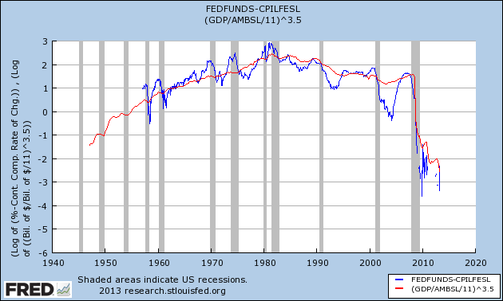

I mentioned doing [this](http://informationtransfereconomics.blogspot.com/2013/08/the-interest-rate-in-information.html) with real rates. Well, no big surprises, it [works](http://research.stlouisfed.org/fred2/graph/?g=lZN) just as well (this fit was done partially by eye using the values from the nominal rates as a starting point):

