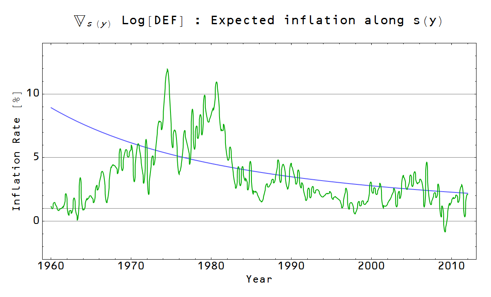
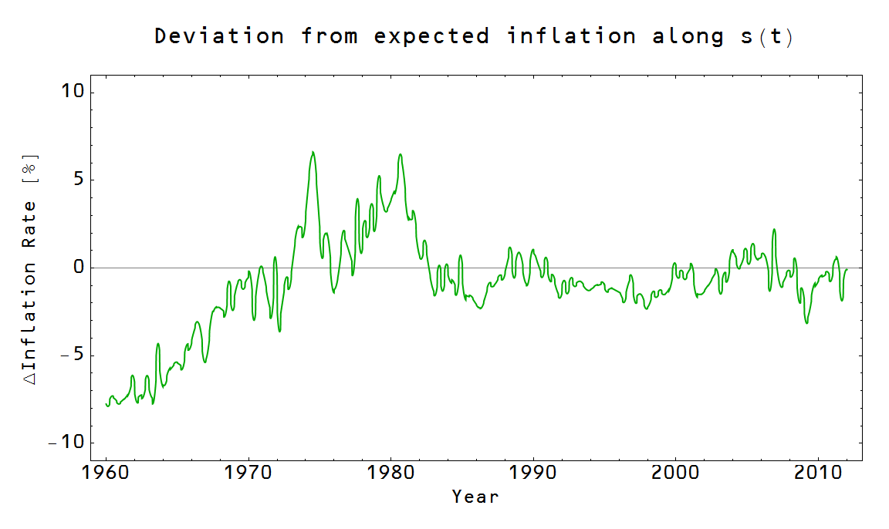

[these results](http://informationtransfereconomics.blogspot.com/2013/10/revealing-true-business-cycles.html)[CPI (less food and energy)](http://research.stlouisfed.org/fred2/series/CPILFESL)[GDP deflator](http://research.stlouisfed.org/fred2/series/GDPDEF)

