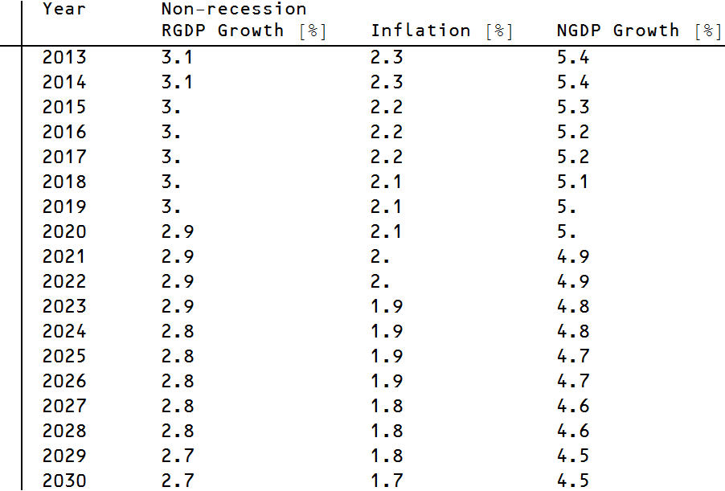

It may be hubris, but I'm going to venture a prediction about average non-recession RGDP growth. By non-recession growth, I mean the average over the quarterly reports with the negative results deleted. (Why do this? Well, it appears that these predictions represent an upper bound from which recessions are deviations; more on this in a subsequent post.) Anyway, building on the [previous post](http://informationtransfereconomics.blogspot.com/2013/10/the-1970s.html) here is a self-explanatory table:

