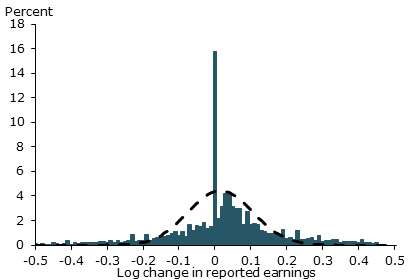

[Simon Wren-Lewis](http://mainlymacro.blogspot.com/2013/10/nominal-wage-rigidity-in-macro-example.html) calls the lack of acceptance of downward nominal wage rigidity (sticky prices) a methodological failure in macroeconomics:

> _I suspect nearly all economists are naturally reluctant to embrace cases where agents appear to miss opportunities for Pareto improvement ... However in most other areas of the discipline overwhelming evidence \[in favor of wage stickiness\] is now able to trump these suspicions. But not, it seems, in macro._ 

> _While we can debate why this is at the level of general methodology, the importance of this particular example to current policy is huge. Many have argued that the failure of inflation to fall further in the recession is evidence that the output gap is not that large._

[Paul Krugman](http://krugman.blogs.nytimes.com/2013/10/12/sticky-wages-and-the-macro-wars/)

> _You see, the question of wage (and price) stickiness, and hence of real effects of changes in nominal demand, was what the great rejection of Keynesianism was all about. And I mean all about. Back in the 70s, there was hardly any discussion of the determinants of nominal demand; what Lucas and his followers were arguing was that Keynesianism must be rejected because it was unable to derive wage stickiness from maximizing behavior._

Sticky wages form the basis of the explanation of the **_existence_** of unemployment in Keynesian economics. If there is a fall in aggregate demand, basic microeconomic arguments suggest that people as maximizing agents will lower their "reserve wage" in order to keep the economy at full employment. This is not what is observed. People do not lower their reserve wage; people become unemployed. There are many reasons given for this (e.g. nominal wage cuts or hiring new employees at a lower wage are bad for morale, the coordination problem where no one person wants be the one to lower their reserve wage, etc). It is a [fruitful arena](http://scholar.google.com/scholar?hl=en&q=downward+nominal+wage+rigidity) for study in economics.

I had [previously considered](http://informationtransfereconomics.blogspot.com/2013/04/sticky-prices-from-non-ideal.html) that sticky wages might be the result of imperfect information transfer, but I am going to tackle the problem from a different perspective. I'm not going to figure out the reason for sticky wages here. However, I will show how sticky wages manifest themselves in the information transfer framework.

In this [earlier post](http://informationtransfereconomics.blogspot.com/2013/08/scott-sumners-model-part-2_30.html), I built a model where the price level _P_ detects signals from the aggregate demand (NGDP) to the labor supply (LS) which I denote _P:NGDP→LS_. The basic equations of the information transfer framework then tell us that _P ~ NGDP/LS_. Now what this suggests is that the number of employees responds to changes in aggregate demand. It also allows us to derive Okun's law where changes in real demand (_NGDP/P = RGDP_) are equal to changes in employment (see the link at the beginning of this paragraph). What would it look like if nominal wages (NW) responded to changes in aggregate demand?

Well, you'd have a market _P':NGDP→NW_ where _P' ~ NGDP/NW_, but we don't know what the price _P'_ is. Let's first have a look at NGDP (solid) and NW (dashed):

_NGDP/NW = 2.1_**_P'_ is a constant**

A constant price means we must always have the same signal from the aggregate demand to nominal wages which means _falling aggregate demand causes nominal wages to fall primarily as a reduction in the number of employed people, not a change in their nominal wage_. There are still some fluctuations in _P'_ so nominal wage rigidity is not absolute, but these fluctuations are small ... which is in fact what is [observed](http://www.frbsf.org/economic-research/publications/economic-letter/2012/april/strong-wage-growth/):

This is an empirical observation. There is no _a priori_ reason that _P':NGDP→NW_ must have a constant price _P'_; it could have had the changing relationship observed in the analogous graph to the one above between the aggregate demand (solid) and the labor supply (dashed):

This small variation seen in P' can be used to slightly improve the fit to the price level _P_ by taking _P→P\*P'_  (old fit in blue, new in purple with the price level in green):

But overall **nominal wage rigidity is the observed dominant market interaction** with nominal wage changes being a small effect. To reclaim the [physics analogy using the Hydrogen atom from Brad DeLong](http://delong.typepad.com/delong_long_form/2013/10/you-dont-need-a-rigorous-microfoundationeer-to-know-which-way-the-well-to-know-much-of-anything-really.html), sticky prices are the Schrodinger equation and wage flexibility is the Lamb shift.
