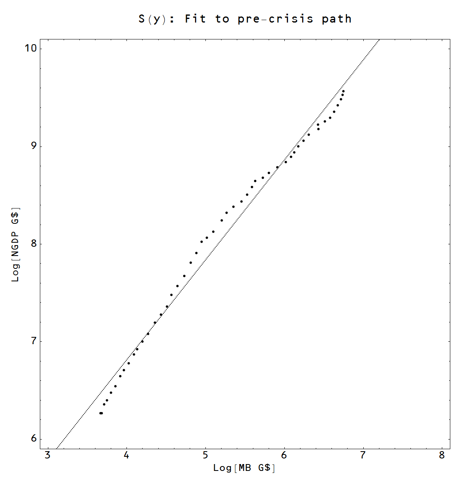

> **Update 3 Feb 2014:** _Basically the posts stands, but I updated the graphs to use the monetary base minus reserves [here](http://informationtransfereconomics.blogspot.com/2014/02/inflation-rgdp-and-expected-rgdp.html)._

Ah, the 1970s. In with _Let It Be_ and out with _Off the Wall_. And so formative for people who were shaped by those years ... especially our current slate of economics professors, political pundits and other associated riff-raff. This is my hundredth post, so I will celebrate with a tribute to the 1970s with lots of pretty graphs and ending with the final conclusion that the 1970s was the same as any other decade.

Brad DeLong has a [recent post](http://delong.typepad.com/sdj/2013/10/what-ended-the-thirty-glorious-years-bonus-delong-smackdown-watch-by-andrew-watt.html) up about the "end" of the Keynesian era and the beginning of the Friedman era. The stylized facts:

> B1. ... adverse energy supply shock--The tripling of world oil prices in 1973 

> B2. ... adverse growth supply shock--The productivity growth slowdown ... for reasons that are still not well understood in the 1970s 

> B3. ... long-run growth-- ... huge backlog of unexploited opportunities for technological improvement and capital investment ... could not be sustained beyond the mid-1970s 

> B4. Political economy--institutions-- ... \[labor-capital\] bargain broke down in the 1970s. 

> B5. Hubris--Governments believed that they could run economies at overfull employment indefinitely without de-anchoring  expectations of inflation, and in the 1970s it turned out that they were wrong

In a similar vein -- in the sense that the 1980s purportedly cured the ails of the 1970s -- I recently countered [Scott Sumner's claim](http://www.themoneyillusion.com/?p=23945) that supply side reforms were that cure. Now [my response](http://informationtransfereconomics.blogspot.com/2013/10/supply-side-reforms-didnt-accomplish.html) to Sumner was that basically the initial combination of low information transfer index and low monetary base starting after WWII basically meant that ceteris paribus the US would always grow faster than e.g. the EU years later unless a "[monetary phase transition](http://informationtransfereconomics.blogspot.com/2013/08/the-liquidity-trap-and-information.html)" or a ["hyperinflation" episode](http://informationtransfereconomics.blogspot.com/2013/09/exit-through-hyperinflation.html) intervened.

But in order to have a thorough trashing of the left and right's economic view of the 1970s, I'll add some of Sumner's stylized facts on how the Fed "blew it" from 1966-1981 from [this post](http://www.themoneyillusion.com/?p=23413):

> S1.  \[Incorrect\] assumption of stable Phillips Curve.
>
> S2.  Mis-estimation of the natural rate of U, which was rising.
> S3.  Confusion between nominal and real interest rates.

In order to address these issues, I will construct a conterfactual path of RGDP and inflation through the years that assumes no major changes in the economy or monetary policy from the 1960s until 2008 and show this counterfactual path _**actually describes the RGDP and inflation we see during that period**_.

I start with the 3D price level surface _P = P(MB, NGDP)_ familiar to regular readers where the actual path of the monetary base (MB) and NGDP is shown as a black line and the information trap criterion (_∂P/∂MB = 0_) is shown as a dotted line. On the right, I show it in 3D as a surface plot and on the left in 2D as a contour plot:

This function _P(MB, NGDP)_ derived from the information transfer model and fit to price level data allows us to make the plot of RGDP growth ( _\= d log (NGDP/P)/dt_ _\= d log RGDP/dt_ with the model in blue, data in green) at the top of this post. What does the gradient of this function look like?

You can see the empirical path (black) travels from areas of high gradient towards low, which means that we will see inflation will go from high in the 1960s to low in the 2000s. But we have some work to do because the gradient is the vector (_∂ log P/∂MB,_ _∂ log P/∂NGDP_) therefore we have to convert that into a derivative with respect to time ∂ log P/∂t to get the inflation rate. There's an easy way to do this --  just take the derivative of the empirical functions with respect to time by taking _P(MB, NGDP) = P(MB(t), NGDP(t)) = P(t)_; this is where the results in the graph at the top of this post come from. However I'd like to create the counterfactual path S(t) mentioned above so we're going to end up taking a [directional derivative](http://en.wikipedia.org/wiki/Directional_derivative) using a [measure](http://en.wikipedia.org/wiki/Lebesgue_measure) along S(t) (i.e. the [pullback](http://en.wikipedia.org/wiki/Pullback_\(differential_geometry\)) of the time differential to the price level surface). We'll start with two linear fits:

On the right we have the empirical points from 1960 to 2008 as a function of the monetary base and nominal GDP and on the left we have the distance from the origin (_R_) of these same points in (MB, NGDP) space. I will take the linear fit in the graph on the right as the counterfactual path _S(t)_ and the linear fit in the graph on the left will be used to linearly **_approximate_** the measure allowing us to convert from a gradient with respect to MB and NGDP to a derivative with respect to time:

_**ŝ** **·****∇** **→** **ŝ**(MB(t), NGDP(t)) **·** (∂R/∂MB ∂t/∂R ∂/∂t, ∂R/∂NGDP ∂t/∂R ∂/∂t)_

In more comprehensible terms, I am accounting for the facts that a) while the gradient points in the direction of maximum change, the counterfactual path doesn't follow the direction maximum change (perpendicular to the contours), but instead follows S and that b) in the graph on the right you can see that 1 year increments (each dot) aren't equal to billion dollar increments so the slope of the price level surface will not be measured correctly if you don't take that information account. Anyway, the final result is given in this plot of the RGDP growth rate along the path S(t):

Now we can read off the RGDP growth rate for the counterfactual path S (I color coded the expected RGDP growth rate in reference to the previous graph, show the derivative along the empirical path in blue and show the empirical data in green):

This graph shows that RGDP growth is roughly what we should have expected following the straight line path, or another way, nothing interesting happened in the 1970s. We are going from high growth in the 1960s towards lower growth today along a continuous trend. And here's inflation (data in green, expected inflation along S(t) in blue):

Again, we're basically following the trend. There are some deviations around 1974 and then another peak in 1980 (probably due to the [Oil Crises](http://en.wikipedia.org/wiki/1979_energy_crisis)). The real question should be _**why was inflation so low in the 1960s?**_

Going back to the stylized facts at the top of this post, there is only evidence of B1. The rest are trying to explain an effect that isn't there. To see this, here is a table of the expected average RGDP growth from the linear path and the non-recession (x > 0) quarterly reported RGDP growth by decade:

1960s: expected: 5.2 actual: 5.4

1970s: expected: 4.5 actual: 5.5

1980s: expected: 4.0 actual: 4.2

1990s: expected: 3.6 actual: 3.2

2000s: expected: 3.3 actual: 3.0

The awesome growth under Kennedy and Johnson? Expected. The anemic growth under Bush? Expected. The 20% growth slowdown from 1960 to 1980? Expected. To first order it appears nothing has happened due raising or lowering taxes, loosening or tightening monetary policy, regulating or deregulating. 

The productivity slowdown (B2) that isn't understood isn't understood for a reason: it didn't happen. Or rather, it's always been happening. There was no backlog of technological developments that ran out (B3). As far as RGDP growth goes, the decline of labor unions (B4) wasn't a major factor (it could still play into wealth distribution). Inflation expectations did not become de-anchored (B5); in fact they were unnaturally low in the 1960s and only returned to the expected trend (after some oil shocks). The stable Phillips curve (S1) is in essence a restatement of (B5); again nothing happened to the relationship between inflation and RGDP growth (and therefore [employment](http://informationtransfereconomics.blogspot.com/2013/10/apparently-monetary-offset-only-offsets.html)). The natural rate of unemployment was not changing (S2). I'm not even sure what confusion between nominal and real interest rates (S3) is supposed to mean, but it's likely a dig at IS-LM and Keynesian economics. I do know one thing: it didn't lead to a change in the RGDP growth path or inflation because there was no significant change!
