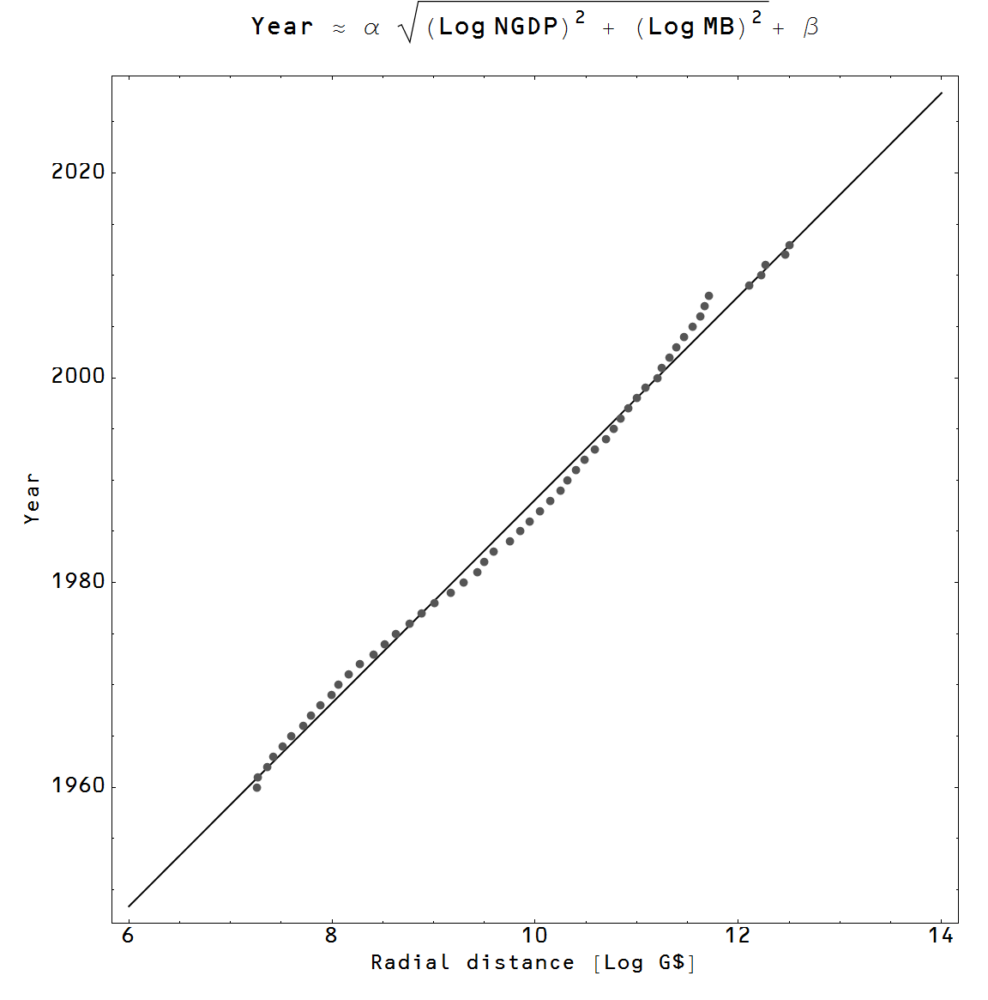

Ostensibly there should be an overall correlation with a larger population meaning a larger monetary base, but in the process of constructing this post, I noticed an interesting correlation in the fluctuations around that overall relationship:

Is the distance from the origin in _(log MB, log NGDP)_ space directly related to the population size?

The effect of cohort size on income is called the Easterlin effect in sociology, see e.g. [this review](http://www.annualreviews.org/doi/abs/10.1146/annurev.so.21.080195.001115). The effect here is different since it looks at contemporaneous population size. The economy is farther out along the _R = (log NGDP, log MB)_ axes than it "should" be in the 80s and 90s, and this is corresponding with a lower population. I wouldn't put very much money down on this being more than a coincidence, but I thought I'd jot it down.
