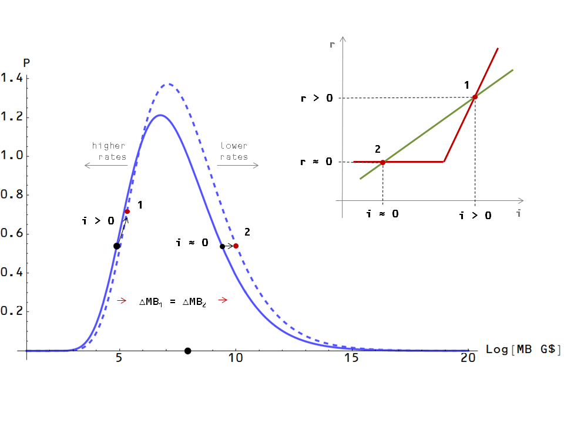
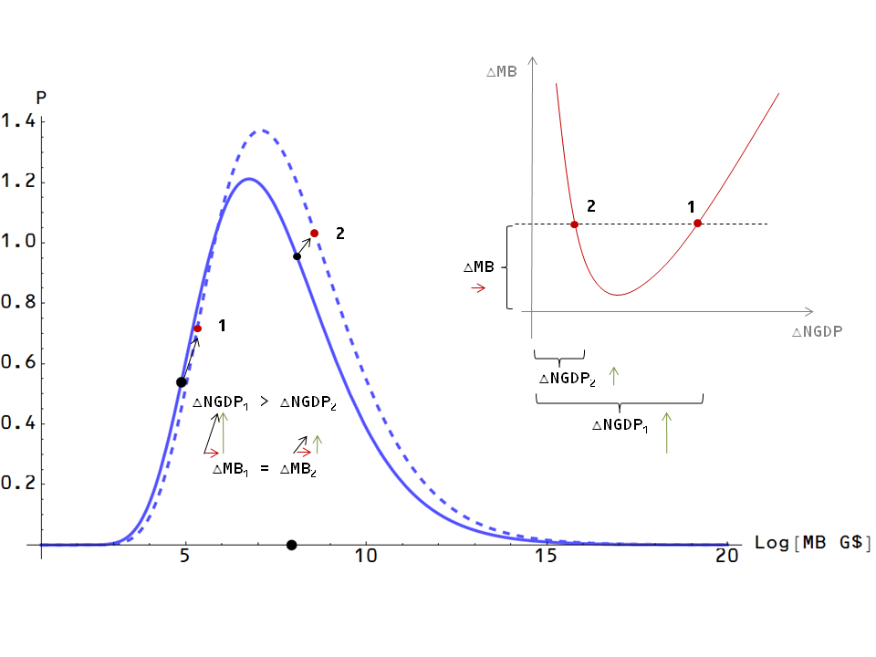
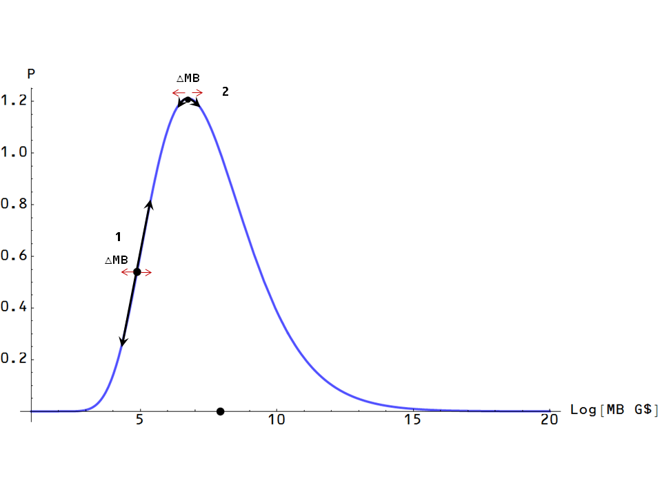

It is nice to know that [my claim](http://informationtransfereconomics.blogspot.com/2013/07/a-summary-of-information-transfer-model.html) that I would get laughed out of an economics conference for proposing that monetary expansion could be deflationary (at least 4 months ago) was off the mark. [Apparently](http://equitablegrowth.org/2013/11/29/970/understanding-the-stability-of-general-equilibrium-as-a-requirement-for-getting-a-union-card-as-an-economist-friday-focus) I'd just be called an idiot and be asked to return my economist union card. I'm glad I don't have one.

I think [Noah Smith](http://noahpinionblog.blogspot.com/2013/12/does-qe-cause-deflation.html) does a good job summing up and crystallizing the differences of opinions in his post and walks away with what I think is the best take on the whole affair. The idea seems to be is that there are models with two "scenarios" -- I will refrain from using the word equilibria (I mean what does a low inflation equilibrium mean? Isn't inflation a time derivative?) -- one of which is a high inflation scenario and one of which is a low inflation scenario. There is a difference of opinion on which is the stable scenario. Smith points out that models exist where either scenario is the stable one. Additionally, Smith appears to be of the opinion that only one case is sensible while Paul Krugman seems to be of the opinion that only one case exists. Steve Williamson's original opinion that set the controversy off is that the other case exists and is sensible.

Scott Sumner [chimes in](http://www.themoneyillusion.com/?p=25034) with some explanation from a monetarist perspective. He provides a graph that allows for two scenarios where 1) the future MB is higher and future NGDP is higher and 2) The future MB is higher but future NGDP is lower. More on this below.

Nick Rowe adds some pretty existential stuff in [this post](http://worthwhile.typepad.com/worthwhile_canadian_initi/2013/12/the-effects-of-nominal-interest-rates-on-inflation.html). Does a representative agent know he or she is a representative agent? Maybe it's all just a representative dream. Can I take the blue pill now? 

The problem seems to lie in the facts that 

1.  You can construct a economic model to show just about anything 
2.  You can construct a plausible sounding human behavior explanation for just about anything
3.  Rational expectations consists entirely of the statement that the economic model in 1) is the plausible explanation in 2)

Taking all of the above with a large grain of salt, what does your humble blogger have to say about this?

Well, it is nice to see the existence of two scenarios where a given interest rate (monetary base) results in two different inflation rates depending on other economic indicators. This happens in the information transfer model (the price level is dependent on the monetary  base and nominal GDP). However, these are not "equilibria" in the information transfer model in the traditional sense; they are simply locations. It would be like saying you can be anywhere along the Taylor rule + ZLB curve, not just at the intersection with the Euler equation condition (which in a sense defines your rational expectations/human behavior). The reason it seems like you are restricted derives from the degree of control over NGDP and the lack of large moves by the central bank or national government.

The information transfer picture analgous to Krugman's or Sumner's is of a price level curve at constant RGDP shown in [this blog post](http://informationtransfereconomics.blogspot.com/2013/07/a-summary-of-information-transfer-model.html). I did my best to put their views in terms of that diagram below. 

First we'll focus on the picture that started all this off. The Euler condition (green line) shows two "equilibria" at different interest rates _**r**_ and inflation rates **_i_** in the graph on the top right. In the information transfer picture, we have the graph of the price level vs monetary base (blue) at constant NGDP which increases for small MB and decreases for large MB. The dashed curve represents an increase in RGDP. Depending on your starting location, the same monetary expansion (red arrows/rightward shifts, which lower interest rates) can result in different amounts of inflation. There is a low interest rate regime (right side of the blue graph) and a high interest rate regime (left side of the blue graph). This basically recovers the Krugman/Williamson picture. 

The picture that Sumner provides is similar, except the axes are the change in MB and the change in NGDP instead of interest rate and inflation rate. Again we have a situation where the same increase in the monetary base can lead to different changes in the price level, which for a constant increase in RGDP (going from the solid to dashed blue line) means different increases in NGDP. One thing to note is that Australia is not at the bottom of the U-shaped curve as Sumner suggests, but is actually on the right side. Additionally Zimbabwe is actually described by a different model (accelerating inflation), but can be approximated by the right side of Sumner's curve in the short run.

In both cases, both "equilibria" are "stable" in the sense that small changes in MB leave you near the equilibrium you started at.

The information transfer framework does not depend on "expectations" adaptive, rational or otherwise to produce these "equilibria" -- it doesn't even care about human behavior. Your economy is in one scenario or the other based on the values of macroeconomic aggregates; it is the tendency for central banks and national governments to only make small changes that keeps you near one scenario or the other. The economy is not stuck at the zero lower bound because of natural rates of interest or expected inflation, but rather because you've already added enough money to the economy to capture the information from the aggregate demand (and are on the right side of the peak in the blue curve). During what are considered "normal times", say 1960-1980, the US economy had a "reserve" of unrealized NGDP. It was halfway up the incline as shown by point 1 in the graph below. Monetary policy could control the economy by adding small amounts of money to realize that reserve. The current US economy (as of 2013) does not have much of that reserve available and it cannot be created by expecting it to appear. It is in the location shown by point 2 in the graph. The same size changes in monetary policy result in smaller changes than point 1.

I'm sad I missed the excitement as it was happening. Lousy vacation.
