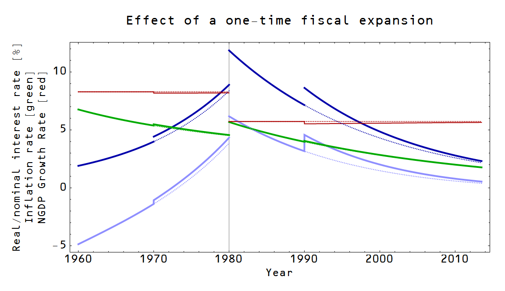
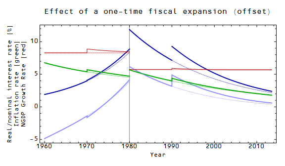
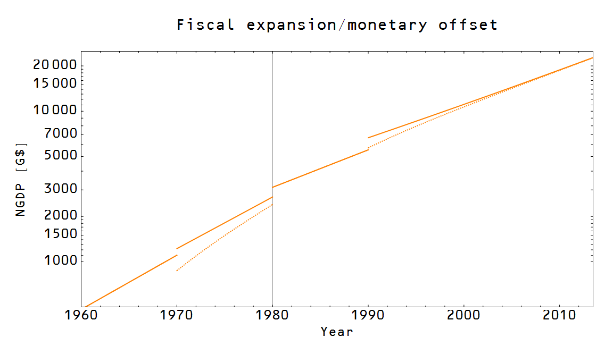

This is a fiscal follow-up to my [monetary expansion post](http://informationtransfereconomics.blogspot.com/2014/01/strange-new-monetary-worlds.html). What does a one-time fiscal expansion do to interest rates, inflation, etc?

Well, if there isn't a negative NGDP shock that it is compensating for, it basically does what economists say it does: it raises interest rates (dark blue curve). It increases NGDP at the expense of reducing NGDP growth. There is a weak impact on inflation (green curve), raising it only a little. What if it is offset by a simultaneous comparably-sized monetary contraction? This is where it gets interesting. If the monetary base is small relative to NGDP (we are in a low information transfer index environment and the quantity theory of money is a good approximation ... i.e. Robert Barro's "[regular economics\*\*](http://uneasymoney.com/2014/01/23/barro-and-krugman-yet-again-on-regular-economics-vs-keynesian-economics/)"), then it almost completely offsets the impact on interest rates (dark blue). In a world with a large MB relative to NGDP (where the IS/LM model is a better approximation, i.e. "[irregular economics\*\*](http://krugman.blogs.nytimes.com/2011/08/25/irregular-economics/)"), the offsetting effect of the monetary expansion is reduced.

The effect is better seen in a graph of NGDP. The effect of fiscal expansion is shown as the solid orange line, while the effect of fiscal expansion and monetary offset is the dotted line. Basically, what you see here is that the monetary contraction has to be bigger than the fiscal expansion in a high information transfer index environment, but can be much smaller than the fiscal expansion in a low information transfer index environment.

It is interesting to note that the idea of monetary offset comes from a time when the quantity theory of money was a good approximation.

\*\* What is that [sarcasm mark](http://en.wikipedia.org/wiki/Irony_punctuation) again?
