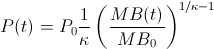

I [commented on my own post](http://informationtransfereconomics.blogspot.com/2014/01/counterfactuals-and-natural-experiments.html) about the fact that MB/NGDP ought to be the primary variable to describe an economy based just on [dimensional analysis](http://en.wikipedia.org/wiki/Dimensional_analysis#A_simple_example:_period_of_a_harmonic_oscillator) and quickly realized that the equation of exchange is just _MB/NGDP = k P_ _MB/NGDP = k,_ so, well, duh. \[Thanks Mike for catching the typo in the equation.\] But that sent me down the rabbit hole of trying to show a graph that captures the picture in my head. The best result was this graph of the price level versus the monetary base:

The graph has the (normalized) data for several countries (US, EU, Sweden, Australia, Japan, Canada as well as the US 1929-1944 as colored points) along with the fits (dashed lines) to the function:

We can see that as the monetary base grows, the price level flattens out. Note that the model fit lines actually happen on a 3D surface (you can see they sidle back and forth a bit in places), so here is the same data along with the 3D plot of the function above (_σ = MB/MB0_):

_P__MB_[rotate the 3D image](http://informationtransfereconomics.blogspot.com/2014/01/three-dimensional-thinking.html)

