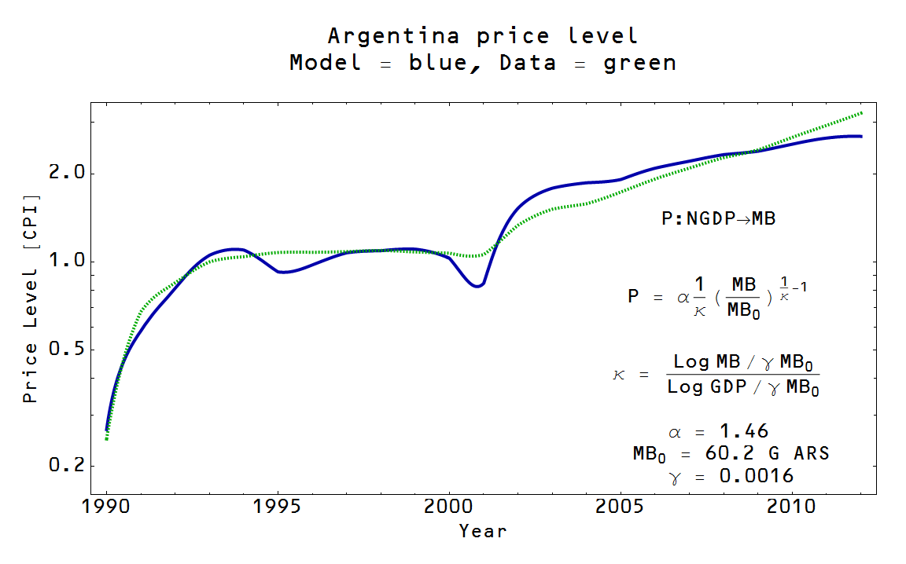

> Joke told at a talk: there are 4 kinds of economies: rich economies, poor economies, Japan, and Argentina.
> — Daniel Schlozman (@daschloz) [January 27, 2014](https://twitter.com/daschloz/statuses/427917763588677632)

The title reference is a joke I read on twitter (I'm now [@infotranecon](http://twitter.com/infotranecon)) via [Matthew Yglesias](https://twitter.com/mattyglesias); it prompted me to see if the information transfer model worked for Argentina. It works quite well across the years for which there is data (green = CPI data, blue = model result):

However, there are news reports lately that Argentina's inflation rate is not faithfully reported by the government (especially since 2008, or so they say) -- [a 26.6% expected rate is only shown as a 10.9% official rate](http://www.nytimes.com/2011/02/06/world/americas/06argentina.html) in the inflation numbers \[1\]. Conservative groups like the Cato institute say [the rate is even higher](http://www.ft.com/cms/s/0/6b36d7c8-845e-11e3-b72e-00144feab7de.html). (Though their methodology is suspect -- how do you obtain a "black market" exchange rate? It would seem that there is a premium charged to wealthy individuals that wish to evade capital controls.) The 2008 date for distrusting the official statistics is also interesting; the populist Kirchner took office in December 2007. Is this all part of some sort of global elite consensus that dislikes policies for the poor? The information transfer model shows that while the monetary base is growing at an average of 25.6% per year since 2008, it could be consistent with the inflation rate of 8.7% in the official statistics through 2012 (in the graph above). What should we believe?

Truth be told, we should probably hold back on any conclusions. [Macro data is fairly uninformative](http://noahpinionblog.blogspot.com/2013/04/the-reason-macroeconomics-doesnt-work.html), especially over a short period in a single country. I decided to do a little more analysis anyway and dust off the [information transfer hyperinflation model](http://informationtransfereconomics.blogspot.com/2013/09/hyperinflation.html) \[2\] and test a question: did the hyperinflation start before or after the election of Kirchner? In the plot below, I show two fits to the hyperinflation model (starting in 2008 = dotted red and started after 2004 = dotted blue) as well as the expected path from the model fit at the top of this post (blue dashed line):

I would say that the non-hyperinflation model is ruled out fairly decisively. It effectively predicts a Japanese style lost decade. The two hyperinflation scenarios warrant some discussion. The pre-Kirchner hyperinflation scenario (blue) fits with the early data and is more consistent with the 26.6% inflation above (it has an average of  20.4% inflation 2012-2014). The post-Kirchner hyperinflation scenario (red) is actually more consistent with the official statistics (a 12.0% inflation rate vs 10.6%). So that leaves a dilemma for the proscriptive economists: trust the official data and blame Kirchner or keep the estimates and place the blame elsewhere?

I'd like to reiterate that the macro data isn't that informative so it's really hard to draw any conclusions. However, I think it is an interesting way to think about what is going on. As for Japan (per the title), [the model already did a good job](http://informationtransfereconomics.blogspot.com/2013/09/the-mystery-of-japanese-monetary-base.html):

\[1\] I used numbers from the IMF and FRED (Argentina's monetary base).

\[2\] The hyperinflation model essentially posits that the monetary base is [exogenous](http://informationtransfereconomics.blogspot.com/2013/10/exogenous-and-endogenous.html)  -- changes to the base come from decisions that do not hinge on macroeconomic variables (the central bank stops taking information from the economy) -- while aggregate demand is endogenous. The basic model used to get the first graph at the top of this post posits that both are endogenous.
