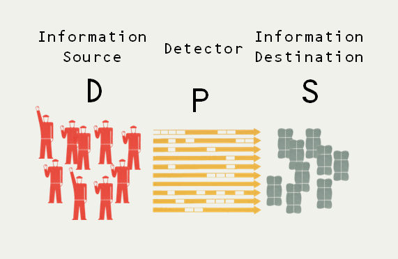

Apparently [François Hollande](http://fsaraceno.wordpress.com/2014/01/15/jean-baptiste-hollande/) has gone and dug up some debunked economic theory. Instead of rehashing the silliness of the idea that "supply creates it's own demand", I'd like to take a moment to point out that if one thinks in terms of the information transfer framework, [Say's law](http://en.wikipedia.org/wiki/Say's_law) (as it's known) never should have come up in the first place.

There are people who like to defend Say by saying Say didn't say that and it really was Keynes who put those words in his mouth, but really, what Keynes said is an excellent distillation of what Say says over the course of a paragraph:

> _It is worthwhile to remark that a product is no sooner created than it, from that instant, affords a market for other products to the full extent of its own value. When the producer has put the finishing hand to his product, he is most anxious to sell it immediately, lest its value should diminish in his hands. Nor is he less anxious to dispose of the money he may get for it; for the value of money is also perishable. But the only way of getting rid of money is in the purchase of some product or other. Thus the mere circumstance of creation of one product immediately opens a vent for other products. (J. B. Say, 1803: pp.138–9)_

What Say says here is that the supply of one product immediately creates a demand for money which immediately creates a demand for other products. Now any one product is going to be a small segment of the economy so "other products" can be approximated closely by "products"; demand for products in general is "aggregate demand". Say also says that money performs "but a momentary function", effectively meaning that the intermediate transaction, according to Say, is not relevant to the overall transaction. Additionally if A → B → C (with "momentary" B) then saying the process is A → C is perfectly valid. Finally, replacing the supply of one product with the aggregate supply in the economy (since it is purportedly true for each product in the economy), we are left with "aggregate supply creates aggregate demand", or Keynes' version of Say's law.

After this long trip, the main point I wanted to make is that in the [information transfer framework](http://informationtransfereconomics.blogspot.com/2013/04/supply-and-demand-from-information.html) the supply is a destination for information. Say's law is effectively saying that a thumb drive creates the jpeg that will be stored on it. It is actually the demand that is the source of the information and the jpeg creates the demand for a thumb drive which creates incentives for the production of a supply of thumb drives. Prices are a means to detect the transfer of information from the supply to demand, allowing the coordination economic activity to solve the resource allocation optimization problem (how many jpegs and thumb drives given the needs of the rest of the economy).

