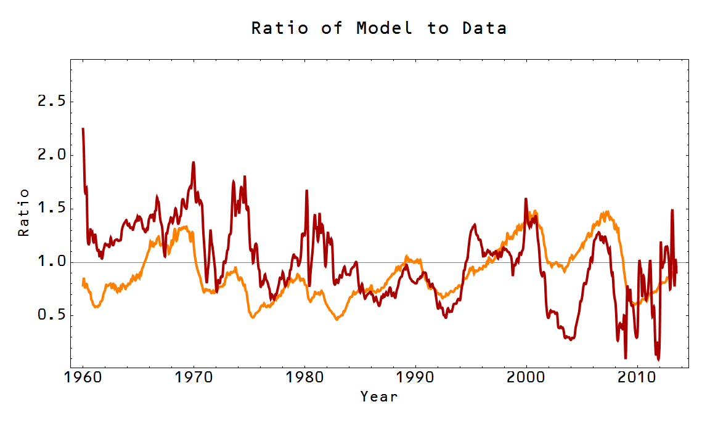

This is partially a follow up to the previous [two](http://informationtransfereconomics.blogspot.com/2014/01/an-information-transfer-framework.html) [posts](http://informationtransfereconomics.blogspot.com/2014/01/an-information-transfer-framework_18.html) with the [unemployment rate model](http://informationtransfereconomics.blogspot.com/2013/11/the-labour-supply-part-2.html) update to 2014 and partially a clarification about what is and isn't explained by the information transfer model. Here is the unemployment rate model (the "natural rate" is the blue curve that comes from the information transfer model, while the data is in green):

The information transfer model doesn't explain the "business cycle" or the series of [shocks](http://informationtransfereconomics.blogspot.com/2013/07/extracting-nominal-shocks.html), or even the obvious regularity in the recovery from high unemployment. These deviations likely occur because the market imperfectly transfers information and that imperfection could be explained by e.g. expectations-based theories or behavioral economics. These same kinds of fluctuations occur in e.g. the interest rate market:

One interesting observation I had was that there appears to be some correlation in the fluctuations in these two markets (taking the ratio of the model and the data, unemployment rate in orange, interest rate in red):

There is probably a piece that is highly correlated because of the business cycle as well as fluctuations in the market itself (e.g. interest rates have some much higher frequency fluctuations that would be due to Fed announcements while the unemployment rate is unaffected or affected with a lag).

Additionally, the information transfer model trends could be [bounds](http://informationtransfereconomics.blogspot.com/2013/12/this-plucking-model.html) (like Friedman's "plucking model") on the observed world. This makes a great deal of sense if one looks at the underlying information theory: information received at the destination must be less than or equal to the information transmitted from the source. Only in the limit of perfect information transfer are these exactly equal. The size of the deviations could give us a measure of how imperfect the information transfer is.
