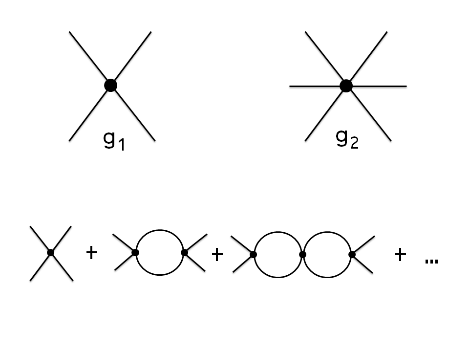

According to Bennett McCallum \[1\], the quantity theory of money (QTM) is the macroeconomic observation that the economy obeys long run neutrality of money (it's not just _MV = PY_).  This Implies supply and demand functions will be homogeneous of degree zero, i.e. ratios of $D$ to $S$ such that if $D \rightarrow \alpha D$ and $S \rightarrow \alpha S$ then $g(D,S) \rightarrow \alpha^{0}&nbsp;g(D,S) = g(D,S)$. The simplest differential equation consistent with this observation is

We can identify the RHS with the price level $P$ (ratio of NGDP to the money supply the exchange rate for the marginal unit of AD for the marginal unit of AS should be proportional to the price level). The solution (for varying D and S) is $D \sim S^{1/\kappa}$, or

If we take _D = NGDP_ and _S = MB_, this equation does well over segments of the price level, with different values of _κ_ (which I'll just call the IT index for now): 

If we let $\kappa$ become $\log S / \log D$ \[2\] then with $D, S \gg 1$ and $\alpha$ small (i.e. small changes in NGDP or MB), there is still approximate short run homogeneity of degree zero. Additionally with _S, D → ∞_ with _S/D_ finite, we have "long run" homogeneity of degree zero in a growing economy \[3\]. And it turns out the best fit to the local values of _κ_ is approximately _log MB/log NGDP_ (measured in billions of dollars):

But why should we be satisfied with (1)? In Part II, we'll motivate the equation via information theory. In this Part I, we'll resort to one of my favorite topics from physics: _[effective field theory](http://en.wikipedia.org/wiki/Effective_field_theory)_.

A general homogeneous differential equation (of first order) is given by

Where $g$ is an arbitrary function. This would capture any possible (first order) theory of supply and demand for money with long run neutrality. A Taylor expansion of $g$ around $D = S$ results in an equation of the form

Note that higher order derivatives by themselves are not consistent with homogeneity. If we take _D→α D_, _S→α S_ means that _d²D/dS² → (1/α) d²D/dS²_. Terms like _D d²D/dS²_ would be necessary, which we'll subsume into "generalized" second order terms.

[Lagrangian](http://en.wikipedia.org/wiki/Lagrangian)

where all terms we consider must be consistent with Lorentz symmetry (i.e. special relativity, this theory is also symmetric under charge symmetry as well); the resulting theory is guaranteed to be consistent with Lorentz invariance. This way of coming up with particle theories is called an effective field theory. Generally, one writes down every possible term consistent the symmetries under consideration. Our process with equation (3) was analogous to writing down every consistent with long run neutrality of money (analogous to a symmetry).

The higher order terms in field theory (4) represent higher order interactions (2, 4-particle, etc interactions with coupling constants $g_1$, $g_2$). They tend to be "suppressed" (in physics) because the coefficient has dimensions of mass and that mass is considered "heavy". The higher terms (degree > 2) in the Lagrangian represent vertices (interactions) in Feynman diagrams.

It is possible that the analogous terms in our long run neutrality of money (money invariance) theory (3) represent three or more party transactions which would be heavily suppressed by the existence of money (you'd likely trade apples for money and then get oranges with some of that money rather than work out some complicated contract between the three parties allocating money, oranges and apples). I.e. the higher order coefficients $c_2$, $c_3$, ... might be suppressed by factors of _1/MB_ (!) where _MB_ is the size of the monetary base (how much money is out there). 

The previous paragraph is just reasoning to justify taking  $c_2$, $c_3$, _... = 0_ \[4\]. But the best reason to do so is that the model fits the empirical data! If we use _κ = log S/log D_, then equation (2) does an excellent job of describing  the price level:

In Part II, we'll motivate (1) with information theory.

\[1\] _Long-Run Monetary Neutrality and Contemporary Policy Analysis_ Bennett T. McCallum (2004)

\[2\] This prescription of _κ = log S/log D_ is reminiscent of the beta function in quantum field theory; it is motivated by empirical evidence and the information theory in Part II because _κ_ is the ratio of the number of symbols used to describe _S_ to the number of symbols used to describe _D_. In an older post, I refer to it as the unit of account effect when used to describe the price level: the size of the money supply defines the unit of money in which aggregate demand is measured.

\[3\] Series expansions around _α_ ~ 0 have a small coefficient for the linear term (if _S, D >> 1_) and the limit as _S, D → ∞_ is independent of  _α._

\[4\] We'll take _c0_ to be zero, too. Although we shoud be careful. Einstein famously took the equivalent of _c0_ (the [cosmological constant](http://en.wikipedia.org/wiki/Cosmological_constant)) in general relativity to be non-zero in order to allow a steady-state universe. He later regretted that action, but more recent results show that it is not actually zero, but very very close.
