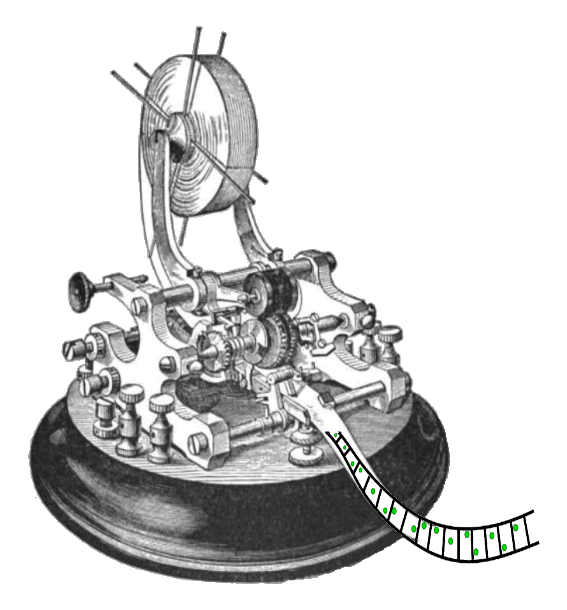

[In Part I](http://informationtransfereconomics.blogspot.com/2014/02/i-quantity-theory-and-effective-field.html), we started with an empirical macro observation: the long run neutrality of money. There are many macro relationships that have followed from empirical study like the [Phillips curve](http://en.wikipedia.org/wiki/Phillips_curve) and [Okun's law](http://en.wikipedia.org/wiki/Okun%27s_law). _But,_ asked e.g. Lucas, _were these relationships consistent with microeconomics?_

Lucas suggested based on the Phillips curve changes that previously observed macro relationships could [change whenever policy changed](http://en.wikipedia.org/wiki/Lucas_critique) \[1\]. A microfounded theory purportedly avoids this by determining how people respond to changes in policy (hence the reason that the Lucas critique tends to be interpreted as saying you must have microfoundations). That is a potential solution.

There is another way: assume ignorance. That is assume [the principle of indifference](http://en.wikipedia.org/wiki/Statistical_mechanics#Fundamental_postulate): given the macrostate information you know  (NGDP, price level, MB, unemployment, etc), assume the system could be in any microstate consistent with that information with equal probability \[2\]. In Bayesian language, this is the simplest non-informative prior. This way lies statistical mechanics, thermodynamics and information theory.

We can see these two paths: assume ignorance about the microfoundations and derive what conclusions that will hold under most microfoundations, or assume particular microfoundations and see what macrostates result.

However we can also see the Sisyphean aspect of the microfoundations program. Since the macrostate represents a loss of information relative to the microstates, many different microfoundations will lead to the same macrostate ... or another way, the details of _**even the correct microfoundations**_ are lost.

How do we know the details of the microfoundations are lost? The efficient markets hypothesis. At least in the sense that I rationalize [both Fama and Shiller winning Nobel prizes](http://noahpinionblog.blogspot.com/2013/10/if-fama-were-newton-would-shiller-be.html) in economics. The EMH (put one way) is the idea that price data is maximally uninformative. Note: that is **_maximally_** uninformative, not **_completely_** uninformative. How else could there be things Shiller found like long run trends, mean reversion and momentum? 

Equilibrium in thermodynamics represents a state of maximum entropy (ignorance) about initial conditions of the system: all we know are "conserved quantities" i.e. properties of the macrostate. Well, we could know more ... and knowing more would theoretically allow you to extract useful work from that knowledge. Consider Bennett's information powered engine \[3\].

Imagine a tape of double-sided pistons with a separating wall and a single atom (green) on one side (see top of the diagram). One side of the wall is labelled 0 and the other 1. Knowledge of which side the atom is on can be converted into work by performing the compression cycle given in the bottom of the diagram. This work could theoretically be used to power a vehicle (I changed the vehicle from Sethna's \[3\] train in the picture below):

How does an information powered warp drive engine relate to the EMH? Supposedly if you knew the series of price movements, you could beat the market by using that information (which becomes useless after you used it). However, this is about as likely as turning knowledge of all the positions of all the gas molecules in a room into useful work.

One more analogy before we get back to microfoundations. One way to see biology is as a process by which living things intercept entropy (free energy) flows. An autotroph converts low entropy high energy photons into high entropy waste (heat, low energy photons); a heterotroph converts low entropy organisms into high entropy waste (heat, poop). Economic agents intercept entropy (information) flows: they convert low entropy money into high entropy goods and services.

In living things, the free energy in the photons or sugars is converted into lower free energy products and the information in their original structure is lost. The information in the market (e.g. prices of goods) is converted in to quantities of goods where the prices they were bought at no longer matter (according to the EMH). This information is consumed by the market in the same way free energy is consumed by organisms.

So take the principle of indifference and posit that information flows from the demand to the supply the way the entropy flows through the conversion of high energy photons into low energy photons that is transferred to the environment.

We have the information source (demand) $I_{D} = K_{D} n_{D}$ and information destination (supply) $I_{S} = K_{S} n_{S}$ (here the Hartley information $I = n \log k \equiv K n$ corresponds to the Shannon information when all the states $k$ are equally probable, i.e. indifference). Define an information flow detector (a price) that measures the transfer of information from _D_ to _S_

Take a small demand signal $dD \ll 1$ and a small supply signal $dS \ll 1$ so that $D/dD = n_{D}$ and $S/dS = n_{S}$ with $n \gg 1$ and assume $I_{D} = I_{S}$ (define $\kappa \equiv K_{S}/K_{D}$). So that now we have

Which is the minimal equation we came up with that satisfied homogeneity of degree zero which guarantees the long run neutrality of money in [Part I](http://informationtransfereconomics.blogspot.com/2014/02/i-quantity-theory-and-effective-field.html). This derivation is basically a simplified presentation of [one of the first posts on this blog](http://informationtransfereconomics.blogspot.com/2013/04/the-information-transfer-model.html) \[3\].

Returning to the microfoundations of macroeconomics, we can say that observed relationships that follow from equations of the form (2) represent microfoundation-independent macroeconomic results. They represent what we know given the greatest amount of ignorance about the microfoundations. Additionally, these macroeconomic relationships will be consistent with microeconomics.

I've used the notation _p:D→S_ as a shorthand for these relationships There are a few of these we've mentioned on the blog (of varying degrees of accuracy):

_[P:NGDP→MB](http://informationtransfereconomics.blogspot.com/2013/07/dotting-is-and-crossing-ts.html)_ 

> _Price level ([quantity theory of money](http://informationtransfereconomics.blogspot.com/2013/07/recovering-quantity-theory-from.html), [liquidity traps](http://informationtransfereconomics.blogspot.com/2013/09/the-liquidity-trap-and-information-trap.html) and [hyperinflation](http://informationtransfereconomics.blogspot.com/2013/09/hyperinflation.html))_

_[r:NGDP→MB](http://informationtransfereconomics.blogspot.com/2013/08/the-interest-rate-in-information.html)_ 

> _Interest rates (part of the [IS-LM model](http://informationtransfereconomics.blogspot.com/2013/08/deriving-is-lm-model-from-information.html))_

_[P:NGDP→L](http://informationtransfereconomics.blogspot.com/2013/08/scott-sumners-model-part-2_30.html)_ 

> _Labor market (leads to Okun's law)_

_[P:NGDP→U](http://informationtransfereconomics.blogspot.com/2013/11/the-labour-supply-part-2.html)_ 

> _Unemployment (less accurate than the labor market version, but gives an interesting interpretation of the [natural rate of unemployment](http://informationtransfereconomics.blogspot.com/2013/11/the-labour-supply-part-2.html))_

Note that the [Phillips curve](http://informationtransfereconomics.blogspot.com/2013/10/the-phillips-curve.html) follows from looking at the price level market and the labor market, and you can see the changes over time (the gradual flattening) is predicted by the theory.

\[1\] We found a way to predict these changes based on the unemployment market mentioned at the end the post.

\[2\] Under e.g. different assignments of initial endowments. In [this earlier post](http://informationtransfereconomics.blogspot.com/2013/08/econophysics-for-fun-and-profit.html) I discuss the idea from Foley and Smith that economics grew up with special consideration for initial endowments and thus a predilection for studying irreversible processes rather than reversible ones that dominated physics.

\[3\] Citations: I borrowed the nice pictures from _Entropy, Order Parameters, and Complexity_ by James P. Sethna (2006), which are based on pictures in the _Feynman Lectures on Computation_ (which is based on work by Charles Bennett). Some of the discussion is based on those works as well. The derivation of the equations follows from work by Fielitz and Borchardt who developed the the original information transfer model of physical processes.
