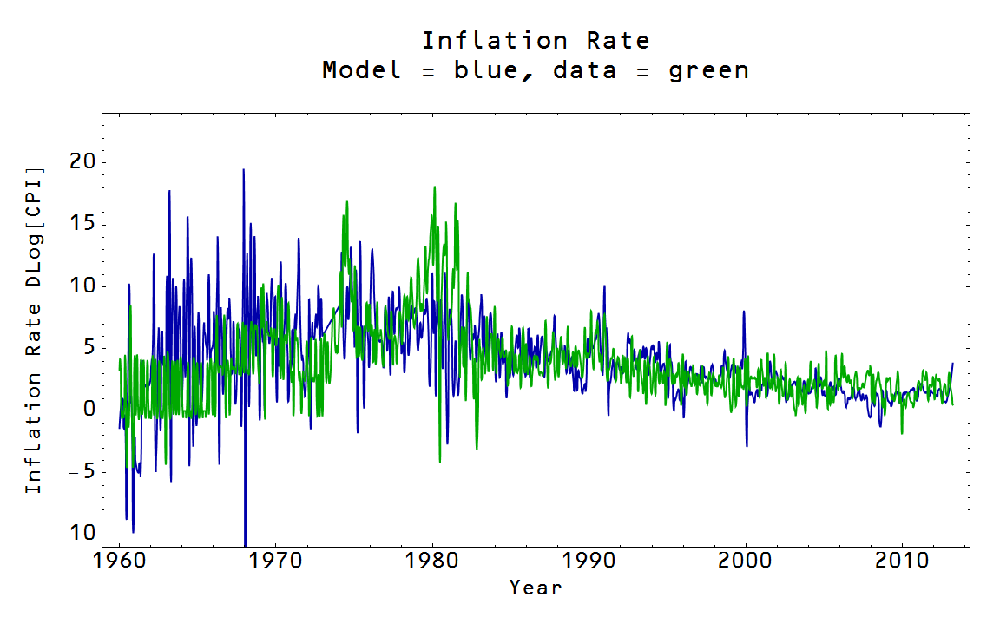

In the [last post](http://informationtransfereconomics.blogspot.com/2014/02/the-role-of-central-bank-reserves-in.html) I found an error (made a discovery?) about which monetary aggregate to use when modelling the price level and said I would update several results from the past blog posts. I thought I would first update [this post](http://informationtransfereconomics.blogspot.com/2013/10/the-1970s.html) on expected RGDP growth using currency in circulation instead of the adjusted monetary base including reserves. First the price level fit from the last post gives a much better account of inflation (model is blue, data is green):

Next, the post on expected RGDP posited a counterfactual straight-line path _S(y)_ in _(MB, NGDP)_ space, where now the base includes only currency, and used that path to derive several results. Here is the RGDP growth path graph:

One thing to note is that the US is only near the "information trap" line now (the condition where _∂P/∂MB = 0_ that is [roughly equivalent to a liquidity trap](http://informationtransfereconomics.blogspot.com/2013/09/the-liquidity-trap-and-information-trap.html)). The path results in a slowly falling expected RGDP growth (black line) in the post-war period (again, model results are blue, RGDP growth data is green):

There are no drastic changes to the conclusions; most dealt with long term trends. The base reserve component would only matter after 2008 since it was a small (proportional) piece of the adjusted monetary base.
