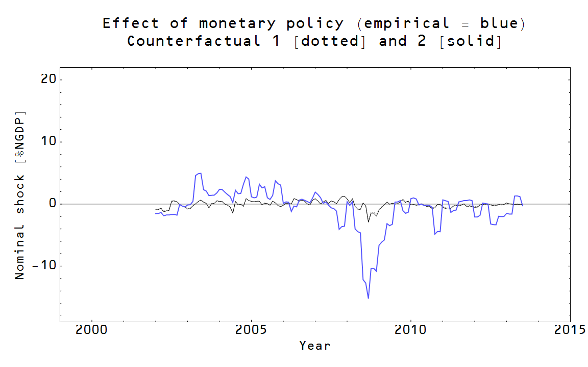
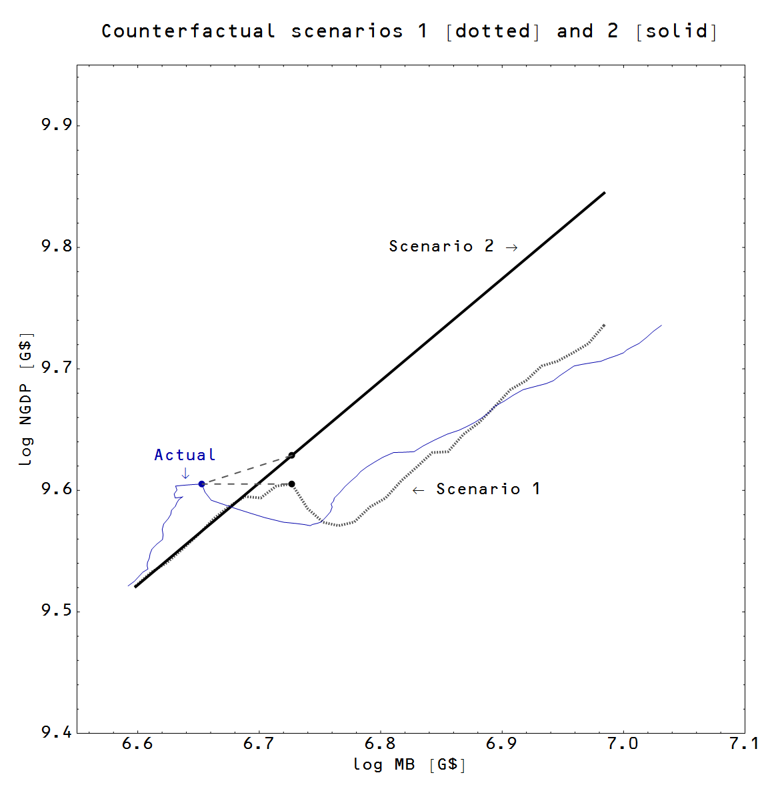

With the release of the Fed transcripts from the September 16th 2008 meeting, a narrative of the Fed worrying about commodities inflation distracted it from the worsening economic situation is forming. Here are e.g. [Matthew Yglesias](http://www.slate.com/blogs/moneybox/2014/02/19/_2008_fomc_transcripts.html) and [David Glasner](http://uneasymoney.com/2014/02/07/now-we-know-ethanol-caused-the-2008-financial-crisis-and-the-little-depression/).  In general this is part of a larger monetarist narrative that the Fed caused the recession and the financial crisis with tight monetary policy prior to September 2008. Here fore example is [Scott Sumner](http://www.themoneyillusion.com/?p=24946).

In this post I will analyze this scenario with the information transfer model. First, I will look at the direct effect of monetary policy on NGDP and the price level. One issue is determining what the counterfactual monetary policy would have been. I chose a linear extrapolation from 2006 as this counterfactual. A second issue is the counterfactual for NGDP: was the shock an exogenous shock (i.e. independent of monetary policy) or not (i.e. potentially caused by monetary policy). Due to this ambiguity, I decided to do the calcuation two ways: NGDP had empirical path (scenario 1: NGDP shock was exogenous -- not due to monetary policy) and NGDP had a counterfactual path (scenario 2: no exogenous NGDP shock) \[2\]. 

Turns out both gave me the same answer, so we can be fairly confident about the effect of monetary policy. I used [this procedure](http://informationtransfereconomics.blogspot.com/2014/02/extracting-shocks-again.html) to extract NGDP shocks. Here is the effect of monetary policy relative to the counterfactual in scenario 1 (the effect of monetary policy is dashed blue relative to the counterfactual solid blue line, the gray shaded area is the actual shock):

Here is the effect of monetary policy relative to the counterfactual in scenario 2 (same key to the graph as above):

Both of these result in the same impact on NGDP (this graph shows the difference between the dashed curves and the solid curves in the previous two graphs in black and the actual shock in blue):

From this analysis, base adjustments resulted in a peak -3% of GDP shock, but that is only about 10% of the required shock (integrated) or 23% of the required shock (amplitude). Therefore the direct impact of monetary policy through the price level (the quantity theory of money) is insufficient to account for the entire shock. There is another potential source of a shock from monetary policy: [interest rates](http://informationtransfereconomics.blogspot.com/2014/02/the-link-between-monetary-base-and.html). Here I show the effect scenario 1 (dashed black) and scenario 2 (solid black) on the long term interest rates and the short term interest rates (green, which is shown relative to the long term rate):

The Fed was effectively raising interest rates gradually from well before the onset of the financial crisis by having the base grow more slowly than NGDP. Short run rates followed long run rates up until the first rounds of QE. If we use the [IS-LM model](http://informationtransfereconomics.blogspot.com/2013/08/deriving-is-lm-model-from-information.html), we can get an estimate of the impact of this interest rate increase. Begin with the IS market equation: 

Essentially the percent increase in the interest rate $r$ is equal to $\kappa_{IS}$ times the percent decrease in output. Now we don't know what $\kappa_{IS}$ (it is effectively the slope of the IS curve, and estimates tend to cluster around 1, but can be as high as 5, see e.g. here \[1\]), but if we assume $\kappa_{IS} \sim 1$ then our approximate 10% change (about 50 basis points) in the 10-year interest rate (which was averaging 4.7% for the two years prior to the financial crisis) would result in a shock of 10%. Coupled with the 3% shock due to the base adjustment above, this would account for all of the shock that caused the Great Recession. ([The 25 basis point adjustment referred to as Alternative A](http://www.slate.com/blogs/moneybox/2014/02/21/rosengren_at_fomc_meeting.html) at the last meeting would have reduced the impact by about half.) 

So according to this analysis the Fed is to blame, acting through the interest rate channel. An exogenous shock from the financial crisis is not necessary to account for any additional shock to NGDP. This is effectively Sumner's view above, however I don't think he'd agree with my use of the IS-LM model! The unfortunate thing is that after the shock occurred, we ended up [mired in a liquidity trap](http://informationtransfereconomics.blogspot.com/2014/02/the-link-between-monetary-base-and.html). 

\[1\] Comparative Performance of U.S. Econometric Models (1991) Edited by Lawrence R. Klein

\[2\] PS: Here is another representation of the counterfactuals (scenario 1 dotted and scenario 2 solid black) and the actual path (blue):

