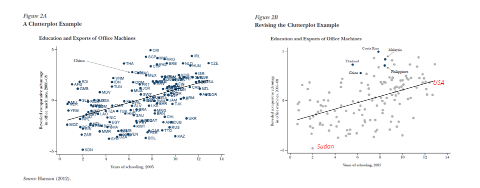
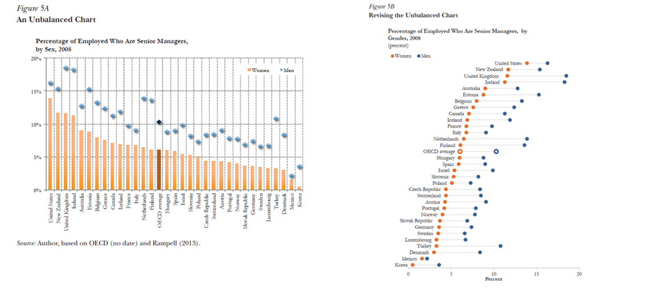
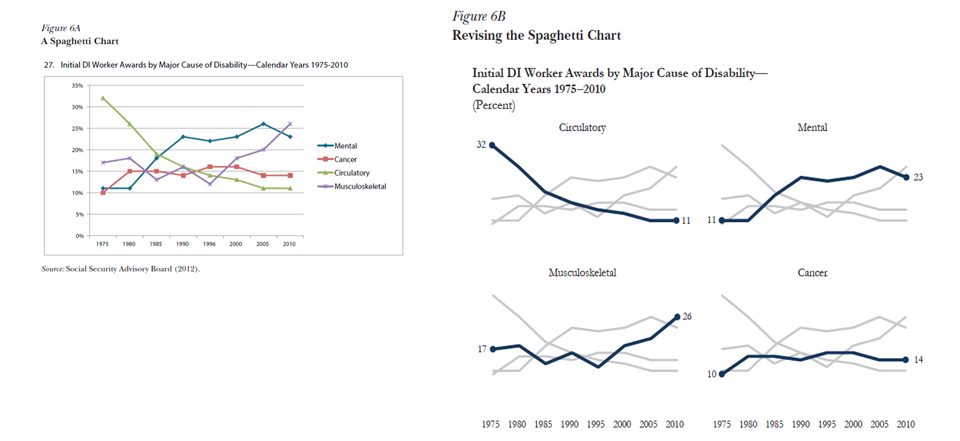
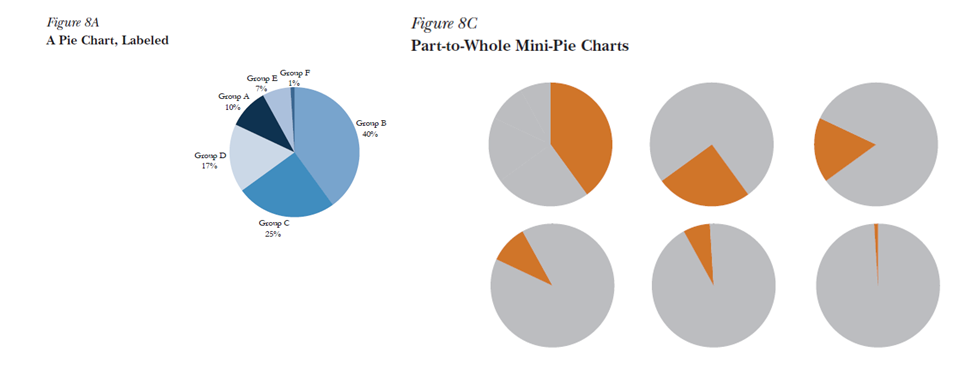
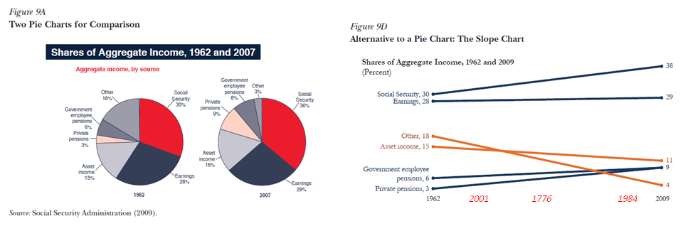

The point of data visualization is to enhance the information content, aid insight and potentially enable others to discover stuff you didn't even notice. It is not to let you live out your graphic designer fantasies. A lot of graphs these days are committing the data analysis equivalent of architects [leaving handrails off stairs](http://www.google.com/search?q=stairs+without+handrails&tbm=isch). Sure, it looks nice, but it's dangerous!

Disclaimer: I attended an Edward Tufte seminar a few years ago, and I thought it was cool that he passed around a first edition of Galileo's _Starry Messenger_. However! I think the infographic set has lost the plot. I am going to pick on [Jonathan Schwabish](http://pubs.aeaweb.org/doi/pdfplus/10.1257/jep.28.1.209) not because he is the worst offender, but because he was the offender most recently [tweeted](http://twitter.com/JustinWolfers/status/431090865386184704). Some of the improvements Schwabish suggests (shown on the right in the graphs below) really do make things better, but many seem to be aesthetics trumping information content.

**Scorched-earth conclusion fascism**

I have a great idea! Let's randomly highlight a few points that are +1 sigma above the trend while destroying all the information about the trend itself. How do I know what to make of China, &c if I don't know what any of the other data points are? Apparently Schwabish is going to tell me and I just have to sit there and listen passively.

**Can I haz gridlines?**

Graphs like the one on the left make me ill, and I'll admit the new graph is a bit of an improvement. The top of the "improved" graph is way too far away from the axis. Grid lines were invented to solve this problem. And friends don't let friends sort bivariate data on one of the variables. Sort on the gender gap (or other function of both variables) or plot in two dimensions. 

**Can I haz axes?**

**Can I haz labels of any kind?**

**Now you're just making $#!T up.**

Social security income went up linearly as a fraction of income from 1962 to 2009? I don't think so. But Schwabish is implying it while the SSA is not. Are "asset income" and "other" are so closely related that they should be color coded a different color than the other data? Sure they've fallen as a fraction of income, but have they fallen overall or is it just because other kinds of income have increased while they stayed the same? There is so much implied by this graph that is not supported by the data it presents.

Sure, I've made [some mistakes](http://informationtransfereconomics.blogspot.com/2013/07/fiscal-and-monetary-stimulus.html) on this blog, but your graphs shouldn't have a cleaner look than your data. And economists take note: your data is rather dirty.
