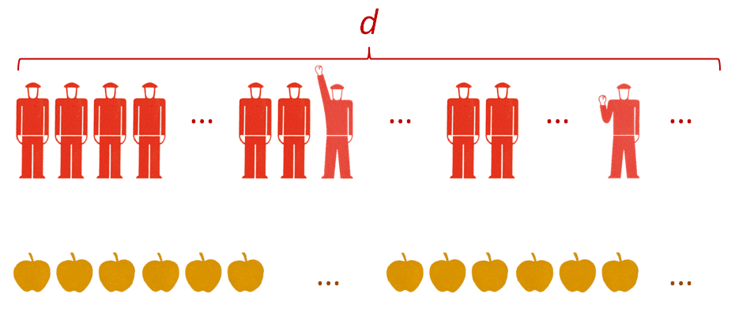

I was [asked by Nick Rowe](http://worthwhile.typepad.com/worthwhile_canadian_initi/2014/03/coordination-and-the-demand-for-money.html) to explain where the information comes in:

> _"If I trade an apple for a banana, there is supply and demand, but where does information come into it?"_

My initial reply on the post was less clear than I'd like, so I'm going to try and do better here. First we'll start with a single good (apples).

Let's say there are d potential apple buyers, labelled 1, 2 ... $d$. Selling one apple to #42 uncovers $\log_{2} d$ bits of information (the number of bits required to describe the ID number). Selling a second apple to #42 uncovers another $\log_{2} d$ bits of information for a total of

$$ 
\log_{2} d + \log_{2} d = 2 \log_{2} d 
$$
bits of information. Selling a third apple to #1005 uncovers another $\log_{2} d$ bits of information, and so on, until we've sold $n_{d}$ apples and uncovered $n_{d} \log_{2} d$ bits.

This uncovered information is transferred from the buyers (the demand) who ostensibly know how much they'd like to buy (at a given price) to the sellers (the supply) who only have some vague idea of the size of the apple market after they start to sell some apples (or do a little market research).

The optimal way to register this information would be to keep a log of each apple and each buyer's ID number. In that case, the information captured by the supply would be

$$ 
\text{(1) }I_{d} = &nbsp;n_{d} \log_{2} d 
$$

However, the suppliers don't actually know the size of their market d so they actually capture

$$ 
\text{(2) } I_{s} = n_{s} \log_{2} s \leq n_{d} \log_{2} d 
$$

bits of information where $s$ could be e.g. the sellers' estimate of $d$ \[1\]. We have $I_{s} \leq I_{d}$. In an ideal world, this would be equality. If only there were something that existed to help gauge the size of the market for a product allowing a seller to capture all the information ... (hint: it's called money).

Which reminds me, we haven't actually discussed what the buyer's are buying these apples with yet. We'll start with Nick's suggestion of using a banana to buy an apple. In that case the informaton the sellers collect (by acquiring a banana from the apple buyer) is

$$ 
n_{b} \log_{2} b = n_{s} \log_{2} s 
$$

where $b$ is the number of potential banana buyers. We can use this to determine the "exchange rate" (the price of a banana in terms of apples). If we take the smallest unit of bananas to be $dB$ so that $B/dB = n_{b}$, then

$$ 
B \log_{2} b = S \frac{dB}{dS} \log_{2} s 
$$

where $n_{s} = S/dS$ the number of apples supplied to the apple buyers. If we assumed the market for apples bananas is about the same size as the market for apples, we could say that $\log_{2} b \sim \log_{2} s \sim \log_{2} d$, so that:

$$ 
B \sim S \frac{dB}{dS} \leq n_{d} 
$$

where $dB/dS$ (where we let $dS$ and $dB$ become infinitesimal) is the "exchange rate" (price) of apples to bananas. What if the apple buyer gave the apple seller something else instead of bananas? Well, starting with equation (2) you'd have

$$ 
n_{s} \log_{2} s \leq n_{d} \log_{2} d 
$$
$$ 
\frac{S}{dS} \log_{2} s \leq \frac{D}{dD} \log_{2} d 
$$
$$ 
\frac{dD}{dS} \leq \frac{\log_{2} d}{\log_{2} s} \frac{D}{S} 
$$

We'll call the left hand side the price $P$ (like the exchange rate above) and define $\log_{2} s/\log_{2} d \equiv \kappa$ (the information transfer index). Leaving us with:

$$ 
\text{(3) } P = \frac{dD}{dS} \leq \frac{1}{\kappa} \; \frac{D}{S} 
$$

where we can call $S$ the supply and $D$ the demand.

If we take the thing exchanged to be dollars, then we could potentially take $\log_{2} s \rightarrow \log_{2} m$ where $m$ is the size of the money supply (monetary base). This would allow you to get a really good estimate of the potential market size d by looking at the price (or at least changes in the price) while knowing the size of the money supply.

In the information transfer model, I have typically assumed equality in equation (3) and taken $\kappa$ to be an unknown constant I fit to the data. One notable exception is the money market where I took $d = NGDP$ and $s = MB$ and [used it to describe the price level](http://informationtransfereconomics.blogspot.com/2014/02/the-role-of-central-bank-reserves-in.html). In many of the posts on this blog, I've used the shorthand notation $P:D \rightarrow S$ for a model that transfers information from the demand $D$ to the supply $S$ with price $P$.

PS Some notes:

1\. Equation (1) assumes transactions are maximally uninformative, or equivalently, all microstates with $n_{d}$ apples sold are equally likely. One way of thinking about that is that it [makes the fewest assumptions about potential microfoundations](http://informationtransfereconomics.blogspot.com/2014/02/ii-entropy-and-microfoundations.html).

2\. Equation (3) is the simplest possible relationship between supply and demand that [maintains homogeneity of degree zero](http://informationtransfereconomics.blogspot.com/2014/02/i-quantity-theory-and-effective-field.html) (related to the long run neutrality of money).

3\. Per Nick Rowe's original post, if the network of exchanges collapsed, we'd see a fall in the total amount of information being exchanged so that if we looked at the market $P:AD \rightarrow AS$ for aggregate supply and aggregate demand, we'd see a fall in $AD$ and/or $P$.

4\. Equation (3) above can be solved to [recover supply and demand curves and Marshall's diagrams](http://informationtransfereconomics.blogspot.com/2013/04/supply-and-demand-from-information.html).

\[1\] Footnote added in update 3/14/2014. The _a priori_ estimate information about the size of $d$ would actually have to come from somewhere else. Being strict about it, all the seller would know is that $s$ is **_at most_** the size of the total number of apples he or she has sold and **_at least_** the number of different people sold to. In this way, $s \rightarrow d$, eventually _but only if the market for apples was dominated by a monopoly_. Competitive sellers really can't get at the information about the size of $d$ without some sort of tool to measure the size of the market -- that's what money does. It allows a seller to gauge the size of the market in order to calibrate the information they receive (they don't know if $I_{s} = $ 10 bits or 100 bits) so they can use that information to supply the market. If the price suddenly goes up, the amount of information being received suddenly increases ($I_{s}$ goes from say 10 bits per apple to 20 bits per apple), telling the supplier that demand ($d$) has increased (or supply from all the suppliers has fallen).
