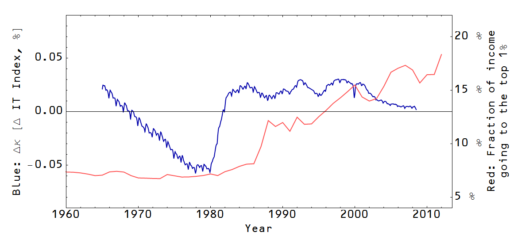

Another speculative post, this time on inequality. I've mentioned inequality before in couple of places (see [\[1\]](http://informationtransfereconomics.blogspot.com/2013/10/is-there-sign-of-inequality-in-price.html), [\[2\]](http://informationtransfereconomics.blogspot.com/2013/12/three-inequality-analogies.html)). This time I plan on using some more fundamental arguments based on the underlying information theory and also use this as an opportunity to generalize the information transfer model. The model uses the Hartley definition of information $I = K n$ where $K = K_{0} \log s$ and s is the number of symbols ($K_{0}$ accounts for the unit of information). Using this definition makes the assumption that all symbols s are equally likely. In general, the Shannon information is 

This accounts for different probabilities of each symbol (the Shannon information reduces to the Hartley definition in the case that all the $p$'s are equal with $p = 1/s$ so that $I = - \log 1/s = \log s$). In the model, the values for K for supply ($K_{S}$) demand ($K_{D}$) are combined into a single "information transfer index"  $\kappa = K_{S}/K_{D}$. Higher kappa is associated with lower elasticity of demand (demand is less responsive to price changes) individual markets as well as price stickiness and less effective monetary policy in macroeconomics. 

My questions were: Can we model consumption/income inequality by having the symbols have unequal probabilities? What effect would that have? We'd imagine the demand symbols (defining $K_{D}$) not being equally distributed with each symbol representing an agent (think of it as an agent's ID). Some agents have more money meaning that their symbol is more likely to be allocated a piece of the supply. We'll take each supply symbol to be equally likely. This makes intuitive sense in the case of single markets as each iPad is the same as any other, or in the macro models as each dollar is the same as any other. In the labor market, this simplification is probably wrong as there are different skills, duration of unemployment, etc. The equal population has all symbols (economic agents) with equal probability. 

I used and extremely simple model of an unequal population where I assigned equal probabilities to every symbol except one ("the rich", the top 1%, etc). Here are couple of sample populations with different [Gini coefficients](http://en.wikipedia.org/wiki/Gini_coefficient):

The math is pretty straightforward (I'll spare you the details), but I managed to derive the rather beautiful result (in terms of Gini coefficient) in the limit $s \rightarrow \infty$ (large number of agents)

Or in terms of [elasticity of demand](http://informationtransfereconomics.blogspot.com/2013/04/the-previous-post-with-more-words-and.html) $e^{D} \sim -1/\kappa \sim G - 1$ \[corrected in update\]

Is there a signal of this effect in macro data? I looked at the difference between the local approximation of kappa fit to the price level compared to a baseline where $\kappa$ is given by $\log MB/\log NGDP$ as I showed [here](http://informationtransfereconomics.blogspot.com/2014/02/i-quantity-theory-and-effective-field.html).  Here is the graph of DELTA kappa alongside the [Picketty-Saez inequality data](http://elsa.berkeley.edu/~saez/):

It's not very convincing, but it was interesting to think about.
