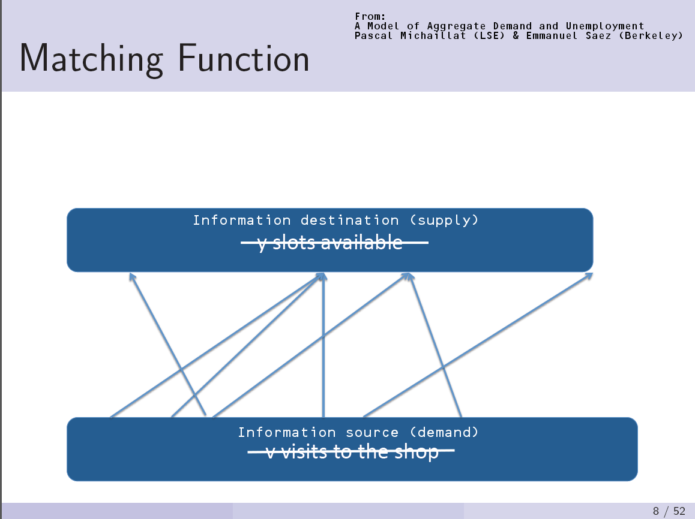
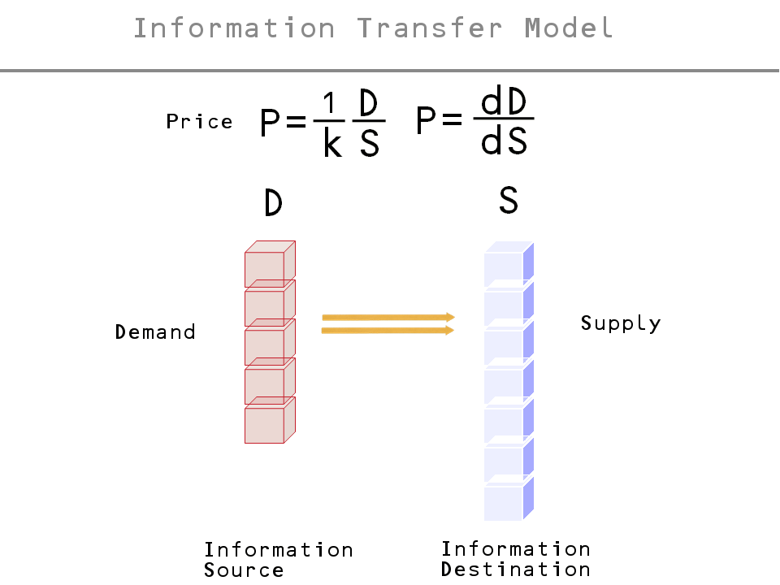

> _**Editor's note, 6 Feb 2017:** This is the beginning of a post that approached the topic incorrectly. I have subsequently wrote up a new approach a couple of years later; it is available [here](https://informationtransfereconomics.blogspot.com/2017/01/matching-theory-and-employment-in.html)._

In looking for inequality data for the previous post, I came across a presentation at [Emmanuel Saez's homepage](http://elsa.berkeley.edu/users/saez/) with the slide that looked very much like the information transfer model turned on its side. It was on matching theory; here is slide from Pascal Michaillat and Saez alongside a slide describing the information transfer model:

I made some suggestive edits to the slide from Michaillat and Saez. Can we use the information transfer model to arrive at the same conclusions as matching theory does in the labor market? Yes, we can. First we'll start with some [matching theory](http://en.wikipedia.org/wiki/Matching_theory_\(economics\)). Essentially, I'd like to derive a matching function in [Cobb-Douglas](http://en.wikipedia.org/wiki/Cobb%E2%80%93Douglas_production_function) form

where $h$ is the number of hires, $U$ is the number of unemployed and $V$ is the number of job vacancies (assuming constant returns to scale, i.e. the exponents are $\alpha$ and $1-\alpha$). The diagram from Michaillat and Saez above shows what we mean by "matching". There are so many job applicants and so many job vacancies and the matching function describes how these match up and turn into new hires. Where do we start in the information transfer model?

...

Please refer to [this post](https://informationtransfereconomics.blogspot.com/2017/01/matching-theory-and-employment-in.html).
