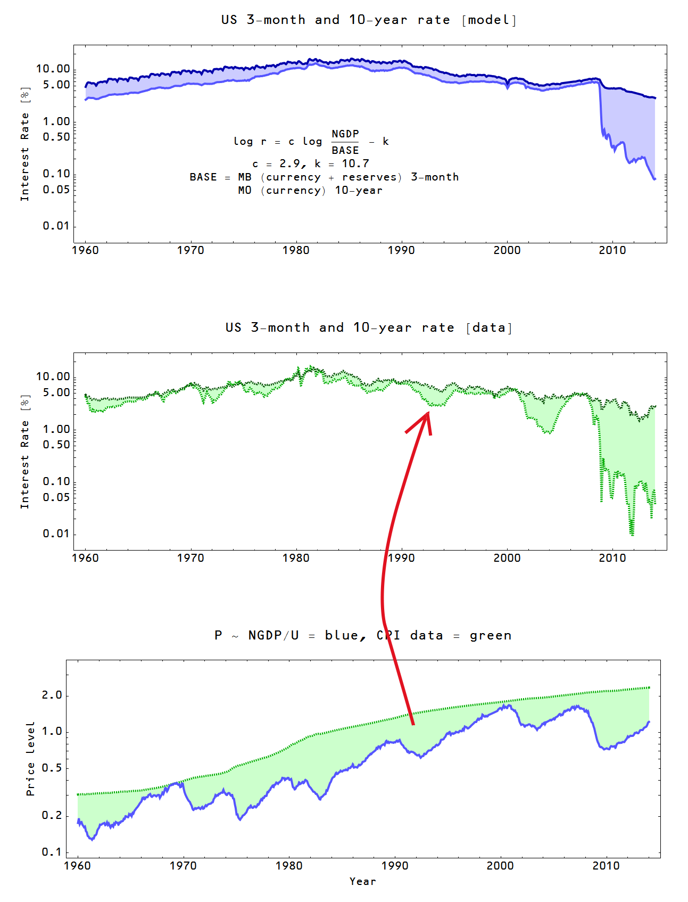

Since I've been heavy into the policy implications of the information transfer model in the past few posts, I thought I'd return to some more speculative research. I've touched on the topic of macroeconomic fluctuations before (see e.g. [\[1\]](http://informationtransfereconomics.blogspot.com/2014/01/what-is-and-isnt-explained-by.html), [\[2\]](http://informationtransfereconomics.blogspot.com/2013/12/this-plucking-model.html)), but I thought I'd do some thinking out loud.

The main idea is that the information transfer model _P:D→S_ with where demand information (_ID_) is equal to supply information (_IS_) represents an upper bound _P_ on the price _P_ in the market\*\*. Since information transferred to the supply can never be greater than the information coming from the demand, the actual price realized _P\*_ in the market is going to [fall below this level](http://informationtransfereconomics.blogspot.com/2013/04/sticky-prices-from-non-ideal.html) (or the supply or demand will fluctuate). If _ID > IS_ for aggregate demand _D_ and aggregate supply _S_, then let's define _0 < ε < 1_ such that _ε_ _ID = IS_ where we will call _ε_  the information transfer efficiency. Our model of macroeconomic fluctuations is then a model of fluctuations in _ε_ where the efficiency in each individual market {_ε1,_ _ε2,_ _ε3_ ...} are all proportional to _ε_. This model will turn out to be at best a first order approximation but interesting nonetheless. Yes, this can be considered just a re-hash of [total factor productivity](http://informationtransfereconomics.blogspot.com/2014/02/phlogiston-economics-is-information.html), but I think macroeconomic fluctuations arising from information transfer inefficiency in the market rather than [animal spirits](http://en.wikipedia.org/wiki/Animal_spirits_\(Keynes\)) or that the [cycle represents a real thing](http://en.wikipedia.org/wiki/Real_business_cycle_theory) is a useful re-framing of the conversation.

To be concrete, we'll look at two markets: _r:NGDP→MB_ (interest rate) and _P:NGDP→U_ (unemployment). _P_ will be described by the CPI less food, energy, _U_ is the total number of people unemployed and _r_ is the 3-month and 10-year interest rate (using the monetary base _MB_ _\=  reserves + currency_ for the former and just the _currency_ component for the latter -- see [here](http://informationtransfereconomics.blogspot.com/2014/02/the-link-between-monetary-base-and.html)). Here are the model fits and the data:

In the interest rate market, the price (interest rate, especially the 3-month rate) appears to do the lion's share of the adjusting to changes in information transfer efficiency _ε_ while in the employment market, the number of people becoming unemployed does the adjusting. This makes intuitive sense: there is an active market for US treasuries while NGDP and the base don't move very fast. Likewise in the unemployment market, NGDP and the price level are slower to adjust, so layoffs do the adjusting. In the picture above, I've drawn a red arrow to suggest the possibility that these fluctuations are related to the same underlying fluctuating information transfer efficiency _ε_ per the thesis of this post. The (log) differences (Δ) in the models -- in the case of the interest rate market it is the double difference _(10 year rate model - data) - (3 month rate model - data)_ -- show qualitatively similar behavior (top graph):

In the bottom graph (purple), I have a simpler model _log U - z0_ instead of the CPI model differences which seems to work as well if not better. Both the simpler unemployment model and the CPI unemployment model miss the big fluctuation in the interest rate market in the mid 2000s and I believe we are seeing zero-bound related effects in the interest rate market post-2008. 

These results imply that the information transfer efficiency model (_ε_\-model) is a good order of magnitude estimate, but still not ready for prime time. There appears to be a significant fluctuating component unique to each individual market.

\*\* _ID = IS_. The shorthand notation _P:D→S_ means that the price _P_ is detecting information transferred from the demand (information source) to the supply (information destination). See [here](http://informationtransfereconomics.blogspot.com/2013/04/the-information-transfer-model.html).

UPDATE: Edited for a marginal improvement in clarity in red and cross-outs.
