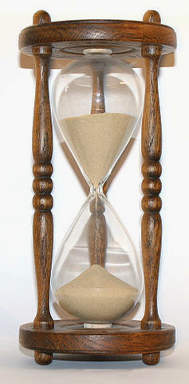

I will get to the title eventually, but the first part is some fun numerical differential equation solving. In particular, I'll be looking at the equation

where _NGDP = NGDP(MB)_ is a function of the monetary base. Everything except the last term is motivated in this [post](http://informationtransfereconomics.blogspot.com/2014/03/how-money-transfers-information.html). This equation models aggregate demand (NGDP) transferring information in the market that is captured/recorded by the money supply (the currency component of the monetary base). The ratio of logarithms (referred to as the information transfer index $\kappa$ in the link) accounts for the fact that NGDP is measured in the same units that are defined by the monetary base (dollars in the US) which creates the ["unit of account" effect](http://informationtransfereconomics.blogspot.com/2013/11/three-ideas.html). This effect allows e.g. [persistent deflation as seen in Japan](http://informationtransfereconomics.blogspot.com/2014/02/micro-deflationary-monetary-micro.html), or low inflation as seen in the US.

An approximate solution to this differential equation assuming $\kappa$ is slowly changing gives us [a pretty good fit to the price level](http://informationtransfereconomics.blogspot.com/2014/02/models-and-metrics.html) and I use it to establish the value of $c_{0} = 0.48$.

The last term is an exogenous noise term (NGDP shocks) I've added to account for the fact that NGDP is not entirely determined by the monetary base -- it [experiences exogenous shocks](http://informationtransfereconomics.blogspot.com/2014/02/extracting-shocks-again.html).

You may have noticed that this is all written with the monetary base (MB) as an independent variable, not time. This will lend itself to the sand pile analogy at the end, but mathematically $\log MB$ is a linear function of time so the only effect is a scale factor (linear transform) relating time and the (log of the) monetary base. More on this later.

So let's numerically solve the differential equation (1)!

Wait, what? Of course this is wrong; this first solution neglects the "shocks". Basically, this is what NGDP would be in the absence of exogenous (systematically negative) factors. We'll use this counterfactual to estimate the shocks -- shown in blue here:

The gray line is a random [AR(2) process](http://en.wikipedia.org/wiki/Autoregressive_model) with parameters estimated from the "empirical" shocks (i.e. the difference between the blue and black line in the first graph). We'll take several  (30) of these gray paths and see the effect on NGDP (I'm basically doing a Monte Carlo simulation) -- that's in the graph on the right below. The graph on the left is the result with the "empirical" shocks (effectively showing that the procedure checks out):

Let's average the results on the right (shown with two-sigma errors in the shaded region):

This isn't perfect, but it's pretty good for such a simple model. I've never seen an economic model that tries to model NGDP over such a long stretch of time (correct me in the comments). The model is systematically low in the 1960s, but otherwise the empirical data is within the error.

Now there are two immediate issues/opportunities for future blog posts:

1.  Is the AR(2) process correct? It seems to look about right except for a couple of large corrections (see the shocks graph above). We can look at this more closely by doing a larger number of Monte Carlo paths and see if systematic deviations hold up. We know if we get the shocks right, we get the empirical NGDP (the graph on the left in the pair above).
2.  As it was modeled, the shocks are uncorrelated with changes in the monetary base. This seems like a bad assumption ([remember the financial crisis?](http://informationtransfereconomics.blogspot.com/2014/02/the-fed-caused-great-recession.html)) ... Again, this can be seen if we do a larger number of Monte Carlo paths -- do systematic deviations occur near large changes in the monetary base? I'd like to produce a random sequence that is correlated with changes in the monetary base as well. This would lend credence to the theory that the central bank can cause a financial crisis that has larger effects than would come from monetary policy alone.

Now for the sand pile analogy! Sorry about droning on about that stuff before getting to the good bit.

The idea is that instead of NGDP shocks occurring at random moments in time, they occur at random points after the accumulation of money in the economy. Think of a pile of sand with a stream of sand falling on top of it (say, in an [hourglass](http://en.wikipedia.org/wiki/Hourglass), keeping with the relationship with time ... the picture below is from Wikimedia Commons). The stream is the addition of money to the base, the total amount of sand is the total monetary base, and the height of the sand pile is NGDP \[1\]. As sand accumulates, there are random moments when small avalanches occur, causing the height of the sand pile to drop -- these are analogous to exogenous NGDP shocks (they are caused by gravity), but -- and this is the insight in this analogy -- are inevitable as you add more sand to the pile. As the central bank adds money to the economy, a recession is inevitable (the central bank can offset the impact by increasing the flow of money/sand). A question I have: are these avalanches related to changes in the flow rate? This is essentially issue #2 above. Certainly a slower flow rate will reduce NGDP growth, but does slowing the flow rate cause an avalanche/recession?

I'll leave these issues for future blog posts.

\[1\] An additional benefit of this picture is that it eliminates the linear relationship $NGDP \sim MB$ (the quantity theory of money). However, the exponent is wrong. This analogy implies that $NGDP \sim MB^{1/3}$ when in fact it is more like $NGDP \sim MB^{2}$.
