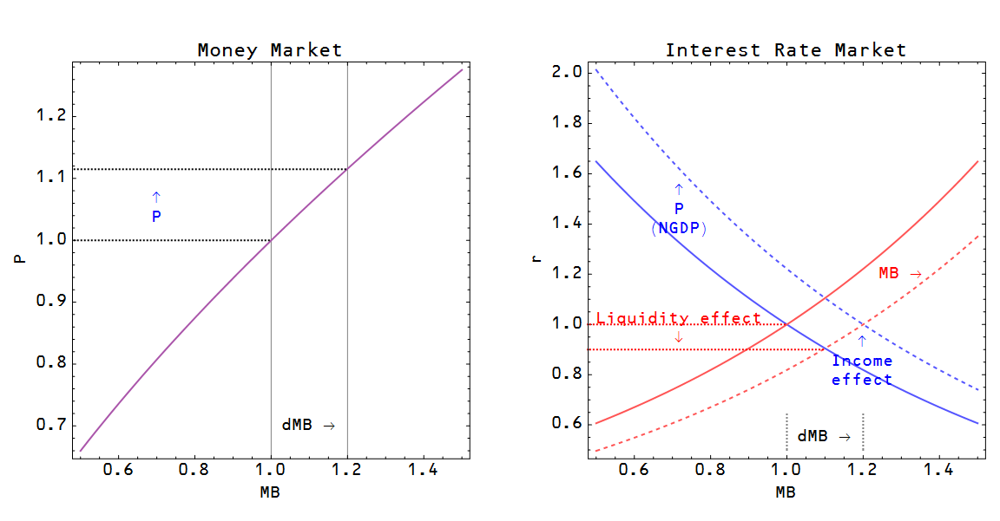

[Scott Sumner](http://www.themoneyillusion.com/?p=26671), to put it lightly, doesn't agree with Noah Smith. And neither does [Nick Rowe](http://noahpinionblog.blogspot.com/2014/04/the-neo-fisherite-rebellion.html?showComment=1398289160702#c3401104455099959999). The claim is that Canada's inflation target has worked out just fine blows the neo-Fisherite model out of the water. But let's look at where Canada is on [my favorite graph](http://informationtransfereconomics.blogspot.com/2014/02/it-really-does-seem-to-be-about-size-of.html) of the price level vs the currency component of the monetary base:

Canada is where the US is in the mid-1990s -- still on the highly sloped part of the curve where monetary policy is effective (also note that Sumner quotes Milton Friedman from 1998). The neo-Fisherite piece of the curve is on the right hand side -- where the US was during the depression, where Japan is now and where the US and EU are moving.

Canada shouldn't have a problem hitting its inflation targets yet. Let's check back in 20 years.

Sumner then moves on to say the Fisher effect in interest rates is confusing neo-Fisherites. However, this also doesn't demonstrate anything -- the [direction of interest rate changes is well described](http://informationtransfereconomics.blogspot.com/2014/03/the-effects-that-move-interest-rates.html) by the information transfer model (in the diagram below). The Fisher effect only strongly impacted long term interest rates during the 1970s and 1980s. Here's the model diagram (note that the price level vs the monetary base curve is effectively the curve at the top of this post):

