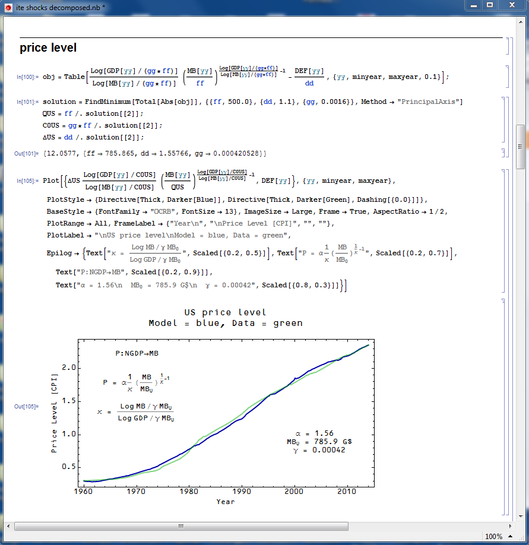

I thought I'd write down a reference post for "the" information transfer model. By putting "the" in quotes, I mean the specific collection of equations for macroeconomics. This is a particular set of solutions to the differential equations defined by [the general information transfer framework](http://informationtransfereconomics.blogspot.com/2013/04/the-information-transfer-model.html).

In the following the notation $p:D \rightarrow S$ is shorthand for saying the demand $D$ transfers information to the supply $S$ that is detected by the price $p$.

The price level and the money market

The price level $P$ is given by the solution to the differential equation for endogenous (see [here](http://informationtransfereconomics.blogspot.com/2013/10/exogenous-and-endogenous.html)) $N$ and endogenous $M$ (i.e. the model sets them both together) in the market $P:N \rightarrow M$ where $N$ is NGDP and $M$ is the currency in circulation (empirically, see [here](http://informationtransfereconomics.blogspot.com/2014/02/models-and-metrics.html)) \[link works now\]. The solution to the differential equation give us $N \sim M^{1/\kappa}$ so that we come to:

based on empirical results and some motivation from the underlying theory (see [here](http://informationtransfereconomics.blogspot.com/2014/03/how-money-transfers-information.html), [here](http://informationtransfereconomics.blogspot.com/2014/02/models-and-metrics.html)). The parameters $\alpha$ and $M_{0}$ are fit to empirical data along with the parameter $\gamma$. However, if $\gamma$ is fit to the price level of one country and kept constant across other countries, all of the countries will be placed on the same two dimensional price level "surface" under a change of variables $P(N, M) \rightarrow P(\kappa(N, M), \sigma (M)) = P(\kappa, \sigma)$ where $\sigma \equiv M/M_{0}$ (see [here](http://informationtransfereconomics.blogspot.com/2013/07/universalizing-model-kappa-sigma-space.html)).

_Examples:_

The other markets

The remaining markets are all "exogenous" (see [here](http://informationtransfereconomics.blogspot.com/2013/10/exogenous-and-endogenous.html)) demand and "exogenous" supply (information source and destination).

**The labor market**

The markets involving labor are $P:N \rightarrow L$ and $P:N \rightarrow U$ where L is the total number of employed people and U is the total number of unemployed people and result in the equations

The first one gives us a form of Okun's law (see [here](http://informationtransfereconomics.blogspot.com/2013/08/scott-sumners-model-part-2_30.html)). The "[natural rate](http://informationtransfereconomics.blogspot.com/2013/11/the-labour-supply-part-2.html)" of unemployment -- the rate at which $U$ seems to fluctuate around when the above parameters $\kappa_{L}$ and $\kappa_{U}$ are fit to data -- is given by $u^{*} \simeq \kappa_{U}/\kappa_{L}$.

_Examples:_

\[The last graph -- of the [UK unemployment rate](http://informationtransfereconomics.blogspot.com/2013/11/the-labour-supply-part-2.html) -- has messed up labels. The model is the blue line (the "natural rate"), the gray line is data and the axis is the unemployment rate, not price level. H/T Tom Brown.\]

**The interest rate market**

The interest rate market is given by $r^{c}:N \rightarrow M_{r}$ where $c$ is a (currently unexplained, **update 5/22/2015:** [explained](http://informationtransfereconomics.blogspot.com/2015/02/information-equilibrium-paper-draft_23.html)) fudge factor relating the interest rate price $r^{c}$ to the actual market nominal interest rate $r$. The resuting equation for exogenous $N$ and $M_{r}$ is:

The parameters $c$ and $\kappa_{r}$ are the same for both long and short term interest rates. One fits $c$ and $\kappa_{r}$ to the data for one interest rate market (the long term interest rate market uses currency in circulation for $M_{r_{long}}$ and the 10 year rate for $r = r_{long}$) and the same parameters work for the other market (i.e. the short term interest rate which uses the full monetary base including reserves for $M_{r_{short}}$ and the 3-month secondary market rate, the interbank rate or the effective Fed funds or other short term interest rate for $r_{short}$ depending on the country). When I do the fit, my current modus operandi is to simultaneously fit both markets with the same $c$ and $\kappa_{r}$. Note $M_{r_{long}} = M$ above in the price level/money market.

_Examples:_

Shifts

If we use the monetary base (i.e in the short term interest rate market) $MB = M_{r_{short}}$, then in this baseline version of the information transfer model there is no effect on the price level or NGDP. This doesn't rule out an impact on output via the IS-LM model (see e.g. [here](http://informationtransfereconomics.blogspot.com/2014/02/the-fed-caused-great-recession.html)), in that case the shift "re-appears" in the model above as an exogenous NGDP shock (I will devote a future blog post to explaining that better). However, I am not as confident in that conclusion so I'm leaving the details out of this reference post

_Examples:_

