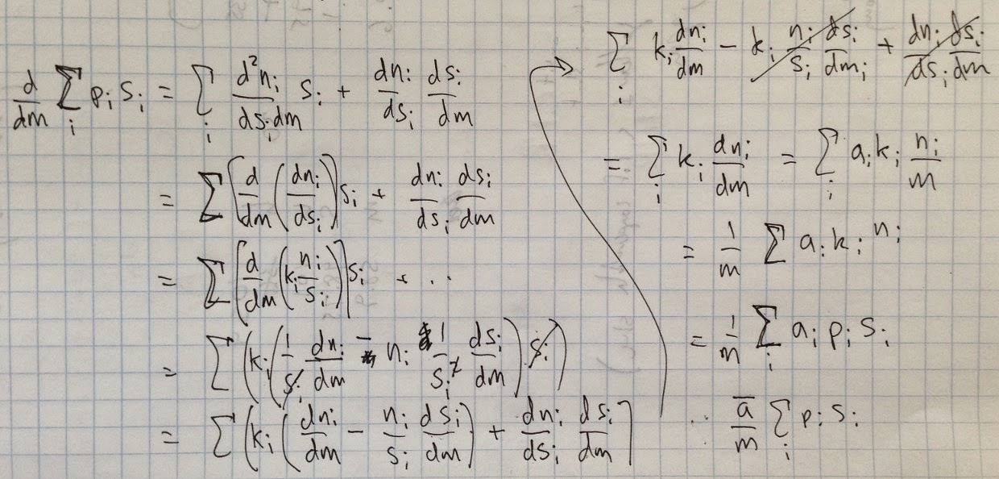

I was [inspired by Noah Smith's review of _Big Ideas in Macroeconomics_](http://informationtransfereconomics.blogspot.com/2014/06/great-review-of-big-ideas-in.html) to see what I could do about showing a Arrow-Debreu-McKenzie-style equilibrium in the information transfer model. I'm going to just attack the problem in bits and pieces. This first piece uses some assumptions I would hope to be able to eliminate in a future approach, but I thought I'd put the ideas down so I can reference them later. 

The starting point is at [this link](http://informationtransfereconomics.blogspot.com/2014/03/how-money-transfers-information.html) which describes the basic idea of a money-mediated economy in an information transfer framework. We'll try to show how a macroeconomy is built out of many small markets (indexed with a subscript $i$). We'll start with the equation:

We've already incorporated our first assumptions (one that is key and I think may be key to understanding all of macroeconomics of money): all the $dm_{i} = dm$ so that the infinitesimal element of money is the same across all sub-markets, which implies that all the $m_{i} = c_{i} m + d_{i}$ (linear transformation). If we then assume that the amount of money transferring information for any individual good is small relative to the total amount of money on average, so we can take $m \gg d_{i}/c_{i}$ so that $m \simeq &nbsp;c_{i} m$ and then subsume the $c_{i}$ into the definitions of $a$ and $b$ above. (This is connected to a maximum ignorance assumption and is related to the [equipartition theorem](http://en.wikipedia.org/wiki/Equipartition_theorem): the money is on average equally distributed among the markets so that no $m_{i}$ dominates the distribution.) I'd like to do this more rigorously in the future (e.g. using distributions and integrating over them).

In the last differential equation (3), we defined the prices $p_{i}$ and made the assumption of non-interacting markets ($dn_{i}/ds_{j} = p_{i} \delta_{ij}$, also made at [this link](http://informationtransfereconomics.blogspot.com/2013/09/walras-law.html)) -- i.e. the prices for a particular good don't depend strongly on the prices for other goods or services. I'd like to relax this assumption in the future, but [Arrow-Debreu appears to make it as well](http://cowles.econ.yale.edu/P/cp/p10b/p1090.pdf) \[pdf\]. At the end of this post, I make a hand-waving argument in terms of a geometric interpretation of the trace. That gives you, kind reader, something to look forward to because you are about to get slapped in the face with a bunch of algebra.

I put in the weights because measures of NGDP actually do this (e.g. some weights on food and energy are zero for some measures of CPI). You can also see why I used $n$ for the demand. Now let's take a derivative with respect to money:

so that equation (6) becomes, after substituting the differential equation (1) for the second term and taking $m$ outside the sum:

The piece outside the parentheses is our original aggregate demand $N$, but we can't just ignore the term in the parentheses. We'll resort to an averaging argument. If the number of markets is large, we can use the law of large numbers to say that $a_{i} \simeq \bar{a}$ (maximum ignorance about the actual distribution of the $a_{i}$) so that:

and we can define $\kappa = 1/(2 \bar{a} - 1)$ to make the connection with [aggregate money market equation](http://informationtransfereconomics.blogspot.com/2014/03/how-money-transfers-information.html):

where $P$ is the price level. This shows that a macroeconomy can be built up from a bunch of individual markets in a relatively straightforward way. There are some criticisms brought up by economists regarding the so-called [aggregation problem](http://en.wikipedia.org/wiki/Aggregation_problem) (and aggregate demand in particular). Those appear to come down to challenges to the assumptions that $a_{i} \simeq \bar{a}$ and $dn_{i}/ds_{j} = p_{i} \delta_{ij}$ (i.e. changes in agent preferences change with income and significantly affect the distribution of the $a_{i}$ and relative prices matter, respectively). The first can be defended with a [maximum entropy argument](http://informationtransfereconomics.blogspot.com/2014/06/what-if-money-was-made-of-vinegar.html): if aggregate models appear to work in the sense that e.g. GDP seems to be meaningful (recessions are a real thing -- e.g. Okun's law appears valid on average), then the n-dimensional space of agents does seem to be reduced to a lower dimensional space consisting of GDP and unemployment rates and your extra dimensions (agents) aren't particularly relevant.

The second challenge is more serious at first glance, hence why I'd like to drop it in the future. However, the trace

is an invariant measure for matrices under various transformations. Also via [Jacobi's formula](http://en.wikipedia.org/wiki/Jacobi%27s_formula), the trace is basically the differential of the determinant which means that it represents an infinitesimal volume measure ($\det p$ is the volume spanned by the vectors of $p$). That volume represents the size of the aggregate economy, so the trace represents an infinitesimal change in the size of the economy -- and that depends only on the diagonal elements of $p$, so the relative prices $p_{ij}$ don't matter. At least that's the reasoning I'd like to use to prove that the $p_{ij}$ don't really matter, only the $p_{ii} \equiv p_{i}$.

PS There probably is some way to represent all of this in terms of fiber bundles with money representing the [common differential element](http://en.wikipedia.org/wiki/Connection_\(fibred_manifold\)) moving various vectors of goods over the manifold that is the economy. I'm going to try [to keep Chris House happy](http://informationtransfereconomics.blogspot.com/2014/04/economics-is-neither-physics-nor.html), though.

PPS The values of $\bar{a}$ are about 3/2 to 7/6 for values of $\kappa$ being 1/2 to 3/4.

PPPS After going through all this, I did the same calculation using the quantity supplied (see picture at the top of the post) and got $\kappa = 1/\bar{a}$. This may have something to do with the right hand side of the supply and demand equations giving us $p_{i} s_{i} = k_{i} n_{i}$ such that the demand $n_{i}$ already contains the price (the units of $n_{i}$ are total value demanded, not total quantity demanded). This makes the whole derivation above from the demand side much easier:

and gives consistent measures of $\kappa = 1/\bar{a}$ approaching the problem from the supply side and from the demand side. I'm thinking that's actually the right way to do it.
