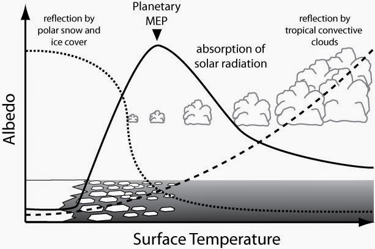

Yep. Weird title. This post is largely based on Roderick Dewar's 2009 paper _[Maximum entropy production as an inference algorithm that translates physical assumptions into macroscopic predictions: Don't shoot the messenger](http://www.mdpi.com/1099-4300/11/4/931)._ Yep. Long title. This post was largely motivated by an Anonymous [commenter commenting on my comment](http://informationtransfereconomics.blogspot.com/2013/04/the-philosophical-motivations.html):

> _If \[microfoundations survive aggregation to into a macroeconomic model as anything other than a coefficient\], the resulting model is likely intractable._

Anonymous gave me some great references on heterogeneous agent models. But he or she also prompted me to start thinking about what I meant by that statement more carefully. Turns out Dewar already did the heavy lifting on that, so all I have to do is apply what he was say about complex systems like the climate to economics.

[We observe](http://en.wikipedia.org/wiki/Boyle%27s_law) that the pressure and volume of a gas are related in such a way that, when we keep the temperature constant, _p ~ 1/V_. Since we are able to reliably reproduce this macroscopic behavior through the control of a small number of macroscopic degrees of freedom even though we have absolutely no control over the microstates, _the microstates must be largely irrelevant_. This is not to say you can't derive the ideal gas law from assumptions about atoms. It's just that nature has found a computationally efficient model for dealing with the _N_\-dimensional (number of atoms) problem with just two dimensions _(p, V)_.

[We observe](http://en.wikipedia.org/wiki/Quantity_theory_of_money) that the price level _P_ grows with money _M_ in the long run such that _log P ~ log M_ (the quantity theory of money). Since this is observed across many natural experiments, I mean, countries where we have no control over the micro degrees of freedom, I mean, people, _the microfoundations must be largely irrelevant_. This is not to say that a microfounded theory won't get you _log P ~ log M_, it's just that the information theory approach that leads you there is more computationally efficient, reducing the _N_ heterogeneous agents to two degrees of freedom _(P, M)_.

This is what I mean by intractable in that long-ago post. If the dimension of the problem doesn't fall significantly from _d ~ N_ to _d ~ 1_, you're not going to have enough computational resources.

Another way to say this is that if macroeconomics is a universal discipline, then microfoundations don't matter. George Robert Lucas [said it does matter](http://en.wikipedia.org/wiki/Lucas_critique); e.g. the German policy environment matters and Germans behave in a different way because of it. Lucas is saying you really should study German Macroeconomics or Ethiopian Macroeconomics much like universities have departments of German Studies. \[The microfoundations really do seem to matter in politics and culture.\]

That last paragraph was a bit hyperbolic to make a point. It should really apply to particular macroeconomic relationships. If you think the quantity theory of money is universal, then you think microfoundations for the quantity theory are irrelevant. If you think the [Phillips curve](http://en.wikipedia.org/wiki/Phillips_curve) isn't universal, then microfoundations could potentially be relevant. But the fact that it was observed to exist in several countries is evidence that the microfoundations are irrelevant (and [they seem to be](http://informationtransfereconomics.blogspot.com/2013/10/the-phillips-curve.html)).

_but what if money was made of vinegar?_

Um, wait. Let me back up and start again with Dewar. Climate scientists were able to get remarkably accurate results about cloud cover, polar ice cover and thermal gradients while ignoring the microfoundations (the physics and chemistry of water) and assuming maximum entropy production (MEP) by the Earth's water cycle. See the picture at the top of this post. An enterprising climate scientist asked: _but what if the ocean was made of vinegar?_ Since MEP enthusiasts got the result without using the properties of water, isn't MEP wrong because it would give the same result when using vinegar and we know oceans of vinegar would give drastically different results? That's where Dewar says no. MEP is a tool; it's not wrong or right on its own. The fact that you can use MEP to create an accurate picture of the water cycle means that the chemical details of water don't matter that much. MEP must be capturing the essential physics of the water for relevant to climate. The fact that the same calculation in vinegarworld (probably) gets macrostate wrong means some of the microfoundations of vinegar matter.

So what if money was made of vinegar -- such that e.g. people at home could make it themselves and central banks ceased to matter? Well, that would change the system, and it's possible you'd end up with something besides the quantity theory of money.

However, if you can derive results like _log P ~ log M_ that seem to have some universal validity without specifying what money is, but rather [from information theory](http://informationtransfereconomics.blogspot.com/2014/03/how-money-transfers-information.html) (our version of MEP) just using the facts that money carries information and there is a lot of it around, then it must not really matter how money "works" (i.e. the microfoundations of money). Information theory must be capturing the essential economics of fiat currency.

And the converse is if you can't capture the essential economics of fiat currency in this way (or via some other dimensional reduction), the real model of fiat currency is likely intractable.
