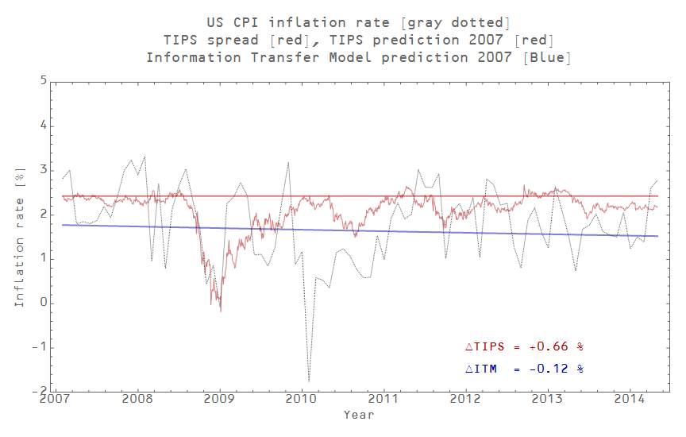

Scott Sumner asked (in comments on his [post on AD](http://www.themoneyillusion.com/?p=27080)) if the information transfer model (ITM) was better at predicting inflation (gray line in the graph above) than TIPS spreads (the difference between inflation indexed treasuries and ordinary treasuries of the same maturity, red jagged line in the graph above). The TIPS spread on a given day represents the market's future expected average inflation over the maturity of the treasury (we'll use the 10-year).

Well, the ITM is better -- **about 5 times better**. Actually, the ITM was better at predicting inflation even though the worst economic crisis since the Great Depression intervened!

I fit the ITM model to 1960-2006 Q4 data and then did a log-linear extrapolation of NGDP  and M0 (currency in circulation) starting in 2007 to predict inflation from 2007 to 2014 Q1. That's the blue line in the graph above.

The 10-year TIPS spread from Q1 2007 represents the market's best guess at the average inflation rate over the next 10 years, and so should also represent the average inflation rate from 2007 to 2014 Q1. That's the red straight line.

The ITM model average difference from 2007 to 2014 was -12 basis points, while the TIPS model was on average off by +66 bp.

Actually, the ITM totally dominates the market prediction -- the **2007 prediction** of the ITM was better than the TIPS prediction _for almost every date you start the TIPS prediction_. This graph shows the ITM 2007 prediction difference alongside the TIPS prediction from the given year:

The ITM prediction from 2007 was a better predictor of inflation in 2013 than the TIPS spreads from 2013! The ITM model falls apart in the last couple months, but then the past couple months only represent a couple CPI data points. The ITM model represents a long run trend, so its predictions will have a higher error over short runs of data. The market random guess TIPS spread is better at short runs because in the short run, inflation this month is about what inflation was last month.

PS It seems the TIPS spread is a good predictor of the TIPS spread though.
