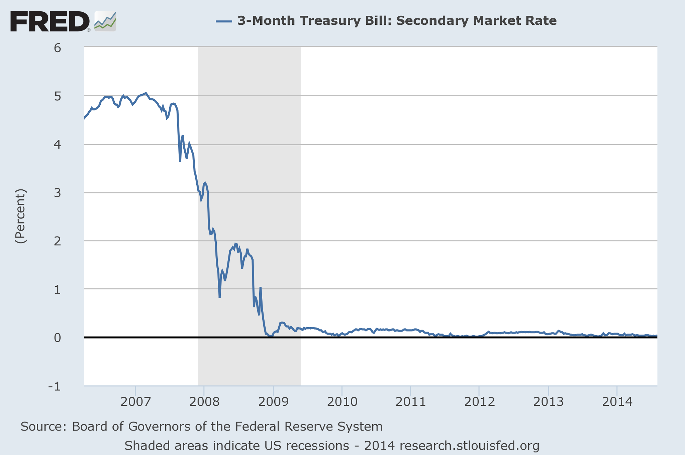

When I first read what [John Cochrane said](http://johnhcochrane.blogspot.com/2014/08/qe-and-interest-rates.html) about interest rates, it was in a [quote at Noahpinion](http://noahpinionblog.blogspot.com/2014/08/can-fed-set-interest-rates.html):

> _\[S\]tandard theory makes a pretty clear prediction about \[QE's\] effects \[on interest rates\]: zero. OK, then we dream up "frictions," and "segmentation," and "price pressure" or other stories._

I thought this was ridiculous; anyone can see that the 3 month interest rate dropped precipitously (to the zero lower bound) at the onset of QE:

Maybe he was talking about real interest rates or some other measure. I checked the original post and sure enough Cochrane was talking about long term interest rates like the 10-year treasury. And that's something I agree with. The 10-year rate appears to be controlled by the currency component of the monetary base ("M0"). QE, which involved asset purchases, has full monetary base MB -- including reserves -- rising to over 4 trillion dollars. The full monetary base appears to control short term interest rates.

Let's say we have two markets _rl:NGDP→M0_ and _rs:NGDP→MB_ with the same information transfer index (κ) where _rl_ is the long run interest rate (10 year treasury rate) and _rs_ is the short run interest rate (3 month rate). I fit κ to the 10 year treasury rate _rl:NGDP→M0_ and then looked at how well the MB data fit the 3-month rate in the same function:

The M0 model result is the darker blue line, while the MB result is the lighter blue one. The 10 year rate is darker green, while the 3-month rate is lighter green. The fit for both uses the function 

_log r = c log NGDP/(__κ_ _Mx)_

with _κ = 10.4_ and _c = 2.8_, and Mx being either the currency component ("M0") or currency + reserves (MB).

Now if the Treasury were to print more currency (or the Fed somehow caused banks to request more currency which would then grant Fed grants), then that would bring down long term interest rates. At least it would in today's economy with the "liquidity effect" dominating because _log M0/log NGDP_ is close to ~ 1. If we were back in the 1970s, the extra currency would cause rates to rise via the inflation/income effect (_log M0/log NGDP_ was closer to 0.5). See [here](http://informationtransfereconomics.blogspot.com/2014/03/the-effects-that-move-interest-rates.html) for more details.

While I agree that QE has no impact on  long term interest rates, I don't agree with the [just-so argument](http://noahpinionblog.blogspot.com/2014/08/can-fed-set-interest-rates.html) behind it. This has nothing to do with Wallace neutrality or Modigliani-Miller. It has to do with the information exchanged in the treasury markets in an economy and monetary base of a given size. The result requires ideal information transfer (information transmitted from the demand is equal to the information received by the supply), which is the information theory equivalent of "complete frictionless markets", but it is independent of government policy (except inasmuch as it affects NGDP, the monetary base or level of currency). The fluctuations around the theory likely come from non-deal information transfer and could be anything -- and likely stems [from (irrational) human behavior](http://informationtransfereconomics.blogspot.com/2014/08/against-human-centric-macroeconomics.html).
