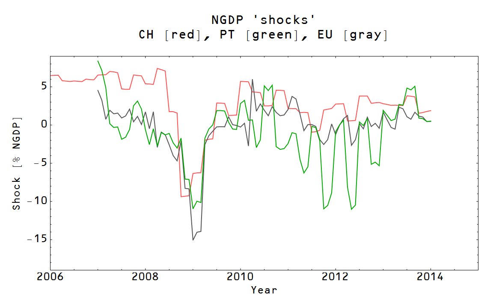

Scott Sumner [is upset](http://www.themoneyillusion.com/?p=27212) about using inflation to describe economies. He says that inflation doesn't describe shocks and that NGDP (of course) is a better measure. He then gives Portugal and Switzerland as an example where inflation isn't very indicative.

I thought this would be a good place to use [my more precise definition of nominal shocks](http://informationtransfereconomics.blogspot.com/2014/05/models-matter.html) that takes into account monetary and fiscal impacts to NGDP. Taking this on included a pretty interesting challenge for the information transfer model: _how do you describe Portugal?_

In the information transfer model, one needs NGDP, CPI and currency data (M0) for the economy in question. Portugal doesn't have the last one, at least not on its own. So I posited that Portugal's M0 was αM0 for the Eurozone (i.e. Portugal has a fixed fraction of the Euro currency) where α was a free parameter. The best fit gave α = 0.052, which was sensible: Portugal is about 5% of the Eurozone economy. So here are the fits to the price level for the EU, Portugal and Switzerland from 2007-2014:

The nominal shocks follow from the price level (see the procedure [outlined at the bottom of this post](http://informationtransfereconomics.blogspot.com/2014/06/the-information-transfer-model.html)) by taking out the effect of the expansion of the monetary base and looking at the remainder -- this remainder is the nominal shock. Here are the nominal shocks for Switzerland and Portugal:

You can see the great recession shock at the end of 2008 and the subsequent shock to Portugal due to the post-crisis austerity measures. Since these three regions are all experiencing "lowflation", these shocks turn out to be roughly correlated with changes in NGDP. Here for example is the EU (change in NGDP is the dotted line, and the solid line is from the previous graph):

The pictures for Portugal and Switzerland are similar (I didn't want to put too many graphs in this one post). So Sumner is right: NGDP changes are a pretty good indicator. At least when inflation is low ... here is the same graph for the US going back to the 1980s:

As inflation increases, the actual nominal shocks (solid) and changes in NGDP (dotted) diverge. One benefit of the information transfer model nominal shocks is that going through zero is generally associated with a recession. Additionally, negative shocks are associated with an accelerating unemployment rate:

In particular note that the small negative shocks in the mid-to-late 1980s and after the 1991 recession (neither of which are associated with a recession) appear to arrest the fall in the unemployment rate. Although it is correlated, the change in NGDP doesn't have this meaningful zero-crossing quality.

The take-away is this: when you have "lowflation", you can say ΔNGDP ≈ nominal shocks, making NGDP a decent metric. However there is more information you can extract using the information transfer model definition of nominal shocks, and that definition is based in part on the price level.

Additionally, "lowflation" is also a good indicator of how monetary policy [will affect interest rates](http://informationtransfereconomics.blogspot.com/2014/03/the-effects-that-move-interest-rates.html). When an economy has low inflation, monetary expansion makes interest rates fall (the liquidity effect dominates). When inflation is high, monetary expansion makes interest rates rise (the income/inflation effect dominates).

You can't get everything from NGDP.
