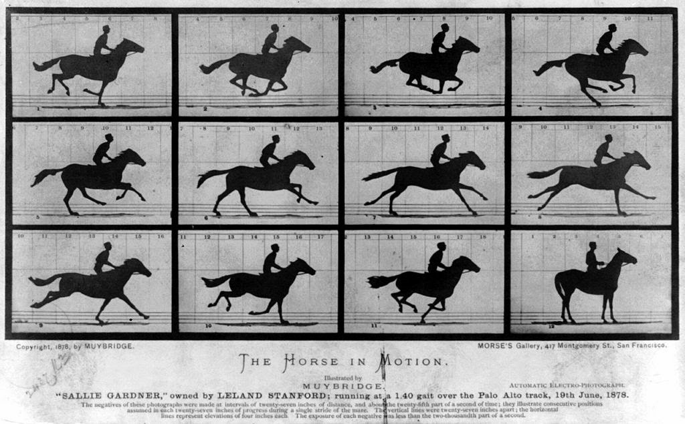

There were a lot of emails, comments ([here](http://informationtransfereconomics.blogspot.com/2014/08/on-taking-people-out-of-economics.html) and [elsewhere](http://worthwhile.typepad.com/worthwhile_canadian_initi/2014/07/learning-about-theory-does-not-teach-people-how-to-theorize.html)), [forum discussions](http://pragcap.com/forums/topic/against-human-centric-macroeconomics) as well as a couple of [blog](http://realfreeradical.com/2014/08/06/taking-the-people-out-of-economics/) [posts](http://www.intropilia.com/2014/08/are-people-important/) that were generated by my post _"[Against human-centric macroeconomics](http://informationtransfereconomics.blogspot.com/2014/08/against-human-centric-macroeconomics.html)"_. Widespread opposition is an apt description. Part of that was probably because I framed the question in a particularly antagonistic way (the title started with "against", for instance). I recommend reading these discussions because they bring up many excellent points.

I was actually surprised to see that the underlying idea was controversial. If a market is an information processing system, then it has a peak information processing capacity (assume a single-good market for simplicity). That capacity doesn't usually change day to day -- the price mechanism (not a given price, but the mechanism itself) continues to be capable of sending us the same amount of information.

One way we know this is that we as humans know how to work with prices we see in the market. We don't think that because the price of bacon went up a dollar to 6 dollars per pound that we won't be able to fork over 6 dollars and get a pound of bacon. The new price of 6 dollars doesn't tell us that there is a new disease affecting pigs or that a new fad bacon diet has started. It just tells us that something happened to supply or demand. Sure a new tax on bacon or subsidy could affect the processing capacity, but new taxes don't happen every day.

Humans, however, will behave differently from day to day. Maybe you decided you should hold off on the bacon from now on. Maybe you think the apocalypse is coming and need to stock up. Whatever you decide, the peak information processing capacity of that single good market for bacon is still the same. With the exception of abolishing money or outlawing bacon, most changes will leave the peak information processing capacity of the bacon market unaffected.

In the information transfer model, we call operating at peak capacity "ideal information transfer" and identify it with the condition I(D) = I(S): the information transmitted by the demand is equal to the information received at the supply. No more information than I(D) can be processed by the market and transferred to the supply; I(D) is all the information that exists.

The thing that I thought would be uncontroversial is the statement that _I(D) = I(S) is independent of human decision-making_. Sure, human decision-making could change the value of D to D' so that I(D) becomes I(D'), but that just means that I(D') = I(S') if we are operating at peak information processing capacity. The peak is still the case where the market transfers all the information.

The information transfer model assumes I(D) = I(S) most of the time in a functioning market. Human decision-making can make I(S) < I(D) as I [have observed](http://informationtransfereconomics.blogspot.com/2013/12/this-plucking-model.html). I have some intuition that this is the mechanism behind recessions and unemployment. For those of you out there more familiar with information theory, the maximum channel capacity is independent of the encoding you use (there exists an encoding that produces peak capacity, and many encodings will leave you with less information getting through your channel than the maximum capacity). The general idea is that assuming a market is operating at peak information processing capacity most of the time leads to some pretty good empirical success (see for example [here](http://informationtransfereconomics.blogspot.com/2014/07/inflation-prediction-errors.html)).

I came up with a pretty good analogy for all this. Imagine a race with jockeys and horses. To a first approximation, I would say that the speed around the track is that of the maximum speed of the horse, independent of the jockey. That is the analogy of I(D) = I(S). The (human) jockey can affect that speed -- based on his expectations of the other jockeys' strategies, he or she may hold some speed in reserve for the home stretch or may abort the race completely if the horse seems injured (recession). Humans also bred horses to be faster and may introduce a new breed from time to time -- but not in the middle of a race! These new breeds would be analogous to new institutions or monetary policy regimes. No jockey can make a horse go faster than its top speed -- and the horse's top speed is independent of the jockey (but can be influenced through human directed breeding over time).

Before I go, I have a question for the integral human view of economics: _what is gained by having the market consist of only human decision-making?_

One benefit to economic theorists is wide latitude in modeling. We don't fully understand human behavior, so anything that is plausible can be allowed. The central bank can set inflation expectations at x% and achieve x% inflation through the market alone without performing any open market operations. Wide latitude in modeling is hard to distinguish from just-so stories, though.

Integral humans also produces two major problems for money: the value of money and indeterminacy. There is no reason in human-based theories of economics for [fiat currencies to have any value](http://uneasymoney.com/2014/05/06/monetary-theory-on-the-neo-fisherite-edge/), and there are an [infinite number of future paths](http://www.themoneyillusion.com/?p=20390) for monetary policy that are consistent with the current state. In the information transfer model, the human independent peak information processing capacity of the market sets the value of money (in terms of its information carrying capacity) and there is a pretty solid anchor for the future path of e.g. [inflation](http://informationtransfereconomics.blogspot.com/2014/05/out-of-sample-predictions-with.html).

What have I missed that makes adding humans to the problem so attractive?
