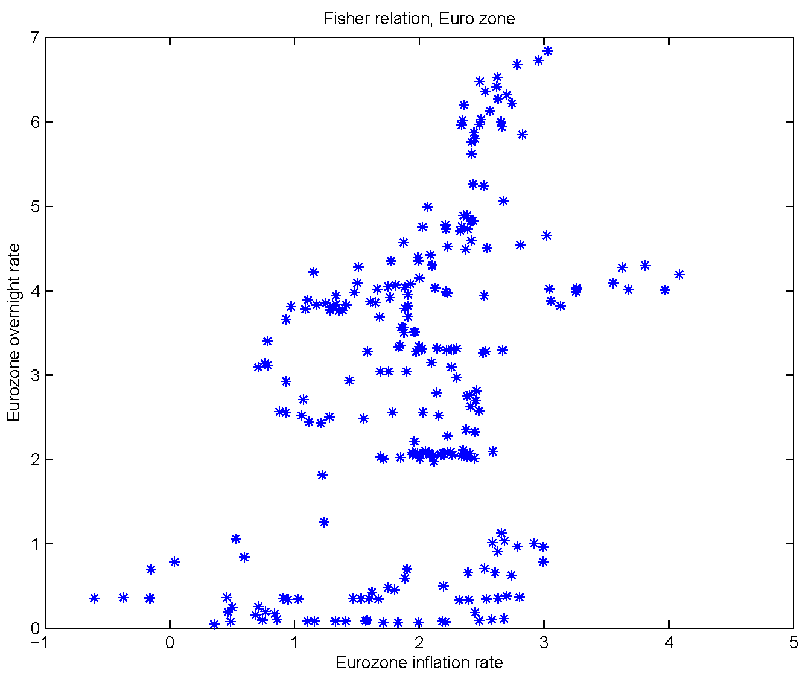

[I mentioned](http://informationtransfereconomics.blogspot.com/2014/09/what-is-inflation.html) I was going to say some more about [Stephen Williamson's piece](http://newmonetarism.blogspot.com/2014/09/theories-of-inflation-and-european.html) on the EU and the Fisher relationship (where higher interest rates are associated with higher inflation and lower rates with lower inflation). The plan of action is to remove the empirical noise from the Fisher relationship Williamson presents by finding the underlying trends in the data in the fluctuations (based on [smoothing the model inputs](http://informationtransfereconomics.blogspot.com/2014/08/smooth-move.html)).

Here is the model (blue) and the data (green) -- [removing the 500 € notes](http://informationtransfereconomics.blogspot.com/2014/09/500-sounds-like-lot-of-money.html) -- for the price level (CPI less food and energy):

Here are the inflation rates (year over year for the data in green, instantaneous derivative of the price level for the model in blue):

Both the inflation based on CPI and CPI less food and energy are shown. And here are the interest rates (long rate is red, short rate is blue):

So now finally we are equipped to reproduce [Williamson's second to last graph](http://newmonetarism.blogspot.com/2014/09/theories-of-inflation-and-european.html):

You can see how much of the scatterplot (green points) is a deviation from the model (blue line). The noise dominates the model; it would be hard to associate any particular movement of interest rates or inflation with this relationship (only the long run trend over several years). Due to some of the data not going back to 1997, only the larger green dots are from the same period as the model result. However those points cover much of the same range as the full data set shown with the smaller green dots (although I couldn't find data on the short term interest rate that goes all the way back to 1994 like Williamson's data -- so it misses the highest interest rate part).

We do recover the Fisher relationship where inflation and interest rates are directly correlated, though. I'm not sure this is a causal relationship -- at least in the way a [neo-Fisherite](http://informationtransfereconomics.blogspot.com/2014/05/a-neo-fisherite-rebellion-yes-please.html) would see it. The neo-Fisherite view is that the central bank could e.g. raise rates and produce inflation (or keeping rates low leads to deflation). However, [in the information transfer model](http://informationtransfereconomics.blogspot.com/2014/03/the-effects-that-move-interest-rates.html), high inflation means that the monetary base is small with respect to the size of the economy (NGDP) which in turn means expansionary policy increases interest rates increase through the income-inflation effect. Low inflation means that the base is large compared to NGDP and the liquidity effect dominates interest rates (expansionary policy reduces rates). In this scenario, any attempt to raise interest rates (reducing M0 or MB growth) to try and increase inflation would throw the economy off [the long run NGDP-M0 path](http://informationtransfereconomics.blogspot.com/2014/09/the-emerging-story-of-great-recession.html) likely leading to recession.
