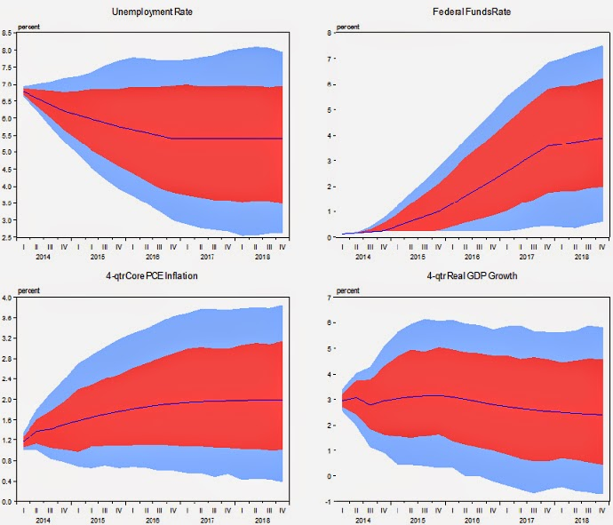
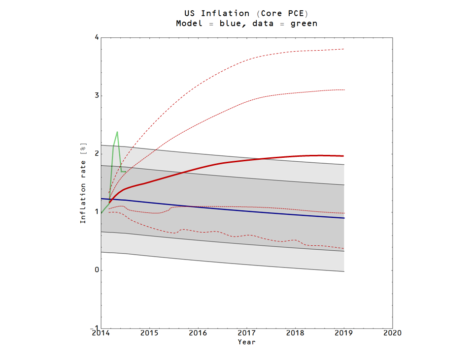

A few months ago I learned from [Noah Smith's blog](http://noahpinionblog.blogspot.com/2014/04/the-foxy-fed_7.html) that the Fed had released one of its models: [the FRB/US model](http://www.federalreserve.gov/econresdata/notes/feds-notes/2014/a-tool-for-macroeconomic-policy-analysis.html). On the linked Fed webpage, they gave an example analysis done with this model that predicted four macroeconomic variables (clockwise from the top left: the unemployment rate, the Fed funds rate -- wait, don't they set this? \[1\], RGDP growth and PCE inflation):

How does the (far simpler \[2\]) information transfer model stack up against this model? I started from the trend inflation [modeled here](http://informationtransfereconomics.blogspot.com/2014/08/smooth-move.html) and predicted out to the end of 2018 (the prediction bands are the 70% and 90% bands like in the Fed model, based on a Gaussian error distribution -- which if you check the link is a pretty good model):

I was unable to find numerical data for the Fed's prediction, so I rather cheesily traced out the central value and the error bands in PowerPoint (in red) and placed them on top of a close up of the prediction in the previous graph:

The overall error at the end of the period seems about the same (recall that for short term predictions, the information transfer model is pretty much [dominated by measurement error](http://informationtransfereconomics.blogspot.com/2014/07/inflation-prediction-errors.html), not model error). It is kind of funny that the first few measurements after the start of the prediction jump right outside the Fed's 90% confidence interval. The interesting thing is that these models predict different things -- although given the overlap of the 70% confidence interval, there is a strong possibility of failing to reject either model (i.e. both are fair descriptions).

I'll keep updating this as inflation data becomes available.

For a bonus graph, here is the model result without the smoothing:

\[1\] Just kidding.

\[2\] According to the Fed website, "FRB/US currently contains about 60 stochastic equations, 320 identities, and 125 exogenous variables" ... of course it models quite a bit more (like household consumption and savings).
