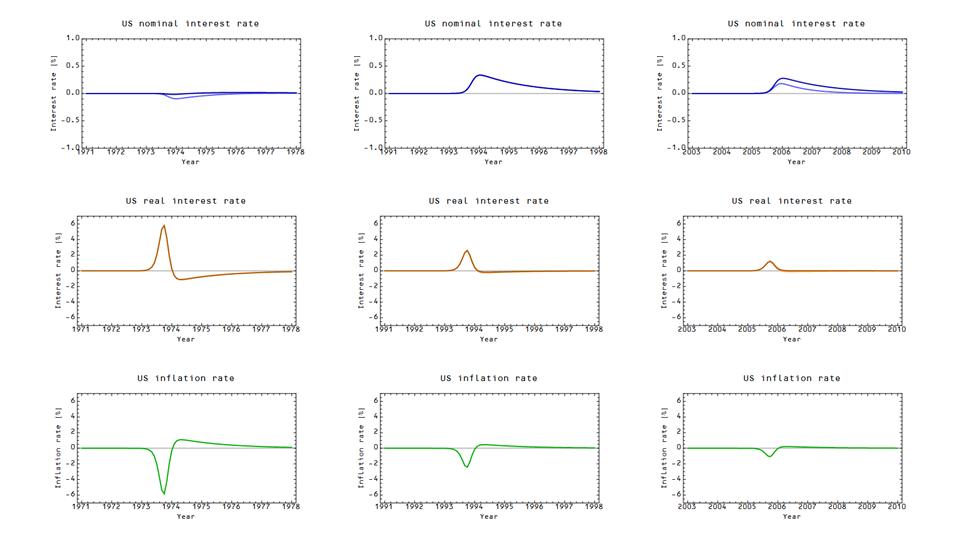
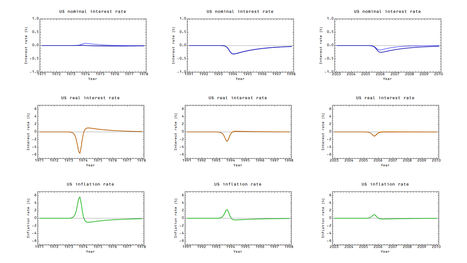

This is an update to [this post](http://informationtransfereconomics.blogspot.com/2014/09/the-path-of-policy-is-strongly.html) where I've instead set the change in NGDP based on the increase due to the change in the monetary base (the NGDP shift is described [here](http://informationtransfereconomics.blogspot.com/2014/06/the-information-transfer-model.html), the methodology for these shifts in monetary policy matches up with [this post](http://informationtransfereconomics.blogspot.com/2014/01/strange-new-monetary-worlds.html)). I show the results for both an increase and decrease in the monetary base (I assume M0 follows MB up to the reserve requirement and the shift is 5% of M0):

There is a disinflationary dip (inflationary spike) at the onset of the policy change, followed by inflation (disinflation) in each case. In the 1993 and 2005 cases, nominal interest rates follow what you'd expect from an decrease (increase) in the base: rates rise (fall). What is interesting is that in the 1970s the income/inflation effect (which raises NGDP and tends to raise interest rates) is offset by the liquidity effect (which lowers interest rates). Essentially, in the equation

_log r = c log (NGDP/M) + b_

NGDP and M go up (or down) by approximately the same amount, leaving _NGDP/M_ unchanged. When inflation is high, the income/inflation effect cancels the liquidity effect; when inflation is low, the liquidity effect dominates.

In [Williamson's post](http://newmonetarism.blogspot.com/2014/09/theories-of-inflation-and-european.html), he gives a model where the Fisher effect causes nominal rate increases to produce inflation. I have used the term "Fisher effect" in different ways on this blog. In [this post](http://informationtransfereconomics.blogspot.com/2014/09/distilling-fisher-relationship-data.html), I use it to describe the direct correlation of inflation an nominal interest rates. In [this post](http://informationtransfereconomics.blogspot.com/2014/03/the-effects-that-move-interest-rates.html), I attributed the deviation from the model to the "Fisher effect" -- i.e. a higher interest rate than the information transfer model predicted due to some un-modeled force (like expectations). However, the information transfer model seems to confine this "Fisher effect" to long term interest rates and to the 1970s. Williamson's approach **_models_** the Fisher effect (expectations of higher inflation). However these two models can be consistent if inflation expectations are viewed in the light of [this post](http://informationtransfereconomics.blogspot.com/2014/06/reconciling-expectation-and-information.html) -- agents expect future inflation if the monetary base is small relative to the size of the economy \[1\].

Overall, the information transfer model takes what closer to an orthodox view -- expansionary monetary policy lowers interest rates and creates a spike in inflation, while contractionary policy raises interest rates and creates a deflationary dip. The dip in inflation is followed by a steadily higher than expected inflation after the onset of the new policy -- this effect is much smaller, but lasts longer (the integrated result is that both of these effects cancel by the time the shock of the change in monetary policy wears off). The information transfer model does indicate that the effect of monetary policy on inflation steadily diminishes from 1973 to 2005, which isn't part of orthodoxy -- except of course, this is how the model describes [the liquidity trap](http://informationtransfereconomics.blogspot.com/2014/06/krugman-keynes-and-liquidity-trap.html).

Essentially, the experiment Williamson describes doesn't have an exact analogy in the information transfer model. The central bank can't choose an interest rate to hold policy at indefinitely (too high or too low would eventually lead to a boom or bust, respectively). What I'm trying to do here (and [here](http://informationtransfereconomics.blogspot.com/2014/09/distilling-fisher-relationship-data.html) and [here](http://informationtransfereconomics.blogspot.com/2014/09/the-path-of-policy-is-strongly.html)) is show that the information transfer model can manifest the effects described by Williamson (under certain circumstances) in order to make contact with "real economics" as practiced by real economists.

\[I'm not sure if I'm happy with this post -- it seems pretty disjoint. Consider it some "thinking out loud" ... \]

\[1\] This does seem to be backwards in the sense that if the monetary base is large, people seem to fear inflation is right around the corner. However an expectation that presumed ignorance of the future direction of policy would see that there are more possible states of the economy with a smaller monetary base than a larger one as the base approaches NGDP.
