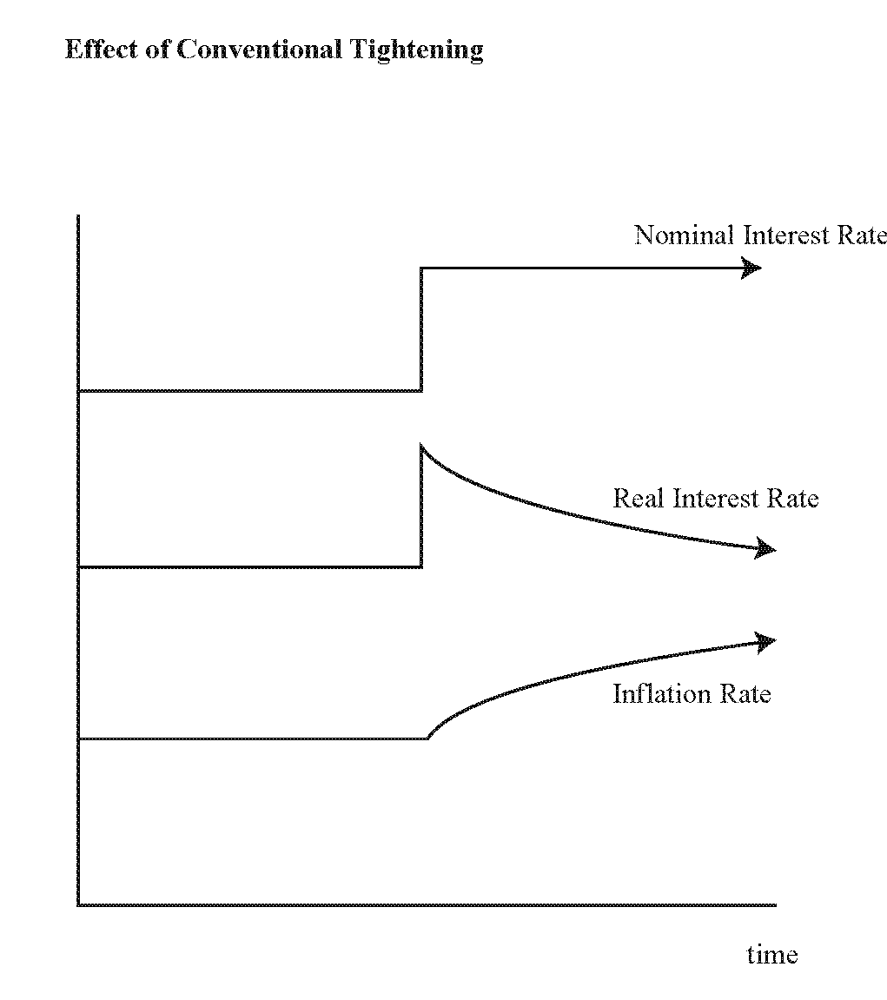
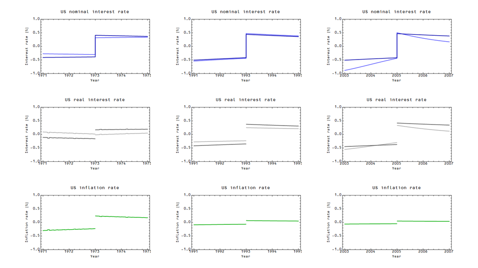
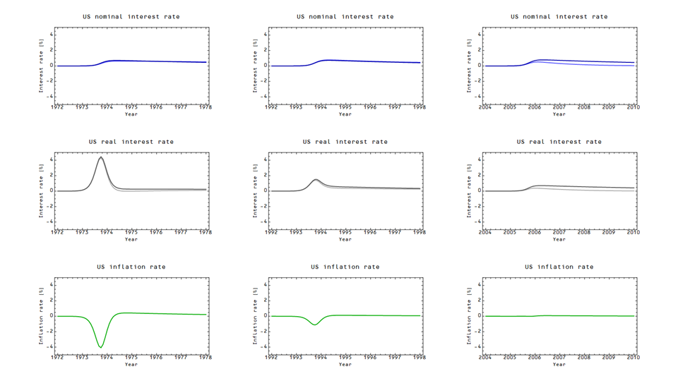
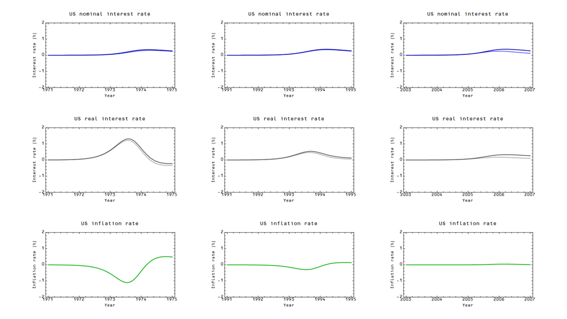

The redundant title was intended as something of a joke. I was hoping to try and do an apples to apples comparison to [Stephen Williamson's last graph at this post](http://newmonetarism.blogspot.com/2014/09/theories-of-inflation-and-european.html):

However, it is impossible to construct an economy that maintains a constant nominal interest rate in the information transfer model, partially for reasons given [here](http://informationtransfereconomics.blogspot.com/2013/12/a-delicate-balance-part-2.html) (constant inflation requires ever increasing NGDP), and partially for reasons given [here](http://informationtransfereconomics.blogspot.com/2014/08/are-interest-rates-good-indicator-of.html) (the interest rates need to follow a specific trend to follow the path of NGDP-M0).

Therefore I looked at the difference between the (smoothed) model result and the (smoothed) model counterfactual result. This means that the results below indicate the difference between the given variable and the expected variable path (i.e. a positive nominal interest rate means that the interest rate would be higher than the trend path). The results also strongly depend on how the nominal interest rate increase happens (in particular because inflation is a derivative, so sudden jumps have strange effects) \[1\]. Additionally, the inflation rate depends on the size of the economy and the monetary base, so I chose three years for the onset of the nominal interest rate increase: 1973, 1993 and 2005.

I tried three different approaches to how the nominal rate changed, and they all end up with slightly different results. The first assumes a sudden jump in the nominal interest rate that goes from being slightly below the NGDP-M0 trend to being slightly above.

The second assumes that there is a smooth (but still narrow) rise in the nominal rate with a long decay back to the trend

The third assumes that there is a smooth rise and shorter decay back to the trend

The end result is that inflation always seems to increase a bit with a nominal rate increase (the increase gets smaller and smaller over time, both in terms of the onset year -- 1973 to 2005 -- and in terms of inflation eventually returning to the trend set by NGDP-M0), broadly in line with Williamson's graph. The path inflation takes to get there varies from a sudden jump to disinflation (of varying magnitude) followed by increased inflation depending on the precise path.

It appears that nominal rate increases (which involve a reduction in the monetary base -- i.e. contractionary policy) tend to be inflationary (relative to a case where there was no rate increase) in the medium to long run because they move the price level down (P decreases if M0 decreases, _ceteris paribus_), so inflation must increase in order to return to the price level back to its expected long run path. It's a bit like how digging a hole in front of a mountain can make the average grade steeper on the far side of your hole. Here is a graph of the price level (with red being the counterfactual contractionary policy):

That dip and the return to the trend is responsible for a nominal interest rate increase leading to inflation.

\[1\] I also tried to make this as pure of a nominal interest rate increase as possible by making the change in the path of NGDP-M0 perpendicular to the lines of constant interest rate illustrated e.g. [here](http://informationtransfereconomics.blogspot.com/2014/06/krugman-keynes-and-liquidity-trap.html). This differs somewhat from the methodology I used [here](http://informationtransfereconomics.blogspot.com/2014/01/strange-new-monetary-worlds.html), where the NGDP increase is dependent on the M0 increase.
