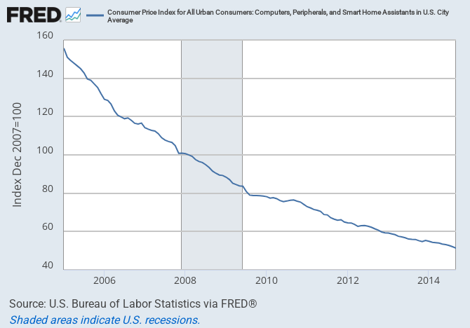

I've been thinking about how expectations can set macroeconomic variables without "concrete steps", and in particular Nick Rowe's analogy with daylight savings time. I had some brief interaction with Nick in comments on [my post here](http://informationtransfereconomics.blogspot.com/2014/08/zen-koan-inflation-targeting.html) and this can be seen as an counterargument to [this post by Nick](http://worthwhile.typepad.com/worthwhile_canadian_initi/2011/10/engdp-level-path-targeting-for-the-people-of-the-concrete-steppes-.html).

Nick puts forward two analogies where we achieve a real macro outcome but we don't know what the concrete steps are (or there aren't any concrete steps): driving on the right and daylight savings time. In these situations, the government sets an expectation and everyone complies because everyone thinks everyone else will comply (in this model). This motivates the same logic applying for NGDP (and [elsewhere inflation](http://worthwhile.typepad.com/worthwhile_canadian_initi/2012/03/sticky-prices-vs-sticky-coordination-inflation-vs-ngdp-targeting.html)) targeting.

The trouble I've been having with this argument comes down to the fact that we as individuals choose which side of the road to drive on or to set our clocks back. Individuals have the power to set their clocks to any time or drive on either side of the road, and individuals enact the concrete steps. Individuals can't turn a wheel or push a button to set inflation or NGDP.

If the central bank set an inflation target and everyone decided to set their prices to rise at 2% per year, then the above analogies seem appropriate. In some cases that could be true: cost of living adjustments, long term contracts, investment decisions, buying a house, etc. However, we as individuals (or even firms) don't make all the choices involved in setting inflation. Some goods actually decrease in price (here is the CPI for computers):

This would be akin to whole segments of the population setting their clocks back when everyone else sets them forward. Additionally, "hedonic" and "quality" adjustments adjustments are made to CPI \[1\]. The owner of a restaurant can't decide to have prices rise at 3% while having people enjoy the food 1% more. No one can make technology improve based on expectations alone ([or can they?](http://en.wikipedia.org/wiki/Moore's_law#As_a_target_for_industry_and_a_self-fulfilling_prophecy)).

Unlike daylight savings time or driving on the right, the concrete steps required to enact the inflation or NGDP expectations set by central bank are out of the individual's hands. This is why [I reside on the concrete steppes](http://informationtransfereconomics.blogspot.com/2014/10/under-spell-of-expectations-fairy.html) and believe that physical currency ("M0") sets inflation \[2\], with a changing, but concrete \[3\], definition of the unit of account.

**Footnotes:**

\[1\] PCE inflation measures are highly correlated with CPI and chained CPI, so it would be remarkable if they represented completely independent processes. Without loss of generality, let's stick to CPI inflation.

\[2\] [Empirically](http://informationtransfereconomics.blogspot.com/2014/02/models-and-metrics.html), not ideologically -- if it was M1, MB, MZM or any other definition of money, that would be fine by me.

\[3\] It's very concrete -- the factor is given by the information transfer index and is explicitly _κ = (log M0/c) / (log NGDP/c)_.
