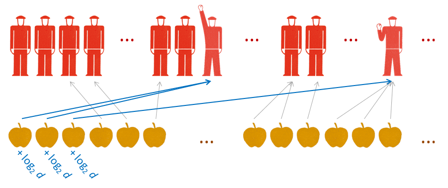

If there's a bright center of the econoblogosphere, you're at the blog that it's farthest from. I thought I'd try and do some outreach by submitting a talk to Ignite Seattle; this post is the draft abstract/outline along with some graphics to be used in the presentation. If you have any comments, let me know!

**The graph that could transform economics**

In 1912, Henry Norris Russell [presented a graph](http://spiff.rit.edu/classes/phys301/lectures/hr/hr.html) of star color (temperature) versus luminosity at a Royal Astronomical Society meeting that inspired Arthur Eddington to come up with a theory of how stars worked while being ignorant of what made them shine -- in fact, the traditional thinking at the time was decidedly wrong. \[[See more here](http://informationtransfereconomics.blogspot.com/2014/05/a-starry-eyed-aside-on-methodology.html)\]

I've put together a graph of economic growth versus the amount of printed money based on a theory that assumes we have no idea how supply and demand works and it shows universal behavior in economies across the world. It's based on [information entropy](http://en.wikipedia.org/wiki/Entropy_%28information_theory%29) from information theory. This theory has deep implications for economic policy, and could transform how the field of economics is practiced.

Contrary to traditional economic thinking, prices in the market place do not communicate information about droughts, harvests or quality, but rather confirm that supply and demand [have matched up ignorance](http://informationtransfereconomics.blogspot.com/2014/11/maybe-it-should-be-called-ignorance.html) of those factors on either side of a transaction. And this modesty -- admitting ignorance about human behavior or what factors boost economic growth -- leads us to question traditional economic thinking on subjects from [Seattle's new minimum wage](http://informationtransfereconomics.blogspot.com/2014/06/seattles-new-minimum-wage-and.html) to how to deal with [the aftermath of the financial crisis](http://informationtransfereconomics.blogspot.com/2014/10/coordination-costs-money-causes.html).

...

Outline -- talk will be based on these posts (a series of sub-minute summaries to fit within  the 5-minute limit):

-   [A starry-eyed aside on methodology](http://informationtransfereconomics.blogspot.com/2014/05/a-starry-eyed-aside-on-methodology.html)
-   [Apples, bananas and the information transfer model of supply and demand](http://informationtransfereconomics.blogspot.com/2014/03/apples-bananas-and-information-transfer.html)
-   [How money transfers information](http://informationtransfereconomics.blogspot.com/2014/03/how-money-transfers-information.html)
-   [Seattle's new minimum wage and information theory](http://informationtransfereconomics.blogspot.com/2014/06/seattles-new-minimum-wage-and.html)
-   [Notes from Ben Bernanke and the P\* model](http://informationtransfereconomics.blogspot.com/2014/07/notes-from-ben-bernanke-and-p-model.html)
-   [Because empirical success](http://informationtransfereconomics.blogspot.com/2014/11/because-empirical-success.html)

