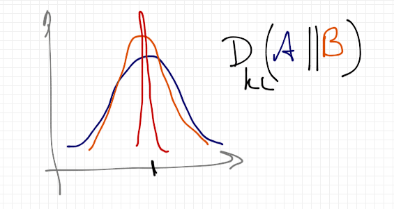

This is going to be a rough sketch of an argument and a derivation. The one sentence summary is that there is always information loss in an economy, and that information loss is measured by a combination of NGDP and inflation.

Let's say that the market has an expectation of future NGDP measured by some distribution B; let's call the actual \[1\] distribution of A. Cartoons of these two distributions are shown in the graph at the top of this post. The difference between these two distributions, measured by e.g. [the KL divergence](http://en.wikipedia.org/wiki/Kullback%E2%80%93Leibler_divergence), is:

This is the information gained by learning the real distribution A given distribution B, or alternatively, the information lost by assuming B. I previously talked about expectations destroying information -- they lead to information loss -- [here](http://informationtransfereconomics.blogspot.com/2014/05/expectations-destroy-information.html) (there's also bit on on the KL divergence). This information loss means that the future NGDP will be lower than the "ideal" NGDP since information in the source (aggregate demand) was not captured at the destination (aggregate supply). Another way to put this is that economic growth is lower than it could be if we knew the future as well as it could be known (i.e. knowing A).

Let's define this ideal (zero information loss) NGDP; we'll call it $N^{*}$ -- measured (observed) NGDP will be denoted $N$. Now the information loss should be equal to the difference in the "economic entropy" (see [here](http://informationtransfereconomics.blogspot.com/2014/10/coordination-costs-money-causes.html), [here](http://informationtransfereconomics.blogspot.com/2014/09/the-economic-combinatorial-problem.html)) of these two NGDPs (I'll work in "natural" units where the parameter $c_{0} = 1$):

Information and entropy [are essentially the same thing](http://en.wikipedia.org/wiki/Entropy#Information_theory), just with different units. Using Stirling's approximation for large $N$, we can write this as

Dividing through by the monetary aggregate that defines the unit of account $M$, we get:

And using the information transfer differential equation $dN/dM \sim (1/\kappa) N/M$, we can say:

Let's identify the ideal NGDP with the [shock-less NGDP](http://informationtransfereconomics.blogspot.com/2014/09/what-is-inflation.html) that defines inflation (and is the result of [numerically integrating that differential equation](http://informationtransfereconomics.blogspot.com/2014/03/the-monetary-base-as-sand-pile.html) without shocks) so that we can use $d N^{*}/dM \sim P$ where $P$ is the price level and $N^{*} \sim M^{1/\kappa}$.

The information loss is proportional to the difference between the growth rates of the ideal NGDP (also known as the price level $P$) and the observed NGDP ($N$) with respect to the monetary aggregate that defines the unit of account ($M$) \[2\].

-   [Rational expectations](http://en.wikipedia.org/wiki/Rational_expectations) is the assumption that the distributions A and B are equal, that the information loss $\Delta I = 0$ and that $dN/dM = P$. This is empirically false (what we really have is $dN^{*}/dM = P$). While rational expectations may be a good first order approximation (over the short run), the market does not accurately know the distribution from which macro random variables are selected.
-   An inflation target or price level target is a target for the first term in equation (1) while a NGDP level or growth rate target is a target for the second term. That is to say, an inflation or price level target is an _ideal NGDP target_ ($N^{*}$) analogous to an NGDP target. Since $\Delta I$ is a priori unknown, setting one target sets the other. Another way to put this same information is that a given inflation target cannot be achieved simultaneously with an NGDP target (such an economy is over-determined).
-   It is interesting that if one adds the assumption that $\Delta I$ is stable (e.g. is a stochastic process with unit root), this comes to the same conclusion [as Nick Rowe](http://worthwhile.typepad.com/worthwhile_canadian_initi/2014/10/sign-wars-with-price-level-targeting.html): _But we could live in a \[self-stabilizing economy\] ... if we adopted price level path targeting_ \[i.e. $N^{*}$\], _or NGDP level path targeting_ \[i.e. $N$\]. However, there is no reason to assume $\Delta I$ is stable and the knob that the central bank would turn would be concrete step of adjusting the currency base ("[M0](http://research.stlouisfed.org/fred2/series/MBCURRCIR)"), not setting expectations (i.e. targeting $\Delta I$, which is impossible since the distribution A is fundamentally unknowable -- it requires knowing not only the future, but all possible futures). Nick's post was the inspiration for this one, which I previously mentioned working on [here](http://informationtransfereconomics.blogspot.com/2014/10/supply-and-demand-for-non-ideal.html).
-   If rational expectations were true (in the model above), NGDP and the price level would not be independent quantities.

**Footnotes:**

\[1\] This would be measured using a large number of identical economies and observing the measured NGDP in each economy.

\[2\] Note this is a growth rate with respect to the monetary aggregate that defines the unit of account unit of account, not time.
