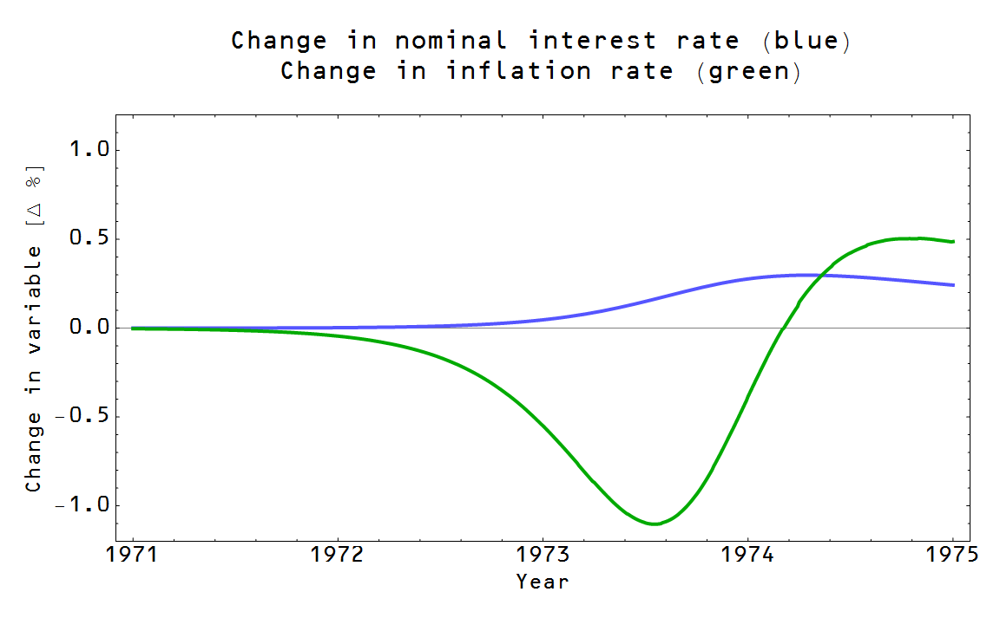

When John Cochrane says it -- [Noah Smith is all twitterpated](http://johnhcochrane.blogspot.com/2014/11/the-neo-fisherian-question.html?showComment=1415321544007#c2098747138279447798) and [Nick Rowe is moony-eyed](http://johnhcochrane.blogspot.com/2014/11/the-neo-fisherian-question.html?showComment=1415324853368#c5643175478073231889); when I say it -- Noah deletes the comment from his blog post \[no link, naturally\] and Nick calls me [warped](http://informationtransfereconomics.blogspot.com/2014/07/beware-implicit-modeling.html). So it goes.

Anyway, Cochrane put out a working paper the other day that's set the econoblogosphere alight and [Tom Brown asked](http://informationtransfereconomics.blogspot.com/2014/11/maybe-it-should-be-called-ignorance.html?showComment=1415333974825#c3138188690598864578) for a response from me. I'll just work from the [most recent post from Cochrane](http://johnhcochrane.blogspot.com/2014/11/the-neo-fisherian-question.html). I'm a little surprised at how much I've [been agreeing with him](http://informationtransfereconomics.blogspot.com/2014/08/in-which-i-agree-with-john-cochrane.html) lately.

The subject this time? The neo-Fisherite rebellion. I'm not [fully a neo-Fisherite](http://informationtransfereconomics.blogspot.com/2014/05/a-neo-fisherite-rebellion-yes-please.html), but I'm sympathetic to many of the ideas and mechanisms.

**1\. Raising nominal interest rates can result in inflation.**

He allows that it might cause a bit of deflation before and then result in inflation. I pretty much showed that, depending on the path of policy, this is what happens in the information transfer model. I discuss it in this post where I tried to reproduce the results as Stephen Williamson:

[http://informationtransfereconomics.blogspot.com/2014/09/the-path-of-policy-is-strongly.html](http://informationtransfereconomics.blogspot.com/2014/09/the-path-of-policy-is-strongly.html)

One of the graphs from that post is at the top of this post. Of course, as I mention in the post on Williamson, something gets in the way: the fact that there is no stable result with a permanent increase in interest rates. Guess what Cochrane' second consideration is?

**2\. If the Fed permanently pegs interest rates, is inflation stable or unstable in the long run?**

I mentioned in the link on Williamson above that there is no stable path of the economy with a permanent increase in interest rates in the information transfer model. In this older post, I show that in order to have an economy with some constant interest rate and some constant inflation rate, you must have an economy with an increasing RGDP growth rate:

[http://informationtransfereconomics.blogspot.com/2013/12/a-delicate-balance-part-2.html](http://informationtransfereconomics.blogspot.com/2013/12/a-delicate-balance-part-2.html)

Cochrane also puts together a list of ideas that have been "demolished" ...

> _... MV = PY. Sorry, we loved you. But when reserves go from \\$50 billion to $3 trillion and nothing at all happens to inflation -- or at most we're arguing about percentage points -- it has to go out the window._

[http://informationtransfereconomics.blogspot.com/2014/11/quantitative-easing-cleanest-experiment.html](http://informationtransfereconomics.blogspot.com/2014/11/quantitative-easing-cleanest-experiment.html)

There still is an equation of exchange, but the real equation is _log P ~ k(Y, M) log M_ where k is a function.

> _... Keynesian deflationary spirals. Just as much as monetarists worried about hyperinflation, Keyensians' forecast of a deflationary spiral just didn't happen._

For this one, I'd say read any post on this blog about inflation. The price level is a function of M and NGDP, and doesn't depend (in the long run) on the expectations involved in the spiral. The only way deflation can happen is either though directly affecting M. In Sweden, the central bank decided to take some currency out of circulation -- and got deflation. In Japan there's a different effect; the currency in circulation has expanded so much that the average information content of each Yen is falling, resulting in deflation.

> _... The Philips curve. Unemployment went to levels not seen since the great depression; the output gap went to 10 percent and ... inflation moved less than one percent._

[http://informationtransfereconomics.blogspot.com/2013/10/the-phillips-curve.html](http://informationtransfereconomics.blogspot.com/2013/10/the-phillips-curve.html)

[http://informationtransfereconomics.blogspot.com/2014/10/updated-non-existent-3d-phillips-curve.html](http://informationtransfereconomics.blogspot.com/2014/10/updated-non-existent-3d-phillips-curve.html)

> _Fiscal stimulus... well, we'll take that up another day._

Given Cochrane's priors, I think he'll say it doesn't have a positive effect (at least). But if he comes with the answer that's right (ha!) rather than the one he likes, let me tell you what that answer should be -- at least according to the information transfer model.

Fiscal policy has an impact when monetary policy doesn't, such as in a liquidity trap (or generally when the monetary base is large relative to the size of the economy). The two "forces" are orthogonal in a liquidity trap and are closer to parallel when the quantity theory of money applies.

[http://informationtransfereconomics.blogspot.com/2014/05/models-matter.html](http://informationtransfereconomics.blogspot.com/2014/05/models-matter.html)

It's pretty amazing that all this comes from some simple considerations stemming from [the idea of money transferring information](http://informationtransfereconomics.blogspot.com/2014/03/how-money-transfers-information.html).
