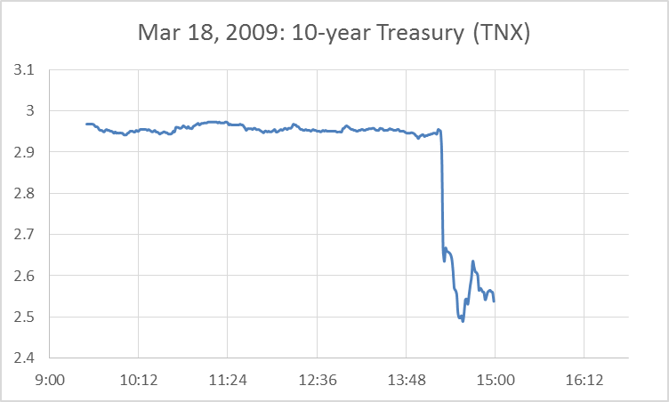
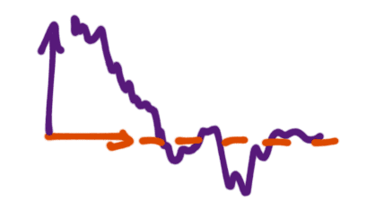

That title will probably get me in trouble. The other candidate was "Are incorrect models a source of excess volatility?", but that was boring. 

First here's the background reading. James Hamilton at econbrowser [put up a post](http://econbrowser.com/archives/2014/11/evaluation-of-quantitative-easing) earlier this month I've only now read. In it there was a very interesting graph:

The 10-year treasury is not impacted by QE as I rather decisively [showed in the data here](http://informationtransfereconomics.blogspot.com/2014/11/quantitative-easing-cleanest-experiment.html), so why should it drop on news of additional QE? Hamilton continues: "But over the next few days, the yield started climbing back up. By the end of April, the 10-year yield was higher than it had been before the Fed’s announcement." Hamilton then suggests and disproves that this was due to inflation expectations. The best answer seems to be that the market was wrong and then randomly drifted back to where it should be. \[See diagram at the bottom of this post.\]

[market inflation expectations are also wrong](http://informationtransfereconomics.blogspot.com/2014/07/better-than-tips.html)

Note that [I've discussed the idea](http://informationtransfereconomics.blogspot.com/2013/09/interest-rates-and-monetary-policy-or.html) that markets might not know what they are doing about a year ago to explain a set of [observations from Scott Sumner](http://www.themoneyillusion.com/?p=23719) about interest rates; the first two are here:

1.  _Moves toward easier money usually lower short term rates. The effect on long term rates is unpredictable._
2.  _Moves toward tighter money usually raise short term rates. The effect on long term rates is unpredictable._

The market appears to think monetary expansion lowers interest rates. However in the information transfer model (ITM) if inflation is high (the IT index 'kappa' is low), monetary expansion will lead to higher interest rates [though the income/inflation effect](http://informationtransfereconomics.blogspot.com/2014/03/the-effects-that-move-interest-rates.html). If inflation is low (kappa is high), then monetary expansion will lead to lower interest rates since the income/inflation effect is muted. I then explained Sumner's rules like this:

1.  Markets like what they think is easier money, but the long run depends on whether the information transfer index is high or low. 
2.  Markets _don't_ like what they think is tighter money, but the long run depends on whether the information transfer index is high or low.

If the market knew how monetary expansion impacts interest rates, then we wouldn't get things like the incorrect adjustment in the graph at the top of this post.

Another potential area where the market appears to be in error is [in exchange rates](http://informationtransfereconomics.blogspot.com/2014/09/what-do-exchange-rates-measure.html). The immediate response to expansionary policy in Japan and the Eurozone were a falling Yen and Euro ... but the Euro should rise if the supply of Euros expands because relative demand for currency explains the behavior of exchange rates, thus more Euros means more demand for Euros.

-   Since "the market" appears to have something like a monetarist view, immediate market responses to news should confirm e.g. Scott Sumner's model. The Fed announces QE, and the market expects a rise in the stock market, lower interest rates, a fall in the dollar and a return to target inflation. The market moves are taken as evidence that the Fed hasn't "run out of ammunition". However, in the long run, the economy moves back towards the ITM trends ... and you get pieces from Sumner like this: _[Were market monetarists wrong about Japan?](http://www.themoneyillusion.com/?p=28054)_
-   If the market frequently moved in the wrong direction in particular venues, that would become a source of excess volatility. I'm not saying all venues! There are many where things where the market appears to get things right. However, there are excess volatility problems in [exchange rates](https://ideas.repec.org/p/zbw/zeiwps/b011999.html) (mentioned above) and [stocks](https://www.aeaweb.org/aer/top20/71.3.421-436.pdf) \[pdf\].

Regarding the stocks, James Hamilton closes his post with a question about whether the rise in the Nikkei on news of QE from the BoJ will last. If stocks rise on what the market believes is good macro news, then if that belief is incorrect and the news should be considered neutral (e.g. QE) from the correct model, then there will be excess volatility and market moves should be discounted \[1\].

This also implies that market monetarism won't work. No matter the market expectations set by forward guidance or NGDP targets, they won't lead to the desired outcomes **_unless the underlying model is correct_**. You could guide inflation and NGDP with the ITM if it is correct -- but then if the ITM is correct, [only certain values of NGDP growth and inflation are attainable](http://informationtransfereconomics.blogspot.com/2014/08/zen-koan-inflation-targeting.html).

\[1\] These are theoretical musings, and the ITM may well be wrong. Actually, the ITM does not as yet predict when the prices should return to trend (the market can be irrational far longer than you can remain solvent). So if you lose money shorting the Nikkei based on this low-traffic blog by a non-economist, it's your own fault.
