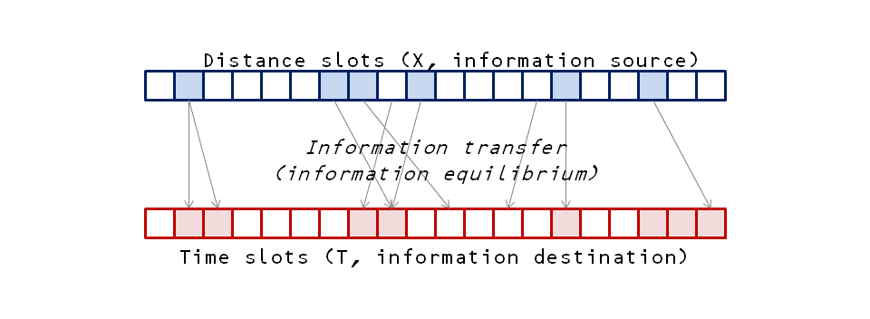
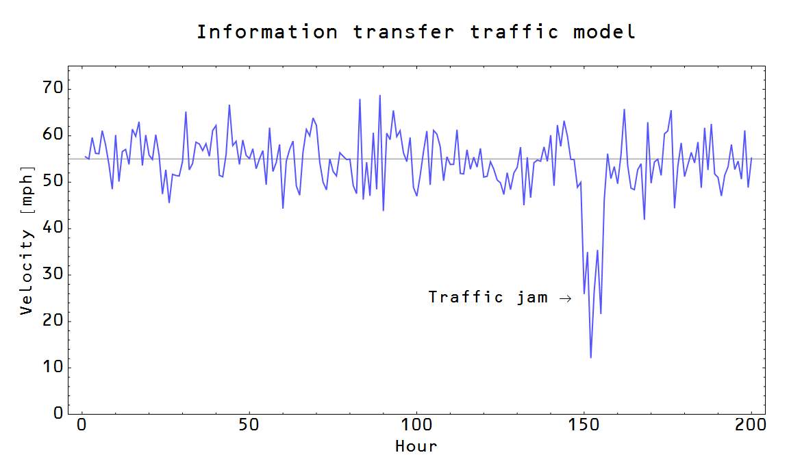

David Glasner is getting into complexity theory with his [two](http://uneasymoney.com/2014/12/09/john-cochrane-meet-richard-lipsey-and-kenneth-carlaw/) [recent](http://uneasymoney.com/2014/12/12/traffic-jams-and-multipliers/) posts. In the [post from today](http://uneasymoney.com/2014/12/12/traffic-jams-and-multipliers/) he talks about traffic as a non-equilibrium complex system and quotes from a paper by Brian Arthur. In an effort to win Glasner over to an information theory view of economics, I'd like to show that a traffic system can be understood in a first order analysis with the information transfer model (or information equilibrium model). The power of the framework is demonstrated by the fact that I put this entire post together in a little over an hour on my lunch break.

Let me quote from the abstract of the paper by Fielitz and Borchardt \[1\] that formulates the information transfer model -- non-equilibrium complex systems is exactly what the model was designed to work with:

> _Information theory provides shortcuts which allow one to deal with complex systems. The basic idea one uses for this purpose is the maximum entropy principle developed by Jaynes. However, an extension of this maximum entropy principle to systems far from thermodynamic equilibrium or even to non-physical systems is problematic because it requires an adequate choice of constraints. In this paper we discuss a general concept of natural information equilibrium which does not require any choice of adequate constraints. It is, therefore, directly applicable to systems far from thermodynamic equilibrium and to non-physical systems/processes (e.g. biological processes and economical processes)._

\[Fielitz and Borchardt added the "economical" after learning of my blog and we periodically discuss how to properly interpret the model for economics. They have been a valuable resource in my research on this subject.\]

We will set up the model as a set of distance slots (X) transferring information to a set of time (T) slots -- these become our process variables (see the preceding diagram). \[Another way, X is in information equilibrium with T.\] The other key ingredient is the "detector", a differential relationship between the process variables that detects information transfer \[or changes in equilibrium\], which we identify as the velocity:

If we assume that the information transfer is ideal so that the information in the distribution of the occupation over the distance slots is equal to the information in the distribution over the time slots, i.e. $I(T) = I(X)$

where $\kappa$ is constant (if the slots in the diagram above don't change) that can be worked out from theory, but can also be taken from empirical observations. It's called the _information transfer index_. This equation represents an [abstract diffusion process](http://informationtransfereconomics.blogspot.com/2013/07/a-diffusion-analogy-for-quantity-theory.html) \[1\] and we have

And for $\kappa = 1/2$, you recover [Fick's law of diffusion](http://en.wikipedia.org/wiki/Fick%27s_laws_of_diffusion). However other relationships are allowed (sub- and super-diffusion) for different values of $\kappa$. It accounts for e.g. the number of lanes or the speed limits \[or number of vehicles\]. This is the equilibrium model of Arthur:

> _A typical model would acknowledge that at close separation from cars in front, cars lower their speed, and at wide separation they raise it. A given high density of traffic of N cars per mile would imply a certain average separation, and cars would slow or accelerate to a speed that corresponds. Trivially, an equilibrium speed emerges, and if we were restricting solutions to equilibrium that is all we would see._

Additionally, ["supply and demand" curves](http://informationtransfereconomics.blogspot.com/2013/04/supply-and-demand-from-information.html) follow from the equation (1) for movements near equilibrium. The "demand curve" is the distance curve and the "supply curve" is the time curve. Some simple relationships follow: an increase in time means a fall in speed at constant distance (increase in supply means a fall in price at constant demand), and an increase in distance results in an increase in speed at constant time. These are not necessarily useful for traffic, but are far more valuable for economics. The parameter $\kappa$ effectively sets the price elasticities.

> _But in practice at high density, a non-equilibrium phenomenon occurs. Some car may slow down — its driver may lose concentration or get distracted — and this might cause cars behind to slow down._

Our model produces something akin to [Milton Friedman's plucking model](http://informationtransfereconomics.blogspot.com/2013/12/plucking-rgdp-growth.html) where there is a level given by the theory and then the "price" (velocity) falls below that level during recessions (traffic jams):

The key to the slowdown is coordination \[2\]. When there is no traffic jam, drivers drive at some speed that has e.g. a normal distribution centered near the speed limit -- their speeds are uncoordinated with each other (just coordinated with the speed limit -- the drivers' speeds represent independent samples). For whatever reason (construction, an accident, too many cars on the road), drivers velocities become coordinated -- they slow down together. This coordination can be associated with a loss of entropy \[2\] as drivers' velocities are no longer normally distributed near the speed limit but become coordinated in a slow crawl.

This isn't a complete model -- it is more like a first order analysis. It allows you to extract trends and can be used to e.g. guide the development of a theory for how coordinations happen based on microfoundations like reaction times and following distances. In a sense, the information transfer model might be the macrofoundations necessary to study the microeconomic model.

For the [information transfer model of economics](http://informationtransfereconomics.blogspot.com/2014/06/the-information-transfer-model.html), one just has to change $X$ to NGDP, $T$ to the monetary base, and $V$ to the price level. There's also an application to interest rates and employment. As a special aside, [Okun's law drops out of this framework](http://informationtransfereconomics.blogspot.com/2013/08/scott-sumners-model-part-2_30.html) with just a few lines of algebra.

Also, the speed limit can coordinate the distribution of velocities -- much like the central bank can coordinate expectations. I'd also like to note that no matter what the speed limit is, the speed of the traffic may not reach that because there are too many cars. This may be an analogy for e.g. Japan, the US and the EU undershooting their inflation targets.

And finally, there may be two complementary interpretations of this framework for economics. One as [demand transferring information to the supply](http://informationtransfereconomics.blogspot.com/2014/03/apples-bananas-and-information-transfer.html) via the market mechanism and another as [the future allocation of goods and services transferring information to the present allocation](http://informationtransfereconomics.blogspot.com/2014/12/how-money-transfers-information-from.html) via the market mechanism.

[http://arxiv.org/abs/0905.0610](http://arxiv.org/abs/0905.0610)
[http://informationtransfereconomics.blogspot.com/2014/10/coordination-costs-money-causes.html](http://informationtransfereconomics.blogspot.com/2014/10/coordination-costs-money-causes.html)
