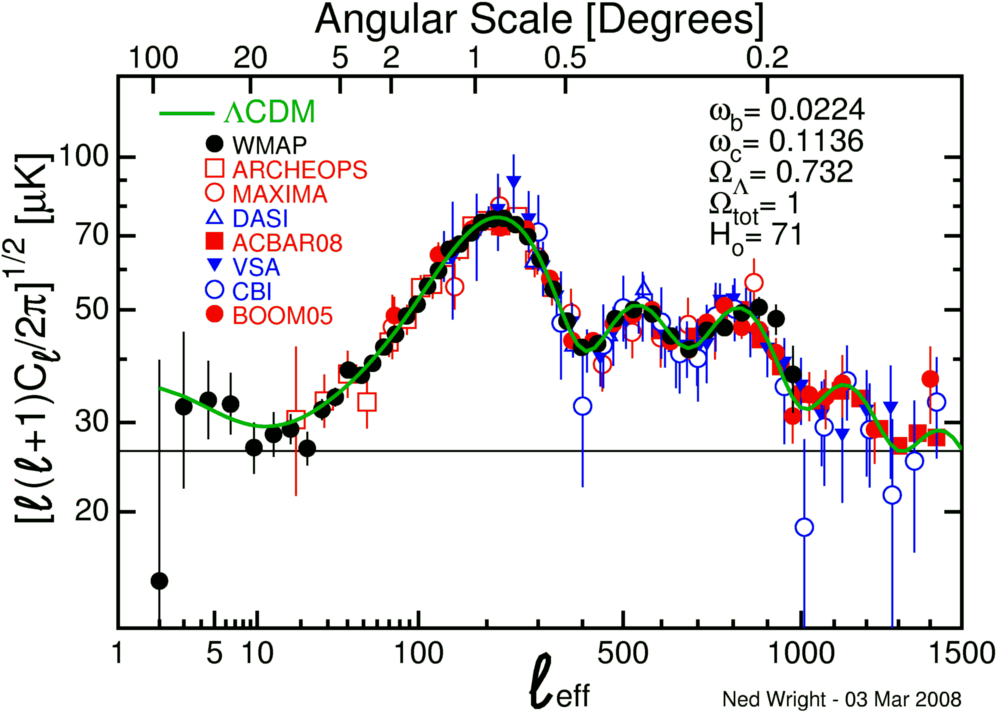

[packing for my trip](http://informationtransfereconomics.blogspot.com/2014/12/on-travel-for-fun-for-once.html)

But [Scott Sumner mentioned the Big Bang today](http://www.themoneyillusion.com/?p=28170), which as a physicist, gives me license to opine about the subject at hand. He says:

> _Instead, the recent deflation \[2014\] is a distinct echo of the actual NGDP “deflation” ... that occurred in the early part of this decade \[2010-2011\]._

At the top of this post is the (spatial) power spectrum of the fluctuations in the cosmic microwave background (CMB) radiation. This (spatial) ringing (echo) is similar to the ringing you'll [sometimes see in a jpeg image](http://en.wikipedia.org/wiki/Ringing_artifacts) that derives from e.g. "overshooting".

Sumner's story is that earlier changes in NGDP are showing up now in inflation after being obscured by commodity prices. I'd like to put forward an alternative story using the information transfer model. The current deflation is [mostly part of a long run trend](http://informationtransfereconomics.blogspot.com/2014/08/smooth-move.html), but there are fluctuations that are echoes of the real big bang: the 2008 financial crisis.

First, let's separate out the contributions to the price level from NGDP terms and monetary base terms ([we can do this](http://informationtransfereconomics.blogspot.com/2014/05/models-matter.html) in the information transfer model):

There is a faint hint of a ringing from the late 2008 financial crisis. I did a fit to a simple ~ _exp(t) sin(t)_ model for these two components:

This actually works really well. However you'd only be able to see it if you can separate out these two components because the fluctuations are almost too small to pull out in the sum relative to the magnitude of the noise. 

This model puts the source of the ringing at the financial crisis -- the commodity booms of the early part of the decade likely follow from it (basically a rebound from the low) as well as the recent deflation (which is on top of [a long run trend](http://informationtransfereconomics.blogspot.com/2014/08/smooth-move.html) towards deflation).

It's still not a perfect model, but it's an interesting take. Here's the graph of all the pieces together:

