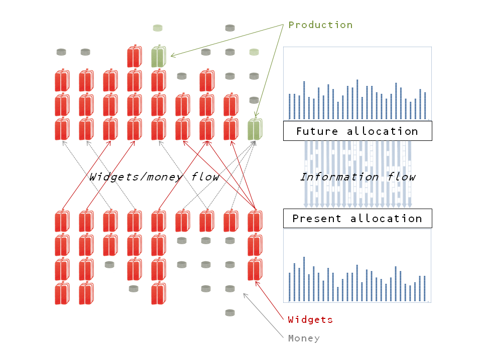

Continuing along [this path](http://informationtransfereconomics.blogspot.com/2014/12/meeting-expectations-halfway.html) where we re-interpret the information transfer model as a picture of information flowing from the immediate future to the present through exchange. The diagram at the top of this post is meant to be a re-interpretation of [the diagrams from this post](http://informationtransfereconomics.blogspot.com/2014/03/how-money-transfers-information.html).

Overall, this does not represent a mathematical difference, but rather a conceptual difference. Instead of organizing supply and demand "spatially" we're organizing it "temporally". This way of thinking about the process does help with the question of [which way the information flows](http://informationtransfereconomics.blogspot.com/2014/09/which-way-does-information-flow.html). There have been a few comments on this blog and [elsewhere](http://uneasymoney.com/2014/08/22/the-trouble-with-is-lm-and-its-successors/#comment-225064) questioning how we know the information flows from the demand to the supply. In this way of picturing the model, information flows from the future to the present through market exchanges (the market is figuring out the future allocation of goods and money and uncovering that distribution means information is flowing from the future to the present).

This picture also gives us a new way to think about "[aggregate demand](http://informationtransfereconomics.blogspot.com/2014/07/aggregate-demand-is-aggregate.html)": it derives from the allocation of goods and services in the future.

The information transfer model (information equilibrium) can also be stated more clearly using this picture. The ITM equates the information flowing from the future to the present though money to the information flowing from the future to the present through the goods. Of course you could always re-arrange this and say that the amount of information sent by the demand is equal to the amount of information received by the supply. However, I think the former description is much clearer.

The total amount of information that flows from the future to the present (in a given period of time) could be measured by e.g. the KL divergence between the future and present allocations. Since our knowledge of the future is imperfect, our [expectations of the future allocation represent a loss of information](http://informationtransfereconomics.blogspot.com/2014/11/expectations-rational-or-otherwise-and.html), and this representation gives us a framework to start talking about that more explicitly.
