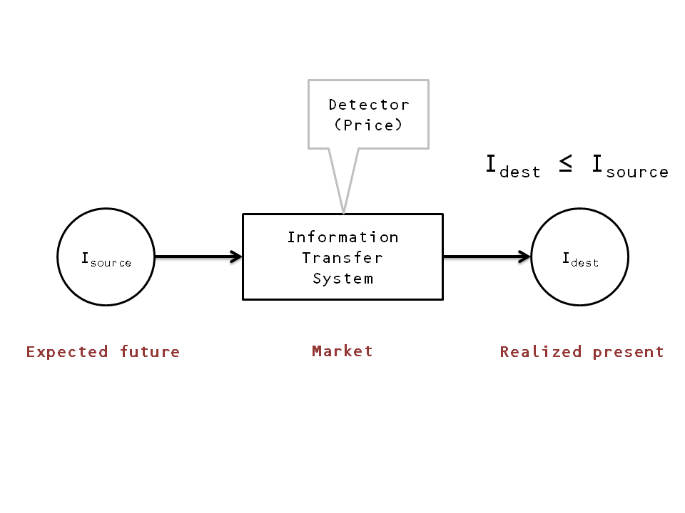

Proceeding in the spirit that theories that are correct have several different formulations, and in conjunction with my [fever-dream post](http://informationtransfereconomics.blogspot.com/2014/12/what-does-et-pit1-mean.html) from yesterday, I thought I'd start a project where I re-interpret the information transfer model in terms of expectations. Maybe it will lead nowhere. Maybe this is how I should have started. I've [tried to make contact](http://informationtransfereconomics.blogspot.com/2014/06/reconciling-expectation-and-information.html) with macro theories that contain expectations before, but [my general attitude](http://informationtransfereconomics.blogspot.com/2014/05/the-effect-of-expectations-in-economics.html) is that "expectations" terms as components in a model are unconstrained and allow you to [get any result you'd like](http://informationtransfereconomics.blogspot.com/2014/11/the-information-transfer-model-and.html).

But maybe that is a strength? If potential expectations are unconstrained, then they could be anything -- and we can simply assume complete ignorance about the expectations that produce a given macrostate (i.e. all expectations microstates consistent with the macrostate defined by NGDP, inflation, interest rates, etc are equally probable).

Let's go back to [the original model](http://informationtransfereconomics.blogspot.com/2013/04/the-information-transfer-model.html) and instead of calling the information source "the demand" and the destination "the supply" let's set it up as a system where information about an expected future is received by the present via the market mechanism. Our diagram is at the top of this post. From there, everything else on this blog follows through essentially with a re-labeling of demand as "expected demand".

I will do a couple of short posts as I think about the implications of this idea in terms of previous results. If this concept triggers any flashes of insight from anyone out there, let me know in comments. My initial feeling is that these expectations are unlike anything economists currently think of as expectations. A central bank still cannot target an inflation rate over the long run. In the normal formulation, if the central bank sets a target, expectations should anchor on that target. There is no reason for these expectations in the theory in the diagram to anchor on some other number. But maybe the undershooting in inflation is a sign that some information is being lost?

I don't know the answers and maybe this will lead nowhere, but I thought this is a more coherent description of what I was going for in my previous post.
