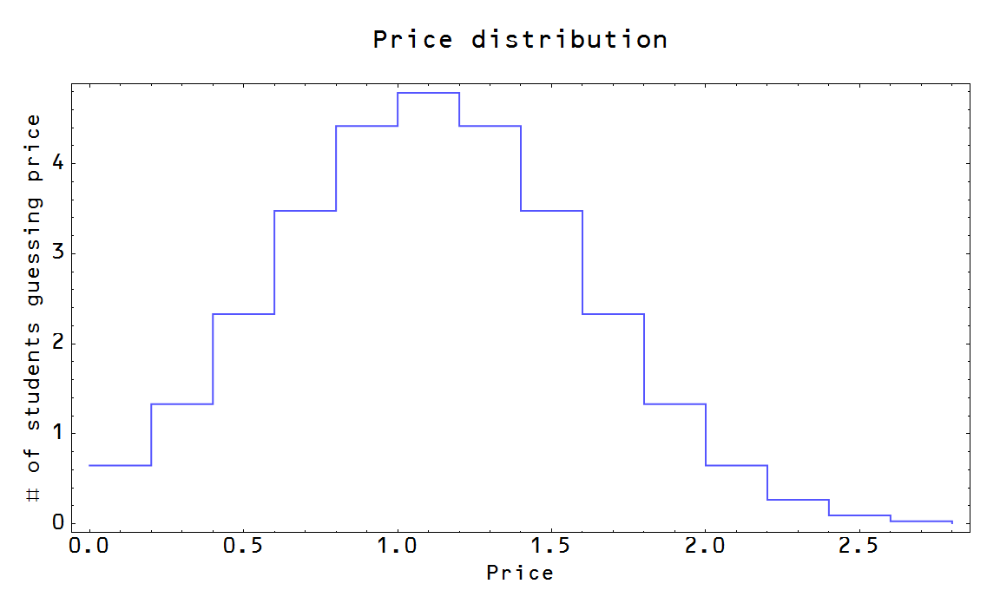
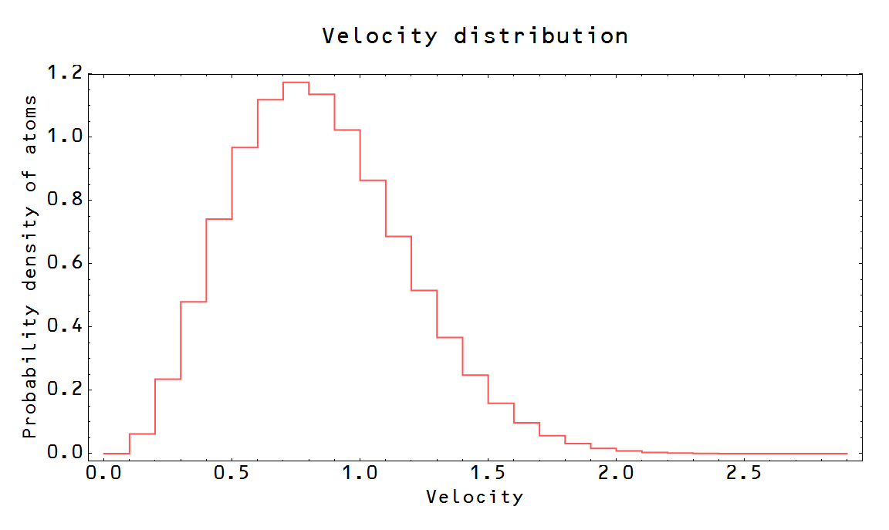
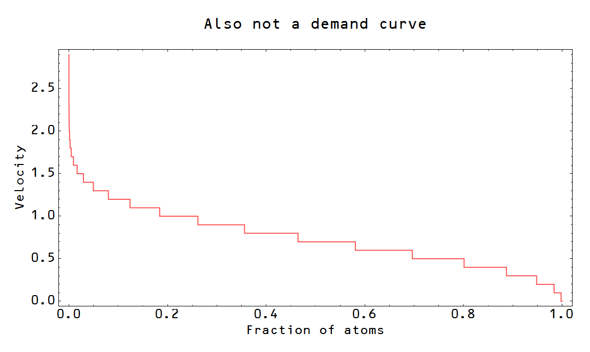

I'm in the process of writing (yet another) simple introduction to the information equilibrium view of supply and demand, but stumbled onto an issue that -- while I may be wrong about it -- really seems to fly in the face of basic economics. I asked myself the question: how would we go about determining the shape of the demand curve -- especially in a way that let's us see human behavior at work?

You might think experiments would help here. However e.g. [Vernon Smith's approach](http://informationtransfereconomics.blogspot.com/2015/01/im-not-sure-economists-understand.html) assumes utility. If you give your agents utility functions that obey the conditions of the Arrow-Debreu theorem, then an equilibrium must result from just the pure mathematics of it, along with the mechanics of supply and demand -- regardless of human behavior. This is basically just a restatement of the idea that assuming _homo economicus_ (by giving people well-defined utility functions) effectively implies ideal markets.

I started to look at some classroom experiments ... and saw that they don't actually demonstrate what they set out to demonstrate.

Take [this experiment](http://www.econport.org/econport/request?page=web_experiments_modules_supplydemand_lecture) \[1\] for example (it is not unusual). The idea is that students write down a reservation price and the instructor collects the cards and tallies up the number that would buy at a given price (or they all stand up and sit down as the price called out gets too high in [this version](http://www.econport.org/content/teaching/modules/DemandSupply/DemandExp.html) \[2\]). As the price goes up, the number of students willing to pay goes down. Makes sense.

But is this measuring a demand curve (i.e. things like diminishing marginal utility)? No. And it is especially clear in \[1\] if you look at their graph. It's not a demand curve, it's an inverse survival curve for a normal distribution:

That is to say it's a cumulative distribution function of a normal distribution turned on it's side (see the second graph [here](http://en.wikipedia.org/wiki/Normal_distribution)). What this is measuring is the (normal) distribution of price guesses from the students:

It is especially telling that in experiment \[2\] above, they leave off the last few students -- i.e. the last piece of the CDF where it stops being linear.

This doesn't have anything to do with human behavior. Why is that? Because I can get the exact same "demand curve" using brainless atoms. The contribution to the pressure from one atom is based on the force it exerts against the container -- the change in momentum as it reflects off the wall. That change in momentum is proportional to its velocity, and in an ideal gas, the atoms follow a Maxwell distribution:

If we asked atoms to sit down as different velocities were called out if the velocity was higher than theirs, we'd get the following "demand curve":

I used this example since both price vs demand and pressure (velocity) vs volume come from the same derivation in the information transfer model and neither require human behavior to explain.

Now you might say that students' knowledge of the average price of M&M's (in the example) shows how human behavior enters the equation; they see the value of other goods and make utility judgments. But! Atoms also seem to 'know' the average velocity of the ideal gas in the analogous experiment -- set by the thermodynamic temperature. The students know the value of a packet of M&M's because it is set by the value of money (perhaps set by an [economic temperature](http://informationtransfereconomics.blogspot.com/2014/06/the-macroeconomic-partition-function.html)) -- something _controlled by the central bank in most economic models_.

So how do we see a demand curve in a way that incorporates human behavior?

In the [MR University video](http://mruniversity.com/courses/principles-economics-microeconomics/demand-curve-shifts-definition), after using 'Black Friday' as an example (which is actually the experiment discussed above), they move on to describing it in terms of substitution. That is definitely human behavior, right? We decide to buy other things with our money!

Well, actually ... how is that different from the experiment above? When you have an estimate of the price of M&M's and the price goes above that reservation price you are effectively making the statement "I'd rather spend my money on something else" (or "I don't have that much money" in some cases). Something being "too expensive" and opting to save the money for something else are logically equivalent statements.

Now you might say that in the case of atoms when things get "too expensive" (too high a velocity) it's because they "can't afford it" (their velocity is all they have), not because they've decided to keep their "money" (velocity) for something else.

And that would be true ... for a single container with an ideal gas. But multiple markets is like multiple containers (with the same number of atoms\*\*, i.e. students) at different temperatures (i.e. prices). So while 20% of atoms have a velocity of at least 1 in one market, 20% will have a velocity of more or less in another, corresponding to 'money' they'd 'spend' on something else.

So, again, how do we see a demand curve in a way that incorporates human behavior?

I'm probably missing something. There could be other experiments\*\*\* that show human behavior shining through. Just because I don't know what they are doesn't mean they don't exist.

There is an ulterior motive here, and it's not just that I think starting with humans as optimizing agents is [likely not only intractable](http://informationtransfereconomics.blogspot.com/2014/06/what-if-money-was-made-of-vinegar.html), but [unnecessary](http://informationtransfereconomics.blogspot.com/2014/08/against-human-centric-macroeconomics.html). It's that in writing that simple introduction I mentioned at the top of this post I realized that the information transfer model, in an ideal market, has literally nothing to do with the behavior of the agents. Supply and demand are a property of two quantities that are in information equilibrium ... and the mechanics follow\*\*\*\* from _D = κ P S_. Hold _D_ constant and as _S_ goes up, _P_ must fall (a demand curve). Hold _S_ constant and as _D_ goes up, _P_ must go up (supply curve).

That's all there is ... and if that's all there is ...

**Footnotes:**

\*\* We are glossing over the the fact that we have the capability to distinguish different people and e.g. assign a particular price estimate in each market to a particular person -- something we can't really do for identical atoms. However, there is the question of whether the market can see people as distinguishable ... using money makes transactions anonymous.

\*\*\* You might think of an experiment where you reduce the supply and watch how the price goes up and take a survey and ask why people decided not to buy something. However 1) the mechanism you are using assumes supply and demand, and 2) since you are reducing the supply, some people will have to buy less _regardless of how they feel about it_. (Humans are subject to post-hoc rationalizations, so the survey would be suspect, anyway.)

\*\*\*\* You can get different shaped demand curves from this equation -- it's actually just an instantaneous equation and _P_ is a derivative (_dD/dS_).
