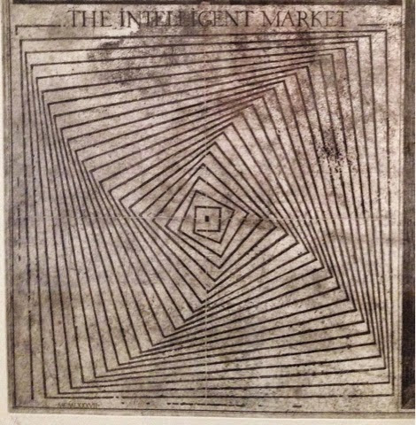

Henry at crookedtimber.org [put up an ad](http://crookedtimber.org/2015/01/16/collective-intelligence-2013/) for a conference called _Collective Intelligence 2015_, where one of the topics is "The intelligence of markets and democracies". In light of [my previous post](http://informationtransfereconomics.blogspot.com/2015/01/i-strongly-disagree-with-what-you-are.html), I got to thinking ... are markets actually intelligent?

One of my favorite blog posts of all time is [another post from crookedtimber.org by Cosma Shalizi](http://crookedtimber.org/2012/05/30/in-soviet-union-optimization-problem-solves-you/) that addresses this question a bit. Well, it says that trying to explicitly solve the linear programming allocation problem that we use the market to solve is actually impossible given a not-heroic dose of computational resources. Which means we really can't check if the market is doing a good job or not. As Shalizi puts it:

> _It means that \[the market mechanism\] faces no competition, nor even any plausible threat of competition._

What follows are essentially notes for an argument against the idea that we should presume markets can uncover information (are 'intelligent') ... or another way, solve an information aggregation problem. In fact, we should not _prima facie_ trust options derivatives or prediction markets.

Prediction markets and options derivatives are considered to be beneficial tools because they allow information to be aggregated and reward correct information and punish incorrect information (both monetarily). If I thought Mitt Romney was going to win the 2012 US presidential election, I could have bought a prediction market contract (at somewhere like Intrade) that would pay out if he won. Since that was an incorrect prediction, I'd lose money while those that thought Romney would lose (the sellers of the contract) would earn money \[1\].

Our only pre-requisites for our analysis are the [general information transfer model](http://informationtransfereconomics.blogspot.com/2013/04/the-information-transfer-model.html), and the derivation of supply and demand curves (for [ideal](http://informationtransfereconomics.blogspot.com/2013/04/supply-and-demand-from-information.html) and [non-ideal](http://informationtransfereconomics.blogspot.com/2013/04/sticky-prices-from-non-ideal.html) information transfer) ... just the first couple of posts on this blog. Here's a quick recap ...

Ideal information transfer from demand to supply (or the future to the present) follows from information equilibrium where the information received by the supply is equal to the information transmitted by the demand, or symbolically _I(S) = I(D)_. Solving the differential equations that result from allowing each side to vary infinitesimally and holding _I(D)_ or _I(S)_ constant results in supply and demand curves that intersect at the equilibrium price.

In general, however, we have _I(S) ≤ I(D)_ since there can be information lost in the transfer (non-ideal information transfer). Additionally, we know the information received by the supply cannot be greater than the information sent by the demand (you can't get more information out of a message than is present in the message). We can use [Gronwall's inequality](http://en.wikipedia.org/wiki/Gronwall%27s_inequality) for a differential equation to show the supply and demand curves at information equilibrium no longer intersect at the equilibrium price, but rather represent an upper bound on the price.

Now, let's look at a price movement from A to B (and B to A) in the following diagrams under conditions of ideal and non-ideal information transfer:

Under ideal information transfer (information equilibrium) in the first graph, a price movement from A to B or B to A represents movement of a demand curve. There is an analogous diagram for supply curve movements. If I bought an option that sells at price B in 6 months (or predicted the price B was too high in a prediction market), I would be rewarded if the price fell to A. Likewise if I bought an option to buy at A in 6 months, and the price rose to B, I would also make money. I make money if I correctly guess the actual movement of supply and demand curves \[2\].

This is the idea behind the incentive structure of prediction markets and options markets that purports to solve the information aggregation problem. Knowledge of factors of how supply and demand will change will lead to profits and being incorrect will lead to losses. Ideal information transfer represents a one-way intelligent box where good information is kept in and bad information is thrown out over time.

You can probably see where I am going with this already.

In the second graph, the price can fall anywhere in the lower shaded area bounded by the red and blue supply and demand curves. The movements from A to B and back are not based on movements of supply and demand curves and in fact movement from B to A represents an additional loss of information (it is farther below the 'ideal' price at the intersection of the red and blue curves). But! Correctly guessing these price movements is still rewarded -- and what is key to this argument is that correctly guessing the move from B to A is rewarded, which represents a fall further below the ideal price. Our box now keeps some bad information and throws out some good information.

Additionally, since the points A and B are exactly the same in the two graphs above, there is no telling which situation you are in and therefore which options/predictions are the faulty trades ruining your information aggregation.

If the series of good and bad trades are random, eventually the price _p → 0_ and the market collapses. But you don't need to go that far -- since both good and bad information can be rewarded, there is no point when you can trust the movements of the market price _p_.

Now maybe you can assure yourself that you really do have ideal information transfer, and you don't need to worry. But then I show you this graph:

Correctly predicting the price movement from A to B, from an ideal market price to a non-ideal market price, can be rewarded (and the prediction that the market stays ideal at A can be punished). Even an ideal market can transition to a non-ideal state and you can make money in a case where information is lost.

Now you might be saying: _how do markets work at all under these conditions?_ We have to be careful and not let the two functions of markets we are describing get entangled.

In prediction markets and options markets, you are trying to use the price mechanism to solve an _**information aggregation problem**_. Another way to do this is via _polling_ \[3\]. The mechanism fails to solve the information aggregation problem because good information leaks out and bad information sneaks in as described above if your market is not (or does not stay) ideal.

In traditional markets for goods and services, you are trying to use the price mechanism to solve an _**allocation** **problem**_. Another way to do this is via _rationing_. The allocation problem tends to be solved sufficiently by maximum entropy distributions (information equilibrium) for large enough markets -- i.e. supply and demand as viewed in the information transfer model.

The information transfer model helps you see this distinction between information aggregation and allocation because we don't care about the content of the information being transferred from _I(D)_ to _I(S)_. As I've said before, transferring false information in an error-free way is considered more of a success that transferring true information with a couple of errors \[4\]. When we talk about supply and demand, the market is solving an allocation problem, not an information problem.

Hypothesis: options work best (solve the information problem) when the price mechanism for the underlying commodity or security is solving the allocation problem with _I(D) ≈ I(S)_ because the allocation problem anchors the information problem -- i.e. prevents _I(S) << I(D)_.

I haven't proven this more nuanced hypothesis here (I haven't rigorously proven the original assertion either, but my intuition says that both likely true). However, it would mean that since e.g. an [NGDP futures market](http://mercatus.org/publication/market-driven-nominal-gdp-targeting-regime) isn't solving an allocation problem (the market allocates contracts invented in order for the prediction market to exist, as opposed to e.g. pork belly futures which allocate bacon for people to eat), it would be subject to information-less booms and busts with _p → 0_ eventually.

To answer the question in the title, though, it seems the market isn't intelligent as it can't in general solve the information aggregation problem. But it seems it can solve the allocation problem -- however we can't check if that is the best or even correct answer given an objective function because of the computational difficulties noted by Shalizi at the top of this post.

**Footnotes:**

\[1\] The same goes for 2016.

\[2\] Yes, prices rise on an increase in demand or a fall in supply and it is hard to tell the difference. However in both cases there is a real movement of (or along) the supply and/or demand curves and that is what is important here.

\[3\] Polling suffers many problems of its own. I think it is useful to consider that the belief that you can set up a prediction market and have it start producing useful information is a bit like the belief you can sample the population and expect it to come back with the right result. In the polling case, the analogous problems to the ones I describe here are things like sample bias and question design.

\[4\] You should think of this more as an analogy using Shannon's channel capacity theorem than as a model for what is happening ... but more concretely the false statement and the true statement would be something like this:

-   "Inflation is going to shoot up to 10%" = false, without errors
-   "Inflation is go to st3y at or below 2%" = true, with errors
